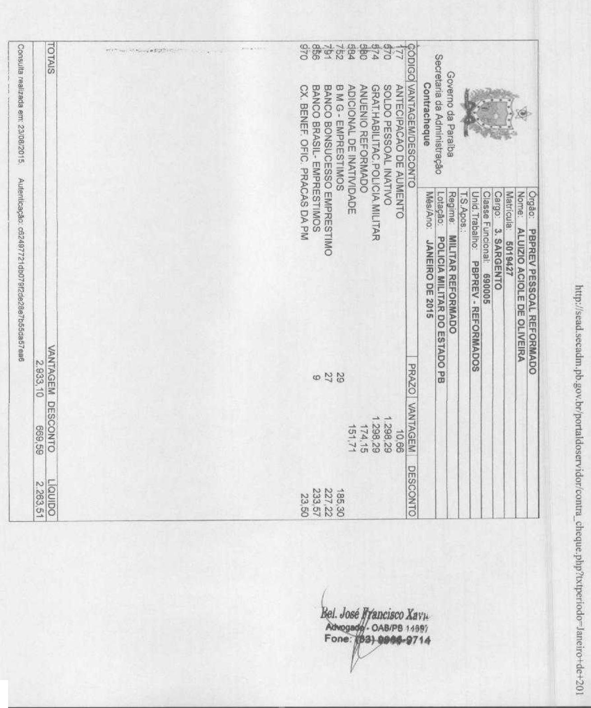

13/06/2025

Número: 0126804-16.2012.8.15.2001

# Classe: CUMPRIMENTO DE SENTENÇA CONTRA A FAZENDA PÚBLICA Órgão julgador: ${ \pmb 6 } ^ { \pmb { a } }$ Vara de Fazenda Pública da Capital

Última distribuição $\boldsymbol { : }$ 08/12/2012

Valor da causa: R\$ 622,00

Assuntos: Reajuste de Remuneração, Soldo, Proventos ou Pensão   
Segredo de justiça? NÃO   
Justiça gratuita? NÃO   
Pedido de liminar ou antecipação de tutela? NÃO

<html><body><table><tr><td colspan="4"></td><td colspan="2">Procurador/Terceiro vinculado</td></tr><tr><td colspan="4">Partes</td><td colspan="2">José Francisco Xavier (ADVOGADO)</td></tr><tr><td colspan="4">ALUIZIO ACIOLE DE OLIVEIRA (REQUERENTE)</td><td colspan="2">VALBERTINA FREIRE DE SOUzA MEDEIROS (ADVOGADO)</td></tr><tr><td colspan="4">PARAIBA PREVIDENCIA (REQUERIDO)</td><td colspan="2"></td></tr><tr><td colspan="6">Documentos</td></tr><tr><td>Id.</td><td>Data da Assinatura</td><td colspan="2">Documento</td><td></td><td>Tipo</td></tr><tr><td>456</td><td>3414210/09/2020 10:08 VOL 1][Peticāo Iniciall</td><td colspan="2"></td><td></td><td>Petigāo Inicial</td></tr><tr><td>458</td><td></td><td colspan="2">3414210/09/2020 10:08 [VOL 2JSentençal[Contestaçao]</td><td></td><td>Autos digitalizados</td></tr><tr><td>459</td><td>3414210/09/2020 10:08VOL 3]</td><td colspan="2"></td><td></td><td>Autos digitalizados</td></tr><tr><td>3410</td><td>3428114/09/2020 18:29Ato Ordinatório</td><td colspan="2"></td><td></td><td>Ato Ordinatório</td></tr><tr><td>3724</td><td>3492830/09/2020 12:06 Resposta</td><td colspan="2"></td><td></td><td>Resposta</td></tr><tr><td></td><td>373302/12/202012:14Despacho</td><td colspan="2"></td><td></td><td>Despacho</td></tr><tr><td></td><td></td><td colspan="2"></td><td></td><td>Petiāo</td></tr><tr><td>341</td><td></td><td colspan="2">65685 06/11/2022 23:42 Provimento Correcional automaático</td><td></td><td>Provimento Correcional automático</td></tr><tr><td>971</td><td></td><td colspan="2">7835128/08/2023 21:24Certidao da Contadoria</td><td></td><td>Certidāo da Contadoria</td></tr><tr><td>940</td><td>8617726/02/2024 16:49Despacho</td><td colspan="2"></td><td></td><td>Despacho</td></tr><tr><td></td><td>8649301/03/2024 21:13 Peticāo</td><td colspan="2"></td><td colspan="2">Petiçao</td></tr><tr><td>510</td><td></td><td colspan="2">86493 01/03/2024 21:13 ALUIZIO ACIOLE DE OLIVEIRA SUBST.</td><td colspan="2">Substabelecimento</td></tr><tr><td></td><td>8649301/03/2024 21:13 PROURACAO</td><td colspan="2"></td><td colspan="2">Procuraçāo</td></tr><tr><td>511</td><td></td><td colspan="2">8649301/03/2024 21:13CONTRATO DE HOORARIOS</td><td colspan="2">Outros Documentos</td></tr><tr><td>512</td><td>8649301/03/2024 21:13 fichas financeiras 1</td><td colspan="2"></td><td colspan="2">Outros Documentos</td></tr><tr><td></td><td>8649301/03/2024 21:13 fichas financeiras 2</td><td colspan="2"></td><td colspan="2">Outros Documentos</td></tr><tr><td>514</td><td>8649301/03/2024 21:13 fichas fianceiras 3</td><td colspan="2"></td><td colspan="2">Outros Documentos</td></tr><tr><td>515</td><td>8838008/04/2024 11:49Decisao</td><td colspan="2"></td><td colspan="2">Decisǎo</td></tr><tr><td>723</td><td></td><td colspan="2">9860516/08/202422:18 Provimento Correcional automático</td><td colspan="2">Provimento Correcional automático</td></tr><tr><td>768</td><td></td><td colspan="2"></td><td colspan="2"></td></tr></table></body></html>

<html><body><table><tr><td>10401 8962</td><td>20/11/2024 11:36 Substabelecimento</td><td></td><td>Substabelecimento</td></tr></table></body></html>

# EXCELENTͧSIMOSENHORJUIZ DEDIREITODA VARADA FAZENDA PUBLICA DA CAPITAL

# ALUIZIO ACIOLE DE OLIVEIRA,

brasileiro, casado,Policial Militar Reforrnado, portadorda cédula de identidade de $\mathfrak { n } ^ { \circ }$ 05341PMPB, CPF $\boldsymbol { \mathrm { n } } ^ { \circ }$ 218.981.544-49, residente e domiciliado na Rua Professora Lourdes Vieira, 75, Jatobá, Patos-PB, por intermédio de seu advogado, “in ñne” assinado,legalmenteconstituídona forma do instrumento procuratório anexo, com escritório na Av. Minas Gerais, 272, Bairro dos Estados,João Pessoa,PB, CEP 58.030-090,onde recebe intimaçõese avisos, vem respeitosamente,a vossahonrosapresença,com fulcro nosarts. 42, $\ S \ S \ O ^ { 1 0 }$ e $2 ^ { \circ }$ da Constituição Federal, art. 52 da lei Estadual n° 3.909/77, arts. $3 ^ { \circ }$ e 4° da Lei 8.562/08e arts. 12 e 14 da Lei Estadua $n ^ { \circ } 5 . 7 0 1 / 9 3$ , propor a presente:

# AÇÃOORDINÁRIAREVISIONALDE PROVENTOS DE REFORMA COM PEDIDO DE ANTECIPAÇAO DOS EFEITOS DA TUTELA

Em face PBPREV- Paraíba Previdência, pessoa jurídica de direito público interno, representadapor suaPresidência,estabelecidaà Rua Rio Grande do Sul, s/n, Bairro dos Estados,João Pessoa-PB, pelos motivos fátícos e jurídicos expostos a seguir:

# l-DA JUSTICA GRATUITA

Inicialmente, vem o autor requerer os benefícios da gratuidade processual, na forma prevista no art.4, da Lei n.1.060/50, em razão de não ter condiçõesde arcar com as custase honorários advocatícios sem comprometera sua subsistência.

# 2-DOS FATOS

O autor é policial militar reformado, e, pelo posto que ocupa, conforme contracheque e ficha financeira que se faz juntada, sua

<html><body><table><tr><td>SOLDO</td><td>R$</td><td>1.188,58</td></tr><tr><td>GRAT. HABILITACAO PM</td><td>RS</td><td></td></tr><tr><td></td><td></td><td>159.4</td></tr><tr><td>ADICIONAL DE INATIVIDADE</td><td>RS</td><td>138.90</td></tr></table></body></html>

Contudo, as duas últimas vantagens remuneratórias, acima em destaque,anuênioreformado e adicional de inatividade, vêm sendopagasa menor,aquémdo quede fatotem direito o requerente.

Tal fato se deve a errônea interpretação da Lei Complementar50/2003,quecongelouosadicionaise gratificaçõespercebidaspor todos os funcionáriospúblicos inativos da Administraçãodireta e indireta do Estado, a qual não deve ser aplicada a categoria especial de servidores, como é o caso dos militares, conformeserádemonstradonasrazõesdedireito a seguirapresentadas

# 3.DO DIREITO

# 3.1- OS MILITARES COMO CATEGORIA ESPECIAL DE SERVIDORES PÚBLICOS

Os militares constituemuma categoria especial de servidorespúblicosestaduais,nãoestandoenquadradoscomoservidorescivis. É da própria Constituição Federal a distinção entre servidores civis e militares, pois trata destacategoriaem seçãoprópria, vejamoso texto constitucional:

"Art. 42 - Os membros da Policias Militares e Corpos de Bombeiros Militares, Instituições organizadascom basena hierarquia de disciplina, são militares dos Estados, do Distrito Federal e dos Territórios.

$\ S I -$ Aplicam-se aos militares dos Estados, do Distrito Federal e dos territórios, além do que vier a serfurado em lei, as disposições do art.14, $\overline { { \vartheta \vartheta } } ^ { \circ } ,$ do art.40, $\ S 9 ^ { \circ }$ ; e do art.I42, §§ $2 0$ e $3 0$ cabendo a lei estadual específicadispor sobre as matérias do art.42, ${ \mathrm { ~ \AA ~ } } 3 ^ { \circ } ,$ inciso X, sendoaspatentesoficiais conferidas pelos respectivos governantes.

$8 2 -$ Aos pensionistas dos militares dos Estados, do Distrito Federal e dos Territórios aplica-se o que for fixado em lei especifica do respectivo ente estatal".

E mais, no âmbitoEstaduala categoriados militares encontra-seregida por norma própria e regimejuridico definido no Estatutoda Polícia Militar, lei n.3.909/77, a qual trata especificamentedo militar como uma categoria especial de servidor, vejamos:

Art. 3 " - Os integrantes da Polícia Militar da Paraíba em razão da destinaçãoConstitucional da Corporação e, em decorrência das Leis vigentes, constituem uma categoria especial de servidores públicos estaduais e são denominados policiais militares.

Além da clara diferenciação trazida pela Carta Magna e pelo Estatuto da Polícia Militar, os Tribunais Superiores possuem farta jurisprudência diferenciando esta categoria de servidor, bastando ver que em seus julgados diferenciam especificamente os servidores militares dos civis.

Conforme acima explanado os militares constituem uma categoria especial de servidores públicos, estando regidos por um regime jurídico próprio, qual seja a Lei n.3.909/77, não podendo a estes servidores ser aplicado o Estatuto do Servidor Público Estadual.

A própria Lei Complementar 58/03, Estatuto do Servidor Público Estadual, prevê a sua inaplicabilidade quanto aos servidores regidos por Lei Especial, como é o caso dos Militares. Vejamos:

'24rt.l. Esta lei disciplina o Regime Jurídico dos Servidores Públicos Civis das administrações direta e indireta do Estado da Paraíba, excetuados aqueles regidos pela Consolidação das Leis do Trabalho ou por outra legislação especial"

Nesse mesmo contexto, a Lei Complementar ${ \mathfrak { n } } ^ { \circ }$ 50/03,que tornou nominais os valores correspondentes as gratificações e adicionais dos servidores públicos da administração direta e indireta, especificamenteno que diz respeitoa esteartigo, não seaplica aosmilitares, pois, estaem todo o seutextotratoude diferenciar servidores civis dos militares:

“Art. I". 0 menor vencimentos dos servidores públicos efetivos, e dos estáveis por força do disposto no art.I9 do ADC T, da Administração direta e indireta do Poder Executivo Estadual e o menor soldo dos servidoresmilitares será deR\$240,00(duzentose quarenta reais).

$\ S I ^ { \rho } -$ Aplica-se o disposto neste artigo à parcela correspondente a vencimento computado no cálculo de proventos derivados de aposentadoria, reforma e pensão"

O legislador foi ainda mais específicono artigo que determinouo congelamentodas gratificaçõese adicionais, não se referindo à categoria dos militares, vejamos:

e gratificações percebidos pelos servidores públicos da administração direta e indireta do Poder Executivo no mês de março.

Parágrafo único. Excetua-se do disposto no 'caput' o adicional por tempo de serviço, cuja forma de pagamento permanece idêntica à

Ora, a omissãodeixada pelo legislador, implica em consequências jurídicas, delimitando diretamente a eficácia normativa sobre o âmbito dos servidores públicos civis, não devendo ser aplicada o congelamentoa classedos militares.

# 3.3- DASVERBAS COMPONENTES DOSPROVENTOS DA REFORMA E DO DIREITO A ATUALIZAÇÃO

A remuneração dos integrantes da Polícia Militar e do Corpo de Bombeiro encontra-se disciplinada pela lei n.8.562/08. Vejamos os componentes integrantes desta remuneração:

“Art. $3 ^ { \circ }$ - Compõem a remuneração do servidor Policial Militar e do Corpo de Bombeiros Militar: I - Soldo;

II - Gratificação de Habilitação Policial Militar;   
III- Outras vantagens previstas em lei”.

Os valores referentes às parcelas de soldo e gratificaçãode habilitaçãomilitar vem sendopagasem conformidadecom a legislação supracitada.No entanto, estarealidadenãocorrespondeàsparcelasrelativas aoanuênio e ao adicional de inatividade, em razão da errônea interpretação da aplicabilidade da Lei Complementar n.50/03.

No que tange à parcela do anuênio, a Lei Estadual n.5.701/93determinaa forma de pagamentona seguinterazão, vejamos:

"Art. 12- 0 adicional por tempo de serviço e'devido à razão de um por cento por ano de serviço público,, inclusive o prestado como servidor civil, incidindo sobre o soldo do posto ou graduação, a partir da data em que o servidor completa 2 (dois) anos no posto ou graduação, a partir da data em que o servidor completa 2 ( dois )anos de efetivo serviço.

Parágrafo único - 0 servidor militar estadual, quer na vida ativa, que na inatividade, fará jus ao adicional de que trata o artigo a partir do mês em que completar cada anuênio, computados ate' , data de sua passagem para a inatividade".

O promoventeao passarpara a inatividade contava com 30anosde serviço, devendoa parcelade anuênioser pagana razãode $3 0 \%$ (trinta por cento) sobre o valor do soldo.

Com relação ao adicional de inatividade, também regulamentadopelo mesmo diploma legal, vem sendopago a menor, não respeitando ospercentuaisprevistosem lei, vejamos:

Art. 14. O adicional de inatividade e' devido em função do tempodeserviço, computadopara a inatividade incidindo sobre o soldo do posto ou da graduação, nos seguintes indices: I- 0.2 (dois décimos), quando o tempo computado for inferior a 30 (trinta) anos de serviço.

II- - 0.3 ( três décimos), quando o tempo for computadoigual ou superior a 30(trinta) anosdeserviço

Para a visualização dos valores legais a que faz jus o promovente, sem a incidência do congelamento, elaboramos um quadro demonstrativo,com basenospercentuaismencionados:

<html><body><table><tr><td>SOLDO</td><td>R$</td><td>1.188,58</td></tr><tr><td>GRAT.DE HABILITACAO</td><td>R$</td><td>1.188,58</td></tr><tr><td>ANUENIO</td><td>R$</td><td>356.57</td></tr><tr><td>ADICIONAL DEINATIVIDADE</td><td>R$</td><td>356,57</td></tr></table></body></html>

O direito requerido em questão vem sendo reconhecido na 2”, 33,4” e $6 ^ { \mathrm { a } }$ Varas da Fazenda Pública da Capital, as quais firmaram entendimento pela legalidade do descongelamentodas verbas supramencionada inclusive em antecipação de tutela, conforme documentos anexos.

Não restam dúvidas que os proventos da reforma do requerente, vem sendo pago a menor, sofrendo um prejuízo direto com o congelamento indevido das verbas já delineadas, a atualização do anuênio, adicional de inatividade e gratificação.

Além da devida atualização, é direito do autor o recebimento das diferenças resultantes dos valores pagos a menor, sob pena de enriquecimento ilícito dos promovidos.

entendimentono sentidode que, restandodemonstradoo pagamentoa menor do que é devido, o requerente do direito tem direito ao pagamento do período retroativo, vejamos:

“REMESSA OFICIAL - Ação de Cobrança - Servidora Municipal Requerimento de diferenças salariais e adicionais - Procedência parcial do pedido - Adicional por tempo de serviço - Previsibilidade em lei municipal - Implantação ao vencimento da autora Condenação ao pagamento das verbas não atingidas pela prescrição - Cabimento Desprovimento da remessa .

A Lei $n ^ { \circ } 4 1 / 9 1 .$ que dispõe sobre Oregime jurídico dos servidores do Município de Bananeiras, estabelece, expressamente, que o adicional por tempo de serviço deve ser incorporado ao vencimento do servidor na proporção de l por cento um por cento por ano de serviço efetivo - Tratando-se de servidora que integra o quadro do município desde 1980, e não logrando a edilidade em provar o pagamento do referido adicional, não restam duvidas de que a mesma faz jus a implantação do referido adicional, bem como o recebimento dos valores não atingidos pela prescrição quinquenal. (Remessa Oficial. Rel. Maria de Fátima Bezerra Cavalcanti. 2. Câmara Cível. DJ.25.08.2008)".

“APELAÇÃO CÍVEL. SERVIDOR PÚBLICO ESTADUAL. POLÍTICA SALARIAL. LEI N” 10.395/95. INCIDÊNCIA nos REAJUSTES SOBRE A PARCELA AUTÔNOMA. DE VENCIMENTO BÁSICO DECORRENTE DA INCORPORAÇÃO PARCIAL DA PARCELA AUTÔNOMA. LEI ESTADUAL N° 11.662/2001. COISA JULGADA. INOCORRÊNCIA. PRESCRIÇÃO DO

FUNDO DO DIREITO. af: um: CUSTAS PROCESSUAIS, TAXA JUDICIÁRIA E DESPESAS JUDICIAIS. Em se tratando de parcelas de trato sucessivo, e não tendo havido negativa formal da Administra ão quanto aoú das reclamadainci somente a prescrição qüínqüenal, nos termos da Súmula $n ^ { \mathrm { ~ o ~ } } 8 5$ do STJ, sobre as prestações vencidas antes do qüinqüênio anterior à propositura da ação. 2. Os reajustes da Lei Estadual ${ \mathfrak { n } } ^ { \circ }$ 10.395/95 incidem sobre a parcela autônoma instituída pela Lei Estadual n° 9.934/93. 3. Tendo a incorporação de $2 0 \%$ da parcela autônoma do magistério ao vencimento básico sido realizada pelo Estado, em cumprimento à Lei Estadual ${ \mathfrak { n } } ^ { \circ }$ 11.662/2001, sem que previamente aquela vantagem - a parcela autônoma - tivesse sofrido os reajustes determinados pelo art. 8°, incisos I a V, da Lei Estadual $\boldsymbol { \mathrm n } ^ { \circ }$ 10.395/95, o vencimento básico restou estabelecido em montante menor do que deveria ter resultado daquela incorporação, restando-que devemser suportada pelo Estado, inclusive com os reflexos decorrentes dos reajustes posteriores e que incidiram sobre um básico inferior ao devido. 4. Não integrando o pedido formulado naquela lide anterior a pretensão de incidência dos reajustes sobre a parcela autônoma, inexiste coisa julgada a tal respeito, como decorre do disposto no art. 468 do CPC. 5. As pessoas jurídicas de direito público estão isentas de custas, taxa judiciária e despesas judiciais nos processos em trâmite na Justiça Comum, ante a superveniência da alteração do Regimentode Custas, trazida pela Lei Estadual $\scriptstyle { \mathfrak { n } } ^ { \circ }$ 13.471/10. Observância, entretanto, do que decidido, provisoriamente, na ADIN $\mathfrak { n } ^ { \mathrm { o } }$ 70038755864, pelo que a isenção não alcança as despesas em sentido estrito, excetuadas as de condução do Oficial de Justiça. 6. Ação julgada integralmente procedente. APELAÇÃO DA PARTE AUTORA PROVIDA. RECURSO DO ESTADO PROVIDO EM PARTE. (Apelação Cível N° 70041694449, Terceira Câmara Especial Cível, Tribunal de Justiça do RS, Relator: Eduardo Uhlein, Julgado em 09/08/2011)" .

Em que pese a Lei Federal $\mathfrak { n } ^ { \circ }$ 9.494/97, com as alteraçõesintroduzidaspela MP 2.180-35/2001,vedar a concessãode tutelaantecipada dentre outras hipóteses, quando a concessãoda medida importar em aumento ou extensão de vantagens a servidores públicos, conforme disposto no art. 2°-B, nos casos de beneficios previdenciários tal norma não tem aplicabilidade em razão da Súmula 729, do Supremo Tribunal Federal, vejamos:

"Súmula 729. A decisão na ADC-4 não se aplica à antecipação de tutela em causa de natureza previdenciária".

A jurisprudência é uníssona nesse sentido: PREVIDENCIÁRIO, ADMINISTRATIVO E PROCESSUAL CIVIL - ANTECIPAÇÃO DOSEFEITOS DA TUTELA CONTRA O ESTADO - POSSIBILIDADE - INTERPRETAÇÃO DO ART. $1 ^ { \circ }$ DA LEI N. 9.494/97 - ADC N. 4/DF - JURISPRUDÊNCIA DO STF -ANÁLISE DOSREQUISITOSPARA A CONCESSÃO DA TUTELA ANTECIPADA - IMPOSSIBILIDADE - SÚMULA 07/STJ. 1. Conforme a jurisprudência do STF, é possível a antecipação dos efeitos da tutela contra a Fazenda Pública em casos previdenciários lato sensu, aí entendidos casos em que se requer liminarmente condenação em verbas alimentícias. 2. "O Supremo Tribunal Federal firmou o entendimento no sentido de que a decisão proferida na ADC n. 4-DF não se aplica às hipóteses de pensões previdenciárias. ( Resp.735850/RN. Min. Humberto Martins. Segunda Turma. DJ. 12.03.2008).

# 3.6- DO PEDIDO DE ANTECIPAÇÃO DOS EFEITOS DA TUTELA

O congelamento indevido das verbas relativas à parcela de anuênio e adicional de inatividade , vem causando enorme prejuízo ao autor, pois se tratam de verbas de caráter alimentar, sendo imprescindíveis para a sua subsistência, necessitando da antecipação do provimento jurisdicional no sentido de que sejam atualizadas tais verbas.

Os requisitos para a concessão da antecipação dos efeitos da tutela, previsto no art.273, do CPC, encontram-se perfeitamente preenchidos vejamos:

A prova inequívoca da verossimilhança das alegações resta plenamente demonstrada, pela comprovação da inaplicabilidade do art. $2 0$ da Lei Complementar de $n ^ { \circ } 5 0 / 0 3$ 3aos militares, em razão do artigo se referir especificamente aos servidores da administração direta e indireta, não mencionando os servidores militares, seguindo o legislador a diferenciação trazida em todo o texto da referida norma.

O fundado receio de dano irreparável ou de difícil reparaçãocaracteriza-seanteo caráteralimentarde tais Verbas,pois estassãodestinadas à subsistênciado requerentee todaa suafamília provimentoantecipado.

Com efeito, há total possibilidade de reversíbilidade do provimento antecipado, pois os valores podem ser devolvidos à administraçãoPública mediantedescontosno contrachequedo requerente.

Dessa forma, diante da presença dos requisitos do art. 273, do CPC, bem como na aplicabilidade da Súmula 729 do STF, requer a concessão de antecipação da tutela, para que seja determinado à PBPREV a imediata atualização das Verbas anuênio e adicional de inatividades nos seguintes termos:

<html><body><table><tr><td>ANUENIO</td><td>R$</td><td>356.57</td></tr><tr><td>ADICIONAL DE INATIVIDADDE</td><td>R$</td><td>356.57</td></tr></table></body></html>

# 3.7-DACONFIRMAÇAODODIREITO PLEITEADO NOSAUTOSEM SEDE DE APELAÇAO PELO TRIBUNAL DE JUSTIÇA DA PARAIBA

EM SEDE DE APELAÇÃO E REMESSA NECESSÁRIA,O TRIBUNAL DE JUSTIÇA DA PARAÍBA, POR SUA QUARTA CÂMARA CIVEL, PUBLICOUACÓRDÃONO QUAL CONFIRMA, EM OUTRAS DEMANDAS, O DIREITO PLEITEADO NOS AUTOS EM TODOS Os SEUS TERMOS:

EMENTA. REMESSA OFICIAL E APELAÇÃO CÍVEL. ORDINÁRIA DE COBRANÇA. MILITAR. REGIME JURÍDICO DIFERENCIADO DO SERVIDOR PÚBLICO CIVIL. INAPLICABILIDADE PARA O MILITAR. AUSÊNCIA DE PREVISÃO LEGAL EXPRESSA. DESPROVIMENTO.

O PODER CONSTITUINTE DISTINGUIU OS MILITARES DOS ESTADOS DOS DEMAIS SERVIDORES PÚBLICOS CIVIS, ACENTUANDO MAIS A DIFERENÇA COM A REDAÇÃO DADA PELA EMENDA CONSTITUCIONAL N.18/98, QUE POSICIONOU TOPOGRAFICAMENTE A CONSTITUIÇÃO FEDERAL EM REGRAMENTO JURÍDICO DIFERENCIADO DOS DEMAIS SERVIDORES PÚBLICOS.

AS LEIS COMPLEMENTARES DO ESTADO DA PARAÍBA E DE N.58/03 NOQUE PERTENCE A TRANSFORMAÇÃO DAS VANTAGENS PECUNIARIAS PERCEBIDAS PELOS SERVIDORES PÚBLICOS EM VANTAGEM PESSOAL REAJUSTÁVEL DE ACORDO COM O ART.37, X, DA CF, NÃO SE APLICA AOS MILITARES POR AUSÊNCIA DE PREVISÃO LEGAL EXPRESSA. (APELAÇÃO CÍVEL N.200.2010.045.855-9. 4. CÂMARA CÍVEL. DES. ROMERO MARCELO. DJ17.02.2012).

ADEMAIS, IMPÕE AINDA RESSALTAR QUE A 2 =, 38,4° E 6\*\*VARAS DA FAZENDA PÚBLICA DA CAPITAL TAMBÉM RECONHECEMo DIREITO, ORA DlSCUTlDO.

# 4- DO PEDIDO

Ex positis, requer:

Gratuita, nos termos do art. 4° da 1.060/50.

1. A concessão dos beneficios da Justiça . A citação do promovido para contestar a ação na forma e no prazo legal.

3. A concessão de antecipação dos efeitos da tutela no sentido de determinar ao promovido a imediata atualização no contracheque do promovente das parcelas relativas ao anuênio e ao adicional de inatividade, devendo ser pagas as respectivas quantias, tudo com base no art. 273 do CPC e na súmula 729 do STF.

4. No mérito, que seja o réu condenado a proceder à atualização da remuneração do autor, no sentido de que as parcelas ANUÊNIOREFORMADOeADICIONALDEINATIVIDADEsejampagasnarazã atualizada, sobre o valor da parcela recebida pelo promovente a título de Soldo, bem como ao pagamento das diferenças resultantes dos valores pagos a menor, referente aos últimos cinco anos que antecedemà propositura da presentedemanda, respeitadaa prescriçãoquinquenal,bemcomo asquevierem a vencerno transcursodesta ação,tudo acrescido de juros e correção monetária, contados a partir da citação, devendo os valores da condenação serem apurados em fase de liquidação de sentença.

5. A condenação do promovido ao pagamento de custas e honorários advocatícios, no percentual de $20 \%$ (vinte por cento) sobre o valor da condenação, nos termos previsto no art. 20, $\ S 3 ^ { \circ }$ do CPC.

Dá-se à causa, para fins meramente fiscais, o valor de R\$ 622,00 ( seiscentos e vinte e dois reais). N. termos. P. deferimento.

# cap\* f' LVL/LEIAM

ERocURAgÃo“ADJUDICI1

OUTORGADO:JoséFranciscqãfavier,brasileiro,divorciado,advogado OAB-PB 14.897, ,ValdemirNecode Souza,brasileiro, casado,0AB/P M4809,comescritórioprofissionalnaAv. Minas'_Gerais,n°272, Bairro dos Estudos, João "Pessoa-PB.

Pelo presenteinstrumentode mandato,ao ñnal assinado,o outorgant nomeia e constitui seu bastante procurador, o outorgado, a quem confere amplospoderes para o FORO EM GERAL, com cláusula "adjudicia " e “et extra”, a ñm de defender os interesses do outorgante, perante qualquer repartição, autarquia, conselhoproñssional, juízo ou tribunal, podendo receber documentos, substabelecer a presente, com ou sem reservas de poderes, podendo,confessar,transigir, firmar compromissosou acordos, receber e dar quitação, praticando todo e quaisquer atos necessáriospara o bom e ñel desempenhodestemandato.

<html><body><table><tr><td rowspan="9">Govemo da Paraiba Secretana da Administraçǎo Contracheque 177 570 574 580 584 ADICIONAL DE INATIVIDADE 791 BANCO BONSUCESSO EMPRESTIMO 970 CX BENEF. OFIC. PRACAS DA PM</td><td>OrgaO: PBPREV PESSOALREFORMADO</td></tr><tr><td>NOme:  ALUIZIO ACIOLEDE OLIVEIRA Maticula: 5019427</td></tr><tr><td>Cargo: 3.SARGENTO</td></tr><tr><td>Classe Funcional: 690005</td></tr><tr><td>Unid.Trabalho:PBPREV-REFORMADOS</td></tr><tr><td>T.S.ApOS: 30/3(REF.JUN2012)</td></tr><tr><td>Regime: MILITARREFORMADO</td></tr><tr><td>Lotacao: POLICIA MILITAR DO ESTADO PB</td></tr><tr><td></td></tr><tr><td>MeslAno: JUNHODE2012 PRAZOVANTAGEM DESCONTO</td></tr><tr><td>CODIGO VANTAGEMDESCONTO ANTECIPACAO DE AUMENTO 10,66 SOLDO PESSOAL INATIVO 1.188,58 GRAT.HABILITAC.POLICIA.MILITAR 1.188,58 ANUENIO REFORMADO 159,44 138,90</td></tr><tr><td>23 227,22 22,17</td></tr><tr><td></td></tr><tr><td></td></tr><tr><td>TOTAIS VANTAGEM DESCONTO LIQUIDO 2.686,16 249.39 2.436,77</td></tr><tr><td>Consulta realizada em: 23/07/2012.Autentuicagao: c4ca4238a0b923820dcc509a6f75849b</td></tr></table></body></html>

<html><body><table><tr><td rowspan="2">PIC5A</td><td rowspan="2"></td><td rowspan="2">2EBBOAI</td><td rowspan="2"></td><td colspan="8"></td><td rowspan="2"></td><td></td><td>MARDA</td><td rowspan="2"></td></tr><tr><td></td><td></td><td colspan="2">EXERCICIO DE 2007 1.01 .5019427</td><td></td><td colspan="2"></td><td></td><td></td><td></td><td></td><td></td></tr><tr><td>C.B.B.21899154449</td><td>PASEF10071923848</td><td>D.1.2CA-07</td><td></td><td>D.EXCP.-0</td><td></td><td></td><td>1CTA28C-25.2002CL7-690005</td><td></td><td></td><td></td><td></td><td></td><td></td><td></td><td></td><td></td></tr><tr><td>DT.ADNTAO-Z/04/173TSRV.ESTADO-056T.SRRV.APOBA-1056管.ER.01S221056 .1.B-00-R3FORNADO</td><td></td><td></td><td></td><td></td><td></td><td></td><td></td><td></td><td></td><td></td><td></td><td></td><td></td><td>TOTAL</td><td></td><td></td></tr><tr><td>con. 0ISCRZCAO</td><td></td><td>PEPERFTRO</td><td>MARCO</td><td>BaRIL</td><td></td><td>BAIO</td><td></td><td></td><td>AGO5T0</td><td>SXTEHARO</td><td>202098Q</td><td>BOVZMBED</td><td></td><td></td><td></td><td></td></tr><tr><td>1 AMSBCIEACAO PE AUMNEO</td><td>10.66</td><td></td><td>20.66</td><td>20.66</td><td>20.56</td><td>10.60.</td><td>18.5</td><td>10.66</td><td>10.66</td><td>10.56</td><td>10.06</td><td>20.6%</td><td></td><td>10.06</td><td>127.92</td><td></td></tr><tr><td>J70 VEHC,13HAL-2005</td><td>131.50</td><td></td><td>131.00</td><td>131,60</td><td>121,26</td><td>111,60</td><td>121,60</td><td>191.60</td><td>111.60</td><td>121,60</td><td>131.50</td><td></td><td>131.0</td><td>131,60</td><td>1.579,20</td><td></td></tr><tr><td>371 RES6ABCTMENTD</td><td>20,54</td><td></td><td>20.44</td><td>20.04</td><td>20.54</td><td>20.45</td><td>20.14</td><td>20.44</td><td>20.44</td><td>20.63</td><td></td><td>20,55</td><td>20.44</td><td>20.11</td><td>245.28</td><td></td></tr><tr><td>570 30L0C FE550AL Z8A21V0</td><td>541,80</td><td></td><td>542.50</td><td>501.80</td><td>541,80</td><td>541.80</td><td>511,00</td><td>541.00</td><td>541.00</td><td>542.80</td><td></td><td>541,00</td><td>542780</td><td>541.80.</td><td>6.501±60</td><td></td></tr><tr><td>573 GRAT.E-ZV.AR2-40.0O8ST,PBD</td><td>160.32</td><td></td><td>160.32</td><td>160.32</td><td>160.32</td><td>160.32</td><td>20±22.</td><td>160.32</td><td>160.32</td><td>160.32</td><td></td><td>160.32</td><td>160.32</td><td>100.32</td><td>1.973.84</td><td></td></tr><tr><td>574 CRAT.EABIDITAC.FOLICTA.MILITAR</td><td>542.00</td><td></td><td>541.80</td><td>541.80</td><td>301.80</td><td>541,80</td><td>561,80</td><td>542,60</td><td>541.60</td><td>541,80</td><td></td><td>54180 35,00</td><td>541,80 25.00</td><td>25.180</td><td>4.501.60 420,00</td><td></td></tr><tr><td>576 202.002C.4c08mk0=95.19381.11</td><td>35,00</td><td></td><td>55,00 154.80</td><td>35.00 156.00</td><td>35.00 154.80</td><td>35.0 154,80</td><td>35.00 154,80</td><td>35.00 154,00</td><td>35.00 154.80</td><td>25.00 154,80</td><td></td><td>154.80</td><td>154.00</td><td>250.80</td><td>1.857.40</td><td></td></tr><tr><td>580 ANUERZO RSEORSACO</td><td>154.80</td><td></td><td>134.84</td><td>234.85</td><td>139,85.</td><td>134.06</td><td>124±86</td><td>134.85.</td><td>134.00</td><td>134.86</td><td></td><td>154.86</td><td>134.86</td><td>136.85</td><td>1.618,32</td><td></td></tr><tr><td>SSS ADICICNIL DE INATEPIDADE</td><td>134,85</td><td></td><td></td><td></td><td></td><td></td><td></td><td></td><td></td><td></td><td></td><td></td><td></td><td></td><td></td><td></td></tr><tr><td>.2OTALEVANTAOER</td><td>1.731.28</td><td></td><td>1.731.28</td><td>1.721,20</td><td>1.722.28</td><td>1.721.28</td><td>1.132±28</td><td>1.724.28</td><td>1.731.28</td><td>1.731.28</td><td>1.721.29</td><td>1.731.28</td><td></td><td>..733.28.</td><td>26.775±36.</td><td></td></tr><tr><td>II8G8RAPRSTIMO</td><td>154.79</td><td></td><td>155.79</td><td>154,79</td><td>154.79.</td><td>254.79.</td><td>1.59.79</td><td>154.75</td><td>154.78</td><td>154.79</td><td>154.79</td><td></td><td>154.79</td><td>134.79</td><td>1.853.48</td><td></td></tr><tr><td>EE4 EXFESTIMO COWSIGMADO B. HBAL</td><td>152.04</td><td></td><td>152.04</td><td>152.04</td><td>152.04</td><td>152,04</td><td>152.04</td><td>152,04</td><td>152.04</td><td>152.04 294.72</td><td>152.04 296.2</td><td></td><td>152.04 294.72</td><td>157:54</td><td>2.824,48.</td><td></td></tr><tr><td>72 BANCOREAI/EMPRESTIMO</td><td>294.84</td><td></td><td>294,24 11.29</td><td>254.64 11.29</td><td>204±=4. 11,29</td><td>294.72 11,29</td><td>294.72 11.20</td><td>294.72 11,29</td><td>294.72 21,29</td><td>1.29</td><td></td><td>11,29</td><td>12.29</td><td>294.72 11.29</td><td>3.537,12 135,40</td><td></td></tr><tr><td></td><td>53,25</td><td></td><td></td><td></td><td></td><td></td><td></td><td></td><td></td><td></td><td></td><td></td><td></td><td></td><td></td><td></td></tr><tr><td>TOTAL CE DERCORTOS</td><td>612.96</td><td></td><td>512.90</td><td>612,96</td><td>6±2,95</td><td>622.84</td><td>632.84</td><td></td><td>61204</td><td>612,86</td><td></td><td>612.04</td><td>612.84</td><td>622.80</td><td>7.354.56</td><td></td></tr><tr><td></td><td></td><td></td><td></td><td>1.118,52</td><td>E.118,32</td><td></td><td></td><td></td><td></td><td></td><td>1.228.54</td><td></td><td>1.218,40 1.128.44</td><td></td><td></td><td></td></tr></table></body></html>

<html><body><table><tr><td>coD. DISCRIQAO</td><td>JABETRO</td><td>FEVBRRTRO</td><td>MARCO</td><td></td><td>WAXO</td><td>JUNO</td><td>00180</td><td>89570</td><td>SETEMSBO</td><td>OUTUBRO</td><td>NOVBHBRO</td><td>DRZRNBKO</td><td></td><td>2oraL</td></tr><tr><td>177ARTROIPACAO DE AUNENTO</td><td>10,50</td><td>k0.56</td><td>10,66</td><td>10,6</td><td></td><td>10.66</td><td>10.46</td><td>10.65</td><td>39.56</td><td>10.66</td><td>20.66</td><td>10,66</td><td>10,66</td><td>127.92</td></tr><tr><td>579 S010O 3E8S0AL 1MATTVO</td><td>54=.80</td><td>541.60</td><td>542±80</td><td>555.91</td><td>020.00</td><td></td><td>620.84</td><td>020.80</td><td>630.54</td><td>620.04</td><td>620,84</td><td>620.84</td><td>764,61</td><td>7.301,80</td></tr><tr><td>572 GHNTF-IVART-4O.COMST,FED.</td><td>10,32</td><td>140.32</td><td>160.32</td><td>16.7,45</td><td></td><td>125.09</td><td>175.09</td><td>175.99</td><td>175.09</td><td>175.09</td><td>175.09</td><td>175.09</td><td></td><td>1.878.04</td></tr><tr><td>574 GRAT.BASTLITAC.POLICIA.MILITAR</td><td>542.90</td><td>542.60</td><td>542.80</td><td>265.91</td><td></td><td>020.89</td><td>620.04</td><td>020.84</td><td>620,54:</td><td>620,84</td><td>620,80</td><td>020.4€</td><td>754,61</td><td>7.302.80</td></tr><tr><td>576 DEC.100TC.ACORDaO-95.19381.20</td><td>=35.00</td><td>35,00</td><td>35.00</td><td>36.55</td><td>28.32</td><td></td><td>3022</td><td>38.22</td><td>28.32</td><td>38.22</td><td>38.22</td><td>35.22</td><td>38.22</td><td>447.31</td></tr><tr><td>500 ANUBNIO RESORMADO</td><td>154.20</td><td>154.89</td><td>254.90</td><td>154.80</td><td>150.60</td><td></td><td>154.80</td><td>154,80 154.80</td><td></td><td>154,80</td><td>150,80</td><td>15.00</td><td>154.80</td><td>1.057.60</td></tr><tr><td>584 ADTCIONAT DE IWATTYIDAOE</td><td>154,80</td><td>134.85</td><td>134.86</td><td>124.85</td><td></td><td>136,86</td><td>120.86</td><td>234,86</td><td>134.06</td><td>134.86</td><td>134.80</td><td>135.86</td><td>124.86</td><td>1.615,32</td></tr><tr><td>ZOTNL DR WTNOENS</td><td>1.579.29</td><td>1.579,24</td><td>1.579±24</td><td>1.626:14</td><td>3.755.33</td><td></td><td>1.755,31 1.755.31.</td><td>1.755.31</td><td></td><td>1.759.21</td><td>1.75>.31</td><td>1.755.>1</td><td>1.867.76</td><td>20.528.74</td></tr><tr><td>1MRETINOS</td><td>54.79</td><td>154=79</td><td>154.79</td><td>154.79</td><td></td><td>154.79</td><td>154,79</td><td>354.79 154.79.</td><td></td><td>154.79</td><td>154.79.</td><td>254.79</td><td>154.79</td><td>1.857.45</td></tr><tr><td>S72 BANCO BEAL/EHPRSTIMD</td><td>294.72</td><td>294.72</td><td>294.72</td><td>294.72</td><td>254.72</td><td></td><td>294.72</td><td>294.72</td><td>294,72.</td><td>294,72</td><td>294.72</td><td>294,72</td><td>294.72</td><td>3.536±64.</td></tr><tr><td>70CX.SSEP.D22C.PRACAG OB DM</td><td>11.29</td><td>11.39</td><td>11.29</td><td>33.29</td><td>12.185</td><td></td><td>21.21</td><td>16.22 14,21</td><td></td><td>24.21</td><td>14.21</td><td>14.21</td><td>11,21</td><td>156.46</td></tr><tr><td>TOIAL DE DSCONTOS</td><td>260.80</td><td>000.00</td><td>460,0</td><td>A60.80</td><td></td><td>461.34</td><td>163.72</td><td>463.72 463.72.</td><td></td><td>463.72</td><td>462072</td><td>062.72</td><td>463.72</td><td>5.250.60</td></tr><tr><td>.TQUTDO</td><td>1.1859</td><td>1.258=54</td><td>2.158.44</td><td>1.175.34</td><td>1.293.95.</td><td>1.291.29</td><td></td><td>2.292.59. 1.291±59.</td><td></td><td>1.291±59</td><td>1.291.59</td><td>1.291.59</td><td>1.004.04</td><td>14.978.19</td></tr></table></body></html>

<html><body><table><tr><td>cob. DZSCRTCAO</td><td>JANRTRO</td><td></td><td>MARCO</td><td>ASRIL</td><td>HAIO</td><td></td><td></td><td>820520</td><td>58TE8830</td><td>OUTUSRO</td><td>NOVEHBRO</td><td></td><td></td></tr><tr><td></td><td>10,65</td><td>10.4</td><td>10,56</td><td>10,66</td><td>10.6</td><td>10.56</td><td>10.6</td><td>10+6</td><td>10.65</td><td>10.55</td><td>10.64</td><td>10.66</td><td>227.92</td></tr><tr><td>177 ANZECIPACNO DE AUMENYO 570 SOLDO PESEOA2 IMATINO</td><td>704.62.</td><td>764.51</td><td>764.61</td><td>822.02</td><td>041,08</td><td>641.09</td><td>841.09</td><td>14109</td><td>942.23</td><td>942.23</td><td>942.23</td><td>942.23.</td><td>20.250.20.</td></tr><tr><td>574 GRAT.HABILITACPOLICIA.MILITAR</td><td>764,61</td><td>704.61</td><td>764,61</td><td>842.09</td><td>841.09</td><td></td><td>042.09</td><td>042.39</td><td>942.23</td><td>942.23</td><td>912,23</td><td>932.23</td><td>10.268.20</td></tr><tr><td>576 D8C.J0DIC.AC0kDa0=95.19361.4</td><td>38.22</td><td>38,22</td><td>38.22</td><td>40.13</td><td>40.13</td><td>00.15</td><td>40,13</td><td>40,11</td><td></td><td></td><td></td><td></td><td>315.31</td></tr><tr><td>S80 ANUENIO REPORNADO</td><td>254,0</td><td>154,80</td><td>154.80</td><td>154,00</td><td>154.60</td><td>154/80</td><td>150.20</td><td>256.80</td><td>154.59</td><td>154.50</td><td>154.80</td><td>154.16</td><td>1.657,60</td></tr><tr><td>584 ADICZOBAI, DE IRATTVIDADE</td><td>134.86</td><td>124.86</td><td>114.00.</td><td>134.86</td><td>134,86</td><td>138,86</td><td>134.06</td><td>130.86</td><td>134,86</td><td>114±06</td><td>134,86</td><td>134,06</td><td>1-628.32</td></tr><tr><td></td><td></td><td></td><td></td><td></td><td></td><td></td><td></td><td>2.022,63</td><td>2.184.75</td><td>2.184.78</td><td>3.104.78</td><td>2.186×70</td><td>24.955.55</td></tr><tr><td>...TOTAL DE VANTAGERE</td><td>1.867.76.</td><td>1.867.76</td><td>1–867,76</td><td>2.022.63</td><td>2.027.63</td><td>2.022.63</td><td>2.022,63</td><td></td><td></td><td></td><td></td><td></td><td></td></tr><tr><td>711日0-ENERESTINOE</td><td>159±79.</td><td>154.79</td><td>154.79</td><td>254.79</td><td></td><td></td><td></td><td></td><td></td><td>61.20.</td><td>51.2c</td><td>61.20</td><td>619120 20.80</td></tr><tr><td>752BX0-EMPRESTIMOS e72 BAKCO RERI/EHFEETIMO</td><td>294.72</td><td>294±72</td><td>1294.72</td><td>294.77</td><td>294.72</td><td>294,72</td><td>294.72</td><td>294,72</td><td>294,72</td><td>295.72.</td><td>294.72</td><td>294.72</td><td>3.036.60</td></tr><tr><td>57D CX. BENE.OFIC. PBACAS DA FN</td><td>14,21</td><td>14.21</td><td>16,21</td><td>1a，21</td><td>2421</td><td>25.21</td><td>14.22</td><td>14.21</td><td>14.27</td><td>41.22</td><td>14.21</td><td>1a,21</td><td>170,52</td></tr><tr><td></td><td></td><td></td><td></td><td></td><td></td><td></td><td></td><td></td><td></td><td></td><td></td><td></td><td>b.571.12</td></tr><tr><td>TOTRL DE SBECOUTOS</td><td>463.71</td><td>463.72</td><td>463±72</td><td>463.72</td><td>308.53</td><td>308,93.</td><td>308.93</td><td>308.93</td><td>370.13</td><td>370.13</td><td>176.13</td><td>370,12</td><td></td></tr><tr><td>..1100200</td><td></td><td></td><td>1.404.04</td><td>3.558,91</td><td>1.713,79</td><td>1.713.20.</td><td>2.713.10</td><td>.2132.70</td><td>1.825.65</td><td>1.824.65</td><td>1.816.65</td><td>1.614.65</td><td>29.884.43</td></tr></table></body></html>

..>..:-.

<html><body><table><tr><td>con. DTSCRTCRA</td><td>JARKIRO</td><td>PRVSREIRO</td><td></td><td>MARCO ABRZ1</td><td>MATO</td><td></td><td>JULFO</td><td>AGOSTO</td><td></td><td></td><td>OUTUBRO</td><td>HOVEMSRO</td><td>DEZRNBRO</td><td>OREP --</td></tr><tr><td>177 ANTECIPACSO DE AUMENTO</td><td>10.06</td><td>10.50</td><td>20.66</td><td></td><td>20.66 20.6</td><td>40.56</td><td>10.54</td><td>10.66</td><td></td><td>10.06</td><td>10.66</td><td>10,66</td><td>50.66</td><td>127,92</td></tr><tr><td>570 SOGDO PB8SOAL TMATIVO</td><td>942,23</td><td>942.23</td><td>342.23</td><td>1.045.43</td><td>1.045,03</td><td>1.085,43</td><td>1.045,43</td><td>1.045.43</td><td>1.253,97</td><td>1.251.97</td><td>1.153.97</td><td>1.153.97</td><td>12.609.72</td><td></td></tr><tr><td>SIE GUAT.BABILITAC.FOLECTA.NTLTTAR</td><td>942.23</td><td>942,23</td><td>942.23</td><td>1.055±53</td><td>1.05,43</td><td>2.045.43</td><td>1.045.42</td><td>1.045.41</td><td>1.153.97</td><td>1.153.97</td><td>1.153,97</td><td>1.153,97</td><td>12.869.72</td><td></td></tr><tr><td>580 AMUENTO REZORUSADO</td><td>254.80</td><td>15e,80</td><td>154.50</td><td>154.60</td><td>154.80</td><td>154.30</td><td>354,80</td><td>254,00</td><td>154.80</td><td>154,B0</td><td>156.80</td><td></td><td>154.80 1.857.60</td><td></td></tr><tr><td>504 ADICIORAT DE TNATIIDRDR</td><td>134.86</td><td>135,86</td><td>134.56</td><td>134,86</td><td>134.86</td><td>134.86</td><td>134.86</td><td>134.86</td><td>134.86</td><td>154.86</td><td>134,86</td><td>134.86</td><td>1.610.32</td><td></td></tr><tr><td>TOA DE VANACENS</td><td>2.184,78</td><td>2.184.70</td><td>2.184.78</td><td>2.391,20.</td><td>2.392.10</td><td>2.391.18</td><td>2.391,10</td><td>2.291.±8</td><td>2.600±26</td><td>2.608.26</td><td>2.608.26</td><td>1.608.26</td><td>28.961.28</td><td></td></tr><tr><td></td><td></td><td></td><td></td><td></td><td></td><td></td><td></td><td></td><td></td><td></td><td></td><td>63.20</td><td>61.20</td><td>735,10</td></tr><tr><td>T52 B 8C-BMPXSTIOS 872 BMBCO 388C/3MPR8ST2M0</td><td>62.20 204.72</td><td>294.22 61.20</td><td>63.20 294.72</td><td>254.72</td><td>62.20 294.72</td><td>61.20 294.22</td><td>61±20 294.72</td><td>61±20 294.72</td><td>61.20 294.72</td><td>62.20 294.72</td><td>299.32</td><td>294.72</td><td>3.536.64</td><td></td></tr><tr><td>970 C.BMNER.OEIC PHACAS DA PM</td><td>16,2</td><td>16,21</td><td>16.21</td><td></td><td>16.21</td><td>25.21</td><td>1Ac21</td><td>36.22</td><td>16.71</td><td>16,21</td><td>10.21</td><td></td><td></td><td></td></tr><tr><td></td><td></td><td></td><td></td><td></td><td></td><td></td><td></td><td></td><td></td><td></td><td></td><td>172.13</td><td>372.13 4.465.56</td><td></td></tr><tr><td>TOTASDEDESCOTOS</td><td>122.13</td><td>372,13</td><td>372.12</td><td></td><td>372±13. 172±13.</td><td>32.13</td><td>372.13</td><td>372.12</td><td>372,1)</td><td>370±13</td><td></td><td></td><td></td><td></td></tr><tr><td>..LIQOEDO</td><td>1.812,65</td><td>1.8±2.65</td><td>1.012,55.</td><td>2.019,05</td><td>2.019.05</td><td>2.03.05</td><td>2.019.05</td><td>2.014.05</td><td>2.234.23</td><td>2.230.23.</td><td>2.2>.13</td><td>2.236,13</td><td>24.477.72</td><td></td></tr></table></body></html>

..>.

<html><body><table><tr><td>cop. DISCRIEAO</td><td>ARRTRO</td><td>PEVERBIRO</td><td>HAROO</td><td>ABRTL</td><td>210</td><td></td><td></td><td>A006T0</td><td>S872MBRO</td><td>DOTUBRO</td><td>ROVEMBRO</td><td>DEZEHBRO</td><td>TOTa1</td><td></td></tr><tr><td>TATECIPMAO DE AOMENRD</td><td>10,66</td><td>10.0</td><td>10.06</td><td>10,6</td><td>10.05</td><td>10.56</td><td>13,66</td><td>20.66</td><td>10.66</td><td>10.66</td><td>30.65</td><td></td><td>10.66</td><td>127,92</td></tr><tr><td>570 9OLDO PESSDAL 1NATIVO</td><td>1.153,97</td><td>1.151.97.</td><td>1.153.37</td><td>1.153.97</td><td>1.153.97</td><td>1.152.97</td><td>1.153±97</td><td>1.153,97</td><td>1,153,97</td><td>2.153,97</td><td>2.153.97</td><td>1.253.97</td><td></td><td>13.847.66</td></tr><tr><td>574 GRAT.HABILITAC.FOLICIA MILITNS</td><td>1.153.97</td><td>1.153,97</td><td>1.153,07</td><td>1.153±97</td><td>1.153.97</td><td>1.153±07</td><td>1.153.97</td><td>1.153.97</td><td>1.153.97</td><td>1.153.97</td><td>1.153.97</td><td>1.15±92</td><td></td><td>13.847,00</td></tr><tr><td>S80 AMUZNIO RIFORNADO</td><td>154.00</td><td>154.00</td><td>250.80</td><td>154.80</td><td>154.80</td><td>151.80</td><td>154,80</td><td>154.80</td><td>154,80</td><td>154,60</td><td></td><td>156,80</td><td>154.80</td><td>1.857.60</td></tr><tr><td>5E4 AOICTONAI DE IBASZVTONDE</td><td>134,86</td><td>134,26</td><td>134,86</td><td>134.86</td><td>139.85</td><td>336.85</td><td>134.80</td><td>134.86</td><td>134.06</td><td>134.86</td><td></td><td>124.06</td><td>135.86</td><td>1.618,12</td></tr><tr><td>TOYAL DE VANTACENE</td><td>2.698,2€</td><td>2.608,26.</td><td>2.608.26</td><td>2.000.25</td><td>2.608,26</td><td>2.608,25</td><td>2.608,26</td><td>2.608±25</td><td>2.608.25</td><td>2.608.25</td><td>2.b08.26</td><td>2.508.26</td><td>31.299.12</td><td></td></tr><tr><td></td><td></td><td></td><td></td><td></td><td></td><td></td><td></td><td></td><td></td><td></td><td></td><td></td><td>40.60</td><td></td></tr><tr><td>702 8 M - SKPRESTIMOS 91 BANCO BONEUCESEO ZMPREETIHO</td><td>61.20</td><td>51,20</td><td>61.20</td><td>220</td><td>5120 227.22</td><td>62.20 227.22</td><td>61.29 227.22</td><td>61.20 227,22</td><td>227.22</td><td>227.22</td><td>22722</td><td>227.22</td><td>1.817.76</td><td></td></tr><tr><td>8T BANCOREAT.EHPRESTTMO</td><td>294.72</td><td>294.72</td><td>294.52</td><td>294.72</td><td></td><td></td><td></td><td></td><td></td><td></td><td></td><td></td><td>1.178,80</td><td></td></tr><tr><td>970 C.APMEF. OFIC. PRACAS DA FM</td><td>16.2</td><td>16.22</td><td>22.17</td><td></td><td>22.17</td><td>22.17</td><td>22.17</td><td>22,17</td><td>32.1</td><td>22.17</td><td>27.17</td><td>.22.47</td><td>254,12</td><td></td></tr><tr><td></td><td></td><td></td><td></td><td></td><td></td><td>210.59</td><td>310;59</td><td>310.59</td><td>249.39</td><td>249.39</td><td>249,39.</td><td>249.29</td><td>3.740.36</td><td></td></tr><tr><td>.TOTAL DB D8SCONTOS</td><td>373±13</td><td>212.12</td><td>378.99</td><td>378.09</td><td>310.59</td><td></td><td></td><td></td><td></td><td></td><td></td><td></td><td></td><td></td></tr><tr><td>FIOUTDO</td><td></td><td>2.236.13</td><td>2.230.13</td><td>3.220.17</td><td>2.297.07</td><td>2.207.63</td><td>2.297,67</td><td>2.297.67</td><td>2.358,87.</td><td>2.358,07</td><td>2.358.8y</td><td>3.358.87</td><td>27.558.76</td><td></td></tr></table></body></html>

<html><body><table><tr><td colspan="4"></td><td colspan="2"></td><td colspan="4"></td><td colspan="4"></td><td colspan="2" rowspan="2"></td></tr><tr><td></td><td></td><td></td><td></td><td></td><td></td><td></td><td>EXERCICIO DE 2012</td><td></td><td></td><td></td><td></td><td></td><td>MARDA OR</td></tr><tr><td></td><td></td><td></td><td></td><td></td><td></td><td></td><td></td><td></td><td></td><td></td><td></td><td></td><td></td><td>RAIB</td><td></td></tr><tr><td>c.8.8.=21898254649</td><td>PAS82~10071933840</td><td></td><td>0.T.B0A-07D.5-9BM-0B.EXC2.-0</td><td></td><td></td><td></td><td>1TACAO-35.2002CL 690005</td><td></td><td></td><td></td><td></td><td></td><td></td><td></td><td></td></tr><tr><td></td><td></td><td></td><td></td><td></td><td></td><td></td><td></td><td></td><td></td><td>a90570.</td><td>GETRMBRO</td><td>CUTURO</td><td></td><td>JG</td><td></td></tr><tr><td>cab. BISCRICAO</td><td></td><td>JAWEIRO</td><td>PEVERECRO</td><td>HARCO</td><td></td><td>MAIO</td><td>JURO</td><td></td><td></td><td></td><td></td><td></td><td>BOVERBRC</td><td></td><td></td></tr><tr><td>17Y ATECIFCAO DE AUMENYO</td><td></td><td>10,66</td><td>10,66</td><td>10.06</td><td>10,66</td><td></td><td>10.66</td><td>10.66</td><td>10,68</td><td></td><td>10.56</td><td>10.66</td><td></td><td>95,9</td><td></td></tr><tr><td>570 5OLDO PESOAL IMATIVO</td><td></td><td>1.28,58</td><td>1.288.58</td><td>1.188,58</td><td>1.190.50</td><td></td><td>1.188.58</td><td>1.188.58</td><td>1.188.55</td><td>1.180±58</td><td></td><td>1.188,58 1.188.58</td><td></td><td>10.697.22</td><td></td></tr><tr><td>574 GRNT.HABILITNC.POLICIN,HILITAR</td><td></td><td>2.188±58 159.49</td><td>1.188.58</td><td>1.188,58 159.54</td><td>1.188,58 159.5</td><td></td><td>1.108,58 159.44</td><td>1.188;58 155.44</td><td>11188;58 159.45</td><td>1.286.58 159.44</td><td></td><td>159.46</td><td></td><td>10.697.22 1.414,96</td><td></td></tr><tr><td>580 ANOENIO BFORMADO 504 ADICIOMAL DE IRATIVTDADE</td><td></td><td>138,90</td><td>159±54 130,50</td><td>138,90</td><td>138,90</td><td></td><td>138,20</td><td>138,90</td><td>138,90</td><td>138:90</td><td></td><td>13.90</td><td></td><td>2.250.10</td><td></td></tr><tr><td></td><td></td><td>2.686.16</td><td>2.606,16</td><td>2.686.26</td><td>2.685.16</td><td></td><td>2.686.16</td><td>2.686.16</td><td>2.686,16</td><td>2.606.26</td><td></td><td>2.685.16</td><td></td><td>20.175.11</td><td></td></tr><tr><td>MOPALDE VANEAGENE</td><td></td><td></td><td></td><td></td><td></td><td></td><td>227,22</td><td></td><td>227.22</td><td></td><td>227.22.</td><td>223.22</td><td></td><td></td><td></td></tr><tr><td>01 ACO BOMCRSSOSTIO</td><td>970 CX-BENRF.OPTC.PRACAS DA EN</td><td>227,22 22.17</td><td>122,22 22.17</td><td>297.22 22.17</td><td>227.22. 22.17</td><td></td><td>22.17</td><td>227,22 22.27</td><td>22.17</td><td>22.17</td><td></td><td>22.17</td><td></td><td>199.53</td><td>2.04.98</td></tr><tr><td></td><td></td><td>249.39</td><td>249.39</td><td>249.39</td><td>249.39.</td><td></td><td>249.28</td><td>249,29</td><td>249.34</td><td></td><td>1249.39</td><td>249,39</td><td></td><td>3.224.51</td><td></td></tr><tr><td></td><td></td><td></td><td></td><td></td><td></td><td></td><td></td><td></td><td></td><td></td><td></td><td></td><td></td><td></td><td></td></tr><tr><td>190100</td><td></td><td>2.436.73</td><td>2.416.77</td><td>2.456.77</td><td>2.426±77</td><td></td><td>2.436.77</td><td>2.436.17</td><td>2.436.77</td><td>2.436.77</td><td></td><td>2.436.77</td><td></td><td>21.930.93</td><td></td></tr></table></body></html>

PODERJUDICIARIODOESTADODAPARAIB   
COMARCADEJOAOPESSOA- CENTRALDEDISTRIBUI   
_L   
Tipodedistribuição: SOR   
Processo: 200.2012.126804-5   
N° Novo: 0126804-16.2012.8l5.2001   
Classe: PROCEDIMENTOSUMARIO   
REAJUSTEDEREMUNERACAO,SOLDO,PROVENTOSOUPENS   
Valor da causa : 622,00   
Serie : 06   
Autor : ALUIZIOACIOLEDEOLIVEIR   
Reu : PBPREVPARAIBAPREVIDENC   
Vara : 6A. VARAFAZENDAPUBLICA z : ALUIZIO BEZERRAFILHO Promotor: AMADEUSLOPESFERREIR

# Poderjudiciário do Estado da Paraíba Sê Vara da Fazenda Pública da Capital

# DECISÃO

Vistos, etc.

Quantoaopedidodeliminar,t ata-sedeprovimentojudicialprovisórina modalidade de medida liminar ou antecipação dos efeitos de tutela que objetiva a positivação de vantagem pecuniária contra o Poder Público.

Na exordial não está evidenciado o pressuposto do justo receio ou de difícil reparação, devido a garantia de viabilidade da concretização do direito vindicado na hipótese exitosa da postulação, conquanto é garantido pela Administração Pública.

Note-se também que se aplica à tutela antecipada, nos termos da Lei n9 9.494/1997, as restrições de provimento provisório imposta pelas normas relativas a essa temátical 2.

Ante o exposto, com respaldo no princípio da obrigatoriedade da fundamentação dos atos jurisdicionais (art. 93, inciso IX, da Constituição Brasileira) e no princípio do livre convencimento motivado (art. 131, do Código de Processo Civil), não se vislumbra no exame sumário da via requerida, os pressupostos para o deferimento da medida acauteladora requerida, razão pela qual, lNDEFERE-SE O PEDIDO.

EXCELENTÍSSIMO (A) SENHOR (A) JUIZ (A) DE DIREITO DA $6 ^ { 3 }$ VARA DA FAZENDAPÚBQCA DACOMARCADE JOÃO pggsoA - PB

Processo n° 200.2012.126.804-5

PARAÍBA PREVIDÊNCIA - PBPREV, autarqui estadual com sede nesta capital, na Av. Rio Grande do Sul, s/n, Bairro dos Estados, por seus advogados e procuradores adiante assinados, vem, perante V. Exa., a tempo e modo, apresentar

# CONTESTAçÃO

comode fato apresenta,nos autosda AÇÃO ORDINÁRIADE REVISÃO DE PROVENTOS, processo em epígrafe, que lhe move neste juízo fazendário, ALUiZiO ACIOLE DE OLIVEIRA, qualificado na prefacial, o que faz com baldrame nos fundamentos fáticos e jurídicos a seguir objetivamente delineados

# INICIALMENTE

Requer, com fulcro no art. 39, I, do CPC, que todas as publicações e despachos sejam realizados em nome da Procuradora-Chefe da autarquia suplicante DRA. RENATA FRANCO FEITOSA MAYER, OAB/PB n.° 15.074 e dos advogados (as) DRA. KYSCIA MARY GUIMARÃESDI LORENZO, OAB/PBN° 13.375; DRA. CAMILLA RIBEIRO DANTAS, OAB/PB 12.838; FREDERICO AUGUSTO CAVALCANTIBERNARDO, OAB/PB17.879 e DR. DANIELGUEDES DE ARAÚJO, OAB/PB N° 12.366, sob pena de nulidade.

# Eãmâev PARAIBA me/;'\\*1¡1Êiv(:¡,»i

# I - DAS ALEGAÇÕES EXORDIAIS

Na condiçãode policialmilitarreformado,o autor pretende, coma açãopresentementerespondida,revisãonosseusproventos,notocante ao supostodireitode reajustena parcela"anuênio"e "adicionalde inatividade componentedo benefícioporcadaanode efetivoserviço.

Nessa toada, o autor teria deixado de receber os reajustes remuneratórios,respeitantesàs sobreditasparcelas, nos termos da Lei n° 5.701/93,em razãode supostainaplicabilidadeda LeiComplementarEstadual $\mathsf { n } ^ { \circ }$ 50/2003.

Esta é a sinopse da exordial.

# II - DO MÉRITO

É imperioso, de proêmio,acentuarque, de fato, a ediçãodas Leis Complementare $1 7 ^ { \circ } 5 0$ , de 29 de abril de 2003,e a de $n ^ { \circ } 5 8$ , de 30 de dezembro de 2003, agasalha a previsão legal da medida que congelou as referidas parcelas da remuneração e proventos de todos os servidores da Administração Pública ligada ao Poder Executivo, inclusivea dos militares.

Não menos forçoso é dizer, também, que a referida legislação, sob o necessário prisma da interpretação lógico sistemática, aplicável, segundo as regras de hermenêuticado direitobrasileiro,a casos do gênero, ostenta tersa e incontroversa aplicação tanto aos servidores públicos civis, quanto aos militares do Estado da Paraíba.

A seguir demonstra-se, didática e objetivamente, por que o servidor militar, apesar de sua singularidade, não está fora do alcance legal em disceptação e, de resto, porque improcede, em todos os seus termos, a pretensão enfrentada por esta resposta.

# PBgtjev PÀRAÍBAPRlÍlV/?PIÊA

Com efeito, a inusitada controvérsia sub occulis gravita, sobremodo, em volta do artigo $2 . ^ { \circ }$ e seu parágrafo único da Lei Complementar $n ^ { \circ } 5 0 / 0 3 ,$ , trazido à ilustração, verbís:

''iÀiãfiÊâi' Hiàhiidoó' valorabsolutodas'ádícióhaisfég'r'ai¡r¡caça percebidospelos servidores públicos da administração direta e indireta do Poder Executivo no mês de março de 2003” (GRIFO NOSSO).

Desse dispositivo, por sua construção literal, dessume-se, claramente, que a volunta legis é abranger o servidor público em geral, como agente destinatário do seu comando legal, eis que não restou ressalvada nenhuma das duas categorias de servidores públicos - a de civis ou a de militares $- { _ y }$ sendo ambas logicamente subordinadas ao poder executivo estadual e aos seus interesses administrativos.

Por outro adminículo - e este é fulminante -, tal generalidade se compreende porque, consoante o art. 43 da Constituição Estadual, a Polícia Militar do Estado da Paraíba É INTEGRANTE E VINCULADA à Secretaria de Estado da Seauranca e da Defesa Social, sendo, portanto, órgão da administração direta do poder executivo do Estado.

Portanto, a regra da Lei Complementar em foco, ante sua literal expressão, mantenedorados valores nominaisde vantagensremuneratória (gratificações e adicionais) está direcionada também e equanimente aos servidores públicos militaresdo Poder Executivo do Estado da Paraíba.

Do contrário, seria estabelecer um regime jurídico paralelo e discriminatório em absoluto detrimento dos servidores públicos civis e incompatibilidade com o principio da isonomia que deve presidir os atos administrativos.

Não é ocioso repisar que as leis complementares em testilha, também por força de clara e irrecusável interpretação doutrinária, imponível ao caso,sãoperfeitase necessariamentextensíveisaosservidoresmilitares,não lhes assistindodireito à pelejada revisão de cálculos proventuais.

Em recente decisão, datada em 19/12/2012, mais uma vez o E. Tribunalde Justiça ratificouo entendimentoesposadopor esta apelante,ao julgar o MANDADO DE SEGURANÇA N°. 999.2012.000.973-6/001,da lavra da Relatora Dra. Vanda Elizabeth Marinho. Vejamos:

Í"EMENTA:MMAENIDADOWDESEGURANÇANó'.""999.2o12,0Ó'0.973-6 ÉPOLICIAL MILITAR - ANUÊNIO E ADICIONAL DE INATlVlDADE - CONGELAMENTO DAS VERBAS IMPOSSIBILIDADE DE ATUALIZAÇÃO- ART.2°DALC50/2003- APLICAÇÃOATODO OS SERVIDORES PÚBLICOS CIVIS E MILITARES DO ESTADO DA PARAÍBA-Segundoo art. 2°, da LC n° 50/2003,todosos servidores ' públicos da AdministraçãoDireta e Indireta do Poder Executivo ÃEstadualpassarama perceberos adicionaise gratificaçãopelovalor ; nominal referente ao mês de março de 2003. - Não há gue se falar em não aplicação do dispositivo, supramencionado, aos policiais militares, uma vez gue, segundo o art. 48, parágrafo único, da « Constituição Estadual, a Polícia Militar consiste em desconcentração administrativa do Executivo Estadual, sendo considerada, portanto, Administração Direta para todos os fins de direito, inclusive para aplicação do art. 2° da LC n°. 50/2003 Entrementes, com relação às verbas referentes aos anuênios antes do “congelamentd”,estas devem ser devidamentepagas.(GR|FO v NOSSO)

Explica ainda a Eminente Relatora em seu voto:

“A redaçãodo art.° 2, da Lei ComplementarEstadualn” 50/2003abrange todos os servidores públicos estaduais, i sejamcivis, sejammilitares[...].Destaforma,entendoqueg conqelamento dos adicionais e gratificações atinqem todos os servidores públicos da Administração Direta e Indireta do Poder Executivo. Tal regra abrange, logicamente, os militares, uma vez que as Polícias Militar e Civil encontram-se inseridas no i quadrodaadministraçãoPúblicaDireta".(GRlFONOSS

Como se vê, a especialidade em que, de fato, o militar se acha inserido, não lhe retira. absolutamente, a condição de servidor

# [BV PÀRAIBAme¡lâi/¡nrilxfcr

público. Portanto,nãorestamdúvidasquantoà aplicaçãodetaisdispositivo aos servidos públicos estaduais; sejam civis, sejam militares.

Sobremais, a Lei Complementar n.° 50, de 29 de abril de 2003, cujosdispositivosnão foram,nessetocante,revogadospela posteriorLei Complementar58/03,não deixa dúvida quanto aos destinatáriosde suas regras,quais sejam, os servidorespúblicos civis e militaresestadcg, isto pelo motivo nevrálqico dgge suas disposições contêm, conjunta e Ioqicamente,mamiamentosespecíficos e ambivalentes,ta_nto:L uma como a outra categoria de funcionários, a partir de sua própria ementa como se tem, verbis:

“Disciplina o pagamentode."vencimentos“e”soldos não inferiores ao salário numérico nacional. mantém o valor absoluto dos adicionais e gratificações mensais pagos em março de 2003, preserva o escalonamento dos soldos e vencimentos dos policiais militares e da outras providências". (GRIFO' NOSSO).

Ora, eminente pretor, se a alegada especialidade da categoria dos militares fosse tão exclusivista, suieita a regramentopQDrio em todas as suas circunstâncias e nuances, teria a referida Lei Complementar se omitido completamente em relação a quaisquer direitos funcionais dos servidores milicianos, nada dispondo sobre soldos ou outros benefícios e prerrogativas corolários, inclusive para não abrigar disposições alheias à sua competência ratione materiae, tornando-se susceptível de impugnação por eventual declaração de inconstitucionalidade.

No entanto, o que se verifica é exatamente o contrário, isto é, a presença de vários dispositivos no seu texto reguladores de benefícios aos servidores da Polícia Militar, numa perfeita e harmônica sintonia com a presente interpretação haurida dos seus termos contextuais.

# !Zãnrzev

Ipso facto, inquestionavelmente,douto julgador, a matéria alusivaaos direitose restriçõesremuneratóriasem tela não está adstritaàs Iindesda especialidademilitarista,nemaoterritóriopriváticoda atividademilitar e SEUS consectários.

É preciso interpretar as leis segundo os seus valores linguísticos,mas,sobretudo,situando-asnoconjuntosistemáticoa quedevem pertencer.Essacompreensãodenomina-seinterpretaçãológico-sistemátic segundoa melhor doutrina.

Trata-se de meio ¡nterpretativo da le¡ ao qual tem de recorrer, obrigatoriamente,a hipóteseem ênfase,dadoqueas regrasem discussã como frutos do fenômeno Iegisferante, devem ser entendidas organicamente, estando uma na dependencia das outras, exigindo-se reciprocamente atraves de um nexo explicado e determinadocoerentemente pela ratio juris.

O artigo 2.° da Lei Complementar multicitada desafia interpretaçãológico-sistemática consideraro conjuntodas disposiçõesonde vigoratodovergadoà expediçãode medidaspara as duascategoriasde servidor público.

Seria, pois, despiciendo balizar no seu comando o previsto congelamentode vantagens,comexpressamençãoaos servidoresmilitares,a fim de lhes endereçar os efeitos de seu império.

Além disso, a corroborar esta tese contestatória, soma-se a ideiade ser inconcebível numúnicotextolegalvigorardisposiç diametralmenteopostasentre si, algumasde concessãopara uma categoria, outras de supressão de direitos para outra classe.

Destarte, é bastante inteligível que dito dispositivo da Lei Complementarn.° 50 alcança, indiscutívele isonomicamente,os servidores militares da polícia estadual, dado, por derradeiro argumento, que referidas vantagenstêm, afinal,índolecomparável,senãohomogênea,às atribuídasaos servidorescivis, pois não decorremde qualquerpeculiaridadeda atividade belicosa, mas são apenas triviais adicionais por tempo de serviço.

Não estão, portanto elencadas nas situações especiais e peculiares(artigo42, $\ S 3 ^ { \circ }$ incis $x x$ da CF) do labormilitar.

Ademais, a recente Lei 9.703, publicada no dia 15 de maio de 2012, comprova os argumentos supracitados, ratificando o entendimento da PBPREV acerca do alcance da norma estatgda gala là 50/2003,e, deste modo, legitima a manutenção dos valores equivalentes ao mês de março de 2003da parcela anuênio do servidor público militar em questão. Tal instrumentolegal, em seu art. 2°, $S 2 ^ { \circ }$ , expressa, in verbis:

§ 2° A formade pagamentodo adicionalestabelecidapelo parágrafo único do Art $2 9$ da Lei Complementar $n ^ { \circ }$ 50/2003 - fica preservada para os servidores públicos civis ej militares. ( grifo nosso)

Diante do exposto, resta indubitável que o congelamento dos componentesremuneratóriosem questão, exigido pela LC n° 50/200 abrange as remunerações dos servidores públicos civis e militares, impossibilitando qualquer interpretação divergente acerca de dita previsão.

À Iuzdo exposto,náotemprocedênciao pedidosub censura, por ser, como fartamentediscutidas,igualmente,aplicáveisaos servidores militares do estado, em todos os seus termos vigentes, a LC $n ^ { 0 }$ . 50/03, LC 58/03 e a Lei $n ^ { \circ }$ 9.703/2012, preservando-se nos respectivos soldos o “congelamento” das vantagens indigitadas desde março de 2003, tal como incidente no estipêndio de todo e qualquer servidor público. A teor dos evocadosdogmaslegais,estão,portanto,sendopagascomrigorosacorreção as respectivas parcelas dos proventos de reforma do demandante.

# Fãipmev PÃRAÍBAme::i/rnjrímrcri

Isto posto, suplica,a entidadecontestante,em face das razões de fato e de direitosupra escandidas,que Vossa Excelência,julgue TOTALMENTE IMPROCEDENTES os pedidos veiculados na ação proposta, conformeostermosdestapeçade resistência,condenandoautornosônus sucumbenciais de estilo.

Protestaprovar o alegado por todos os meios de prova em direitoadmissíveis,especialmentea juntadade novosdocumentos, tudopor exprimirIídimodireitoe irrefragávelJUSTIÇA!

Outrossim, declaram os subscritores a autenticidade das peças trasladadas, a teor do art. 365, IV do CPC.

Reitera, ao final, o requerimento no sentido de que todas as publicaçõese despachossejamrealizadosemnomeda Procuradora-Chefda autarquiasuplicanteDRA.RENATAFRANCOFEITOSAMAYER,OAB/PBn.° 15.074 edosadvogados(as)DRA.KYSCIAMARYGUIMARÃESDILORENZO,OAB/PBN° 13.375; DRA. CAMILLA RIBEIRO DANTAS, OAB/PB 12.838; FREDERICO AUGUSTOCAVALCANTIBERNARDO, OAB/PB17.879 e DR. DANIELGUEDES DE ARAÚJO, OAB/PB N° 12.366, sob pena de nulidade.

Espera deferimento.

João Pessoa, 20 de junho de 2013.

AtoGovernamental nã_535 JoãoPessoa, 15desetembrode201

0GOVERNADORDOESTADODAPARAÍB no;sodasatribuiçõesquelheconfereoan.86,incisoXX,daConstit doEstado.etendoemvistaodispostonoart.9°,incisoII, daLe Complementarn°58,de30dedezembrode2003,enaLein°7.517,de3 de dezembro de 2003,

R E s O L v E nomearHÉLIOCARNEIR FERNANDES,paraocuparo cargodeprovimentoemcomissãd President:daPBPREV+ParaíbaPrevidência,SímboloCCPrev1.

# PROCURAÇÃOADJUDICIA

OUTORGANTE:PBPREV- PARAÍBAPREVIDÊNCIA,autarquiaestadual,inscritano CNPJsobn°. 06.121.067/0001-60,comsedenaAv. RioGrandedoSul,sln°- Bairro dosEstados,nestacapital,nesteatorepresentadaporseuPresidente,oSr.HÉLI CARNEIRO FERNANDES brasileiro, casado, funcionáriopúblico, podendo ser localizadono endereço retro mencionado;

OUTORGADOS:RENATAFRANCOFEITOSAMAYER,brasileira,solteira,advogad inscritana OAB/PBsob n°. 15.074; DANIELLETORRIÃOFURTADO,brasileira solteira,advogadainscritana OAB/PBsobn°. 14.544;LUIZAFERNAND GUALBERTO,brasileira.solteira,advogadainscritana OAB/PBsobn 14.986 FREDERICOAUGUSTOCAVALCANTIBERNARDO,brasileiro,solteiro,advogad inscritonaOAB/PBsobn°. 17.879;EUCLIDESDIASSÁ FILHO,brasileiro,casado advogadoinscritonaOAB/PBsobn°.6.126;RICARDODUTRAPESSOA,brasilei casado,advogado,inscritonaOAB/PBsobn°.3.818;LUIZFELIPELIMALINS brasileiro,solteiro,advogadoinscritonaOAB/PBsobn°.14.216,DANIELGUEDE DE ARAÚJO,brasileiro,solteiro,advogadoinscritona OAB/PBsobn°. 12.366 KYSCIAMARYGUIMARÃESDlLORENZO,brasileira,solteira,advogadainscritana OAB/PBsobn°. 13.375,CAMILLARIBEIRODANTAS,brasileira,solteira,advogad inscritana OAB/PBsob n°. 12.838e THIAGOCAMINHAPESSOADA COSTA brasileiro,solteiro,advogadoinscritonaOAB/PBsobn°. 12.946,todoscomendereç profissionalnaAv.RioGrandedoSul,s/n°-BairrodosEstados.nestacapita

PODERES: Através do presente instrumentoparticular de mandato, a OUTORGANTEnomeiae constituicomoseusprocuradoreso OUTORGADOSa quemconfereamplospoderesparaatuaremnoforoemgeralcomcláusulaadjudici etextra,afimdequepossamdefenderosinteressese direitosdaOUTORGA perantequalquerJuízo,InstânciaouTribunal,repartiçãopúblicafederal,estadualou municipal,autarquiasouentidadesparaestatais,propondoaçãocompetenteemque sejaautoraoureclamante.ré ourequerida,podendo,ainda,reclamar,contest recorrer,proporaçãorescisória,impetrarmandadoesegurança,receberintimaçõ podendoutilizartodosos meiose recursosbemcomopraticartodosos ato necessáriosparaobomefielcumprimentodopresentemandat

# PODERJUDICIÁRIO ESTADODAPARAÍB 63 Vara da Fazenda Pública da Capital

Processo n°.200.2012.126.804-5 Juiz prolator: João Batista Vasconcelos Natureza do feito : Ação Ordinária Autor(a) : Aluízio Aciole de Oliveira Promovido(a) : PBPREV - Paraíba Previdência

# Sentença

ADMINISTRATIVO. PENSIONISTA. MILITAR REFORMADO. ANUÊNIOS. ADICIONAL DE INATIVIDADE. CONGELAlVlENT VALO ABSOILUT NORMA DESTINAÇAO. SERVIDOR PUBLICO CIVIL. INAPLICABILIDADE. POLICIAL MILITAR. PRIVATIVO DE LEGISLAÇÃOESPECIAL.DISTINÇÃO.ESTATUTODO SERVIDORPÚBLICOEDAPOLICIAMILITAR.DIFEREN ORIGEM. CONSTITUIÇÃO FEDERAL. PERIODO. LEI NOVA. ABRANGÊNCI LIMITAÇÃ RESTABELECIMEN DESCONGEÀLAMENT DESCABIMENTO. PEDIDO. IMPROCEDENCIA.

- A edição de lei nova abrangendo os servidores militares para fins de aplicação de norma anterior que fixava o congelamento de adicional por tempo de serviço e do adicionalde inatividade, veda o direito à reimplantaçãodo dos percentuais descongelados, como postulado pela inicial. Improcedência do pedido.

ADMINISTRATIVO. PENSIONISTA. MILITAR REFORMADO. ANUÊNIOS ADICIONA DE INATIVIDADE CONGELAMEN VALO ABSOLUT NORM DESTINAÇAO. SERVIDOR PUBLICO CIVIL. INAPLICAB\~ILIDADE. POLICIAL MILITAR. PRIVATIVO DE LEGISLAÇAO, ESPECIAL. DISTINÇÃO. ESTATUTO DO SERVIDORPUBLICOE_DAPOLÍCIAMILITAR.DIFERENÇ ORIGEM. CONSTITUIÇAO FEDERAL. PERIODO. LEI NOVA. ABRANGÊNCIA. LIMITAÇÃO. CRÉDITO. PRETÉRITO PAGAMENTO. RETROATIvo. PEDIDO. PARCIAL. PROCEDENCIA.

- Apresenta-se inaplicável norma destinada ao servidor público civil para congelamento de vantagem pessoa| disciplinada por Iei especial relativa ao estatuto da Polícia Militar do Estado, conquanto o Estatuto do Servidor Civil distingue a diferenciação ao afastar do seu alcance as categorias especiais, a exemplo dos militares, que também tem na Constituição Federal a exigibilidade de normatividade própria quando se refere à inatividade, os direitos, os deveres, a remuneração, as prerrogativas e outras situações especiais dos militares, de modo que, com a edição de Iei nova relativa aos reajustes dos servidores públicos em geral abrangendo e alcançando a conservação do valor absoluto estabelecido por aquela norma anterior, fica delimitado o direito ao crédito do(a) autor(a), apenas, para fins de percepção dos valores apurados no quinquênio anterior à data do ajuizamento da demanda. Procedência parcial.

Vistos, etc.

Trata-se de Ação de Ordinária de Obrigação de Fazer calcada na tese da inaplicabilidade de norma referente ao Servidor Público Civil nos benefícios e gratificações inerentes ao Estatuto dos Militares, sob o argumento de ser privativa de legislação própria e específica assentada aos militares, na atividade ou quando da ocasião de suas passagens para a inatividade ou reforma.

O(A) Autor(a) é pensionista de Policial Militar reformado do Estado.

No caso em tela, a parcela de anuênio que incide sobre o valor do soldo e o adicional de inatividade foram congelados devido à aplicação da Lei Complementar $n ^ { 0 }$ 50/2003, que dispõe sobre o Estatuto do Servidor Público do Estado da Paraíba.

A pretensão do(a) Autor(a) é que o percentual referido continue a incidir sob o valor do soldo, visto que a citada vantagem foi mantida, mas no seu valor nominal da época.

A petição está instruída com os documentos necessários a demonstrar a legitimidade processual do (a) autor (a) e indispensáveis à comprovação do alegado para invocar a sua pretensão.

Indeferido pedido de antecipação dos efeitos da tutela (fls.).

Contestação (fls.) sem a juntada de documentos.

# Relatado. Decide-se.

Analisando o cerne da controvérsia destes autos, vê-se que, o mérito da causa por ser exclusivamente de direito e de fato, este bem demonstrado com a robusta prova documental que Iastreia este processo, possibilitando assim, o seu integral conhecimento e a consequente desinfluente produção de novas provas para sua noção e deslinde.

Em consequência deste posicionamento adotado, impõe-se sua ciência direta para fins decisórios, conquanto estão presentes às condições que ensejam o seu julgamento antecipado, nos termos do art. 330 do Código de Processo Civil.

Nesse sentir :

Presentes as condições que ensejam o julgamento antecipado da causa, é dever do juiz, e não mera faculdade, assim proceder (STJ - 4a Turma, REsp 2.832-RJ, reI. Min. Sálvio de Figueiredo, DJU 17.9.90). No mesmo sentido : RSTJ 102/500, RT 782/302. O juiz tem o poder-dever de julgar a lide antecipadamente, ao constatar que o acervo documental é suficiente para manter seu entendimento. (STJ - REsp 556368 / SP - 2a Turma - DJ 23/11/2007 p. 452 - reI. Min. João Otávio de Noronha)

Ante o exposto, com suporte no art. 330, I, do Código de Processo Civil, decido julgar antecipadamente a presente causa.

# NO MÉRITO

A controvérsia desta demanda objetiva afastar a aplicação da Lei Complementar $n ^ { 0 }$ 50/2003, destinada aos servidores públicos civis, na transformação das vantagens e gratificações dos integrantes do regime jurídico dos militares, devido à sua peculiaridade em razão de ser uma categoria disciplinada por lei especial.

Na hipótese destes autos, o(a) Autor(a), pensionista de militar reformado, teve congelado o valor da parcela de anuênio e adicional de inatividade, que foram instituídos mediante a lei especial de n° 5.701/1993, que dispõe sobre a remuneração dos integrantes da Polícia Militar do Estado da Paraíba, prescreve no seu art. 1°:

Art. 1° Esta Lei regula a remuneração dos integrantes da Polícia Militar do Estado da Paraíba, da Ativa e na Inatividade Remunerada, observadas as disposições dos parágrafos $1 0 \mathrm { ~ e ~ } 1 1$ do art. 42 da Constituição Federal, os parágrafos 12 e 13 do artigo 41 da Constituição Estadual, e as disposições da Lei Complementar $n ^ { \mathrm { o } }$ 11, de 11 de setembro de 1991

Já o art. 2° da referida lei estabelece que “a estrutura remuneratória dos servidores militares estaduais tem a seguinte constituição:

Tratando do adicional por tempo de serviço, dispõe o parágrafo único do art. 12 desta norma que $" 0$ servidor militar estadual, quer na ativa, que na inatividade, fará jus ao adicional de que trata este artigo a partir do mês em que completar cada anuênio, computados até a data de sua passagem à inatividade".

No tocante ao adicional de inatividade, a referida norma estabeleceu:

Art. 14. O adicional de inatividade é devido em função do tempo de serviço, comutado para a inatividade incidindo sobre o soldo do posto ou graduação, nos seguintes índices:

I - 0,2 (dois décimos), quando o tempo computado for inferior a 30 (trinta) anos de serviço.

II - 0,3 (três décimos), quando o tempo for computado igual ou superior a 30 (trinta) anos de serviço.

Verifica-se que o percentual alcançado pelo servidor militar será levado para o seu contracheque ate com a sua reforma ou inatividade.

Nota-semaisumavez,quenormaespecialdisciplina computaç de percentual incidente sobre o soldo, mesmo quando o servidor militar esteja na inatividade.

Outro importante dispositivo no exame desta causa é o art. $8 0$ da aludida norma assim assentado:

Art. 8° Gratificações são parcelas remuneratórias devidas ao servidor militar estadual pelo exercício, ou por condições reunidas ou adquiridas em virtude do exercício de atividades policiais militares.

Depreende-se assim, que toda a política remuneratória relativa aos policiais militares dispõe de normas especificas e especiais destinadas com exclusividade para esse segmento da Administração Pública.

Agora, examinando a Le¡ Complementar $n ^ { 0 }$ 50/2003, vê-se que é destinada ao servidor público da Administração Direta e Indireta do Poder Executivo, mas não alcança aos servidores militares, como está redigido o art. 2° desta norma:

Art. 2° - É mantido o valor absoluto dos adicionais e gratificações percebidas pelos servidores públicos da Administração Direta e Indireta do Poder Executivo no mês de março de 2003.

Parágrafo único - Excetua-sedo dispostono 'caput' o adicional por tempo de serviço, cuja forma de pagamento permanece idêntica no mês de março de 2003.

Aqui é importante assinalar que o Estatuto do Servidor Público - Lei Complementar n° 58/2003define a categoria de servidores públicos civis, excluindoos celetistase aquelesregidos por outra legislaçãoespecial, a exemplo dos militares.

Tanto é assim, que no seu art. 1° está escrito:

Art. 1° - Esta Lei disciplina o Regime Jurídico dos Servidores Públicos Civis das administrações direta e indireta do Estado da Paraíba, excetuados aqueles regidos pela Consolidação das Leis do Trabalho ou por outra legislação especial.

Comose vê, há claras distinçõesentre servidores públicoscivis das administrações diretas e indiretas, que são abrangidos pela Le Complementar n° 50/2003,mas que exclui aquelas categorias regidas por leis especiais, a exemplo dos militares.

Essa diferença traz uma peculiaridade específica quando o Estatuto da PolíciaMilitar - Lei $n ^ { 0 }$ 3.909/77- no seu art. 3° preceitua:

Art. 3° - Os integrantes da Polícia Militar da Paraíba em razão da destinação constitucional da Corporação $\boldsymbol { \mathrm { e } } _ { \iota }$ em decorrência das Leis vigentes, constituem uma categoria esgecial de servidores públicos estadual e são denominados policiais militares.

De modo que, é a lei especial que define o policial militar “uma categoria especial de servidores públicos", portanto, excluída do alcance do art. 2° da Lei Complementar $n ^ { 0 }$ 50/2003, que congelou os valores dos adicionais para os servidores públicos civis.

Essa distinção e exigibilidade de norma especial destinada aos servidores militares provêm do capítulo II, da Constituição Federal, relativo às Forças Armadas, quando no seu inciso $x ,$ do art. 142, estabeleceu:

Art. 142 - [...]   
§ 3° -[...]   
I - [...]   
X - a lei disporá sobre o ingresso nas Forças Armadas, os limites de idade, a estabilidade e outras condições de transferência do militar para a inatividade, os direitos, os deveres, a remuneragao, as para prerrogativas a inatividade, e outras osdireitos, situaçõesosdeveres, especiaisa remuneraçãdos militares,a consideradas as peculiaridades de suas atividades, inclusive aquelas cumpridas por força de compromissos internacionais e de guerra.

Essa exigibilidade de norma especial destinada para os militares reserva-lhes a prevalência do seu Estatuto e das Leis Especiais que versem sobre a carreira militar, que não se confunde com as normas relativas aos servidores públicos civis.

Nesse particular aspecto, é relevante ressaltar o Estatuto dos Policiais Militares - Lei $n ^ { 0 }$ 3.909/1977 - cujo art. 50 está assim redigido:

Art. 52 - A remuneração dos policiais militares, vencimentos ou proventos, indenizações ou outros direitos é devida em bases estabelecidas em Lei peculiar.

Com efeito, somente lei especial ou peculiar versará sobre a remuneração e outros direitos relativos aos militares.

Nesse sentir, impende-se a transcrição do seguinte julgado:

Cabeàleiestadual, nostermosdanormaconstitucional doart.142 § 3°, X, regular as disposições do art. 42, § 1°, da CF e estabelecer as condições de transferência do militar para a inatividade." (E 495.341-AgR, Rel. Min. Ellen Gracie, julgamento em 14-9-2010, Segunda Turma, DJE de 1°-10-2010.) No mesmo sentido: g 562.165-AgR, Rel. Min. Eros Grau, julgamento em 16-52006, Segunda Turma, DJE de 9-6-2006; RE 226.161, Rel. Min. Sepúlveda Pertence, julgamento em 25-6-2002, Primeira Turma, DJE de 30-8-2002.

Como se vê, o direito do Autor perceber seus proventos com os percentuais fixados pela norma especial versada para os militares, no caso e considerando o seu tempo de serviço, devidamente especificado na inicial, incidente sobre o soldo, dos adicionais de anuênios e de inatividade, devem ser preservados na sua integralidade, no valor descongelado.

Entretanto, esse entendimento predomina até a vigência da Lei Estadual ${ \bar { \mathbf { n } } } ^ { 0 }$ 9.703, de 14 de maio de 2012, que instituiu a data-base para reajuste do servidor público estadual, visto que, no seu § 2° do t. 2° afastou a omissão legislativa a respeito do tema em debate, e que ficou

Art. 2o [...]   
§ 1° [m]   
§ 2° A forma de pagamento do adicional estabelecida pelo parágrafo único do art. $2 0$ da Lei Complementar n° 50/2003 fica preservada para os servidores públicos civis e militares.

Com efeito, o congelamento do valor do adicional por tempo de serviço, anuênio, e do adicional de inatividade foram abrangidos alcançados pela referida norma em vigor nos moldes preconizados pela Lei Complementar n° 50/2003 pela norma acima transcrita.

De modo que, caberá a(o) Autor(a) a percepção dos valores pretéritos relativos ao quinquênio anterior à data da publicação da referida Lei estadual, mas não terá direito a sua integralidade restabelecida no seu contracheque, como postula na exordial, e sim a diferença do pagamento feito a menor da gratificação do adicional por tempo de serviço e do adicional de inatividade incidentes sobre o soldo, cujos quantitativos estão descritos na inicial, devido ao seu descongelamento no referido período entre as normas citadas.

Portanto, descabe a reimplantação do percentual dos adicionais descongelados conquistados pelo(a) Autor(a).

# DECISÃO

Ante o exposto, com respaldo no princípio da obrigatoriedade da fundamentação dos atos jurisdicionais (art. $9 3 ,$ inciso IX, da Constituição Brasileira) e no princípio do livre convencimento motivado (art. 131, do Código de Processo Civil), com fundamento no art. 269, I e seguintes do Código de Processo Civil, JULGA-SE PROCEDENTE, EM PARTE, O PEDIDO, para condenar a Promovida no pagamento da diferença resultante do recebimento pela Autora a menor referente ao adicional por tempo de serviço e o adicional de _inatividade correspondentes, descrito na inicial, incidente sobre o soldo percebido pelo Autor alcançando o quinquênio anterior à data do ajuizamento desta demanda, devidamente atualizado pelo INPC e juros de mora de $0 , 5 \%$ (meio por cento) até a data de 30 de junho de 2009, e a partir desta, com atualização monetária e compensação da mora, pelos índices oficiais de remuneração básica e juros aplicados à caderneta de poupança, nos termos do regramento instituído pelo art. 5° da Lei Federal $n ^ { 0 }$ 11.960/20091, além de condenaçãoem verba honorária na ordem de $10 \%$ (dez por cento) sobre o montante apurado, considerando o preceituado pelo § 4° do art. 20 do CPCZ.

Defere-se o pedido de gratuidade como meio de assegurar o direito fundamental de acesso à Justiça, assim como, se enquadrar dentro dos requisitos necessários à concessão desse benefício.

Esta decisão está sujeita ao duplo grau de jurisdição.oportunamente, remeta-se à Instância Superior.

P.R.I.

João Pessoa, 05/07/2013.

# TRIBUNALDE JUSTIÇA DOE_STADODAPARAIBA COMARCADEJOAO PESSOA 6° VARA DA FAZENDA PUBLICA

Vistos, etc.

Pressupostos de recorribilidade presentes. Remeta-se à Instância Superior.

SISTEMADECONTROLEDEPROCESSODE20.GR

TERMO DE RECEBIMENTO

N. Novo 1°: 0126804-16.2012.815.2001 Hora: 13:09 Qtd Folhas: 42 Qtd de Apensos: Qtd Vo1.Apenso: Omitidas:

N. Novo 2°: 0126804-16.2012.815.2001 Data de Entrada : 13/O1/2014 Numero de Volumes: 1 Numeracao : 02 A 43 Numero de Folhas : Repetidas: Em Branco: Agravo Retido as folhas de : a

Classe : REEXAME NECESSARIO Assunto: ANTECIPACAO DE TUTELA / TUTELA ESPECÍFICA. REAJUSTES DE REMUNERACAO,

Historico

: RO ORIG.DE SENT.DO JUIZO 6.V.FAZ.PUB.DA CAPITAL LANC.NA ACAO ORD.REV.N.0126804 16 2012 815 2001

  
Autor: ALUIZIO ACIOLE DE OLIVEIRA Reu : PB PREV PARAIBA PREVIDENCIA

# DATA

Ao(s) 24 dia(s) do mês de Janeiro de 2014, foram-me entregues estes autos com o termo retro. E, para constar, assino este termo.

Diogo José S de Lucena Lima AuxiIi r Judiciário

# CONCLUSÃO

Ao(s) 24 dia(s) do mês de Janeiro de 2014, faço conclusão destes autos ao Relator. E, para constar, assino este termo.

'de Lucena LimaDiogo José S r Judiciário

# DATA

Aos 28 dias do mês de Janeiro de 2014, foram-me entregues estes autos COM O DESPACHO RETRO. E, para constar, assino este termo.

Diogo José A  /Í4 iar Judiciário 9 Câmara Cível

# VISTA

Aos 28 dias do mês de Janeiro de 2014, faço vista destes autos ao(à) EXMO(A). SR(A). DR(A). PROCURADOR(A) DE

ESTADO DA PARAÍBA MINISTÉRIO PÚBLICO PROCURADORIADEJUSTIÇA CÍVEL Gabinete do Procurador de Justiça Doriel Veloso Gouveia

Segue parecer em 04 (quatro) laudas impressas somente n . - - por mim margo de 2014. F ncisco Serap 1co F. da ' a- - - Promotor de .- ça convocado

Processo n.” 0126804-16.2012.815.2001   
REMESSA NECESSÁRIA   
JuízodeOrigem:6\*VaradaFazendaPúblicadaComarcadaCapital   
Promovente: ALUÍZIO ACIOLE DE OLIVEIRA   
Promovida: PBPREV -PARAíBA PREVIDENCIA   
Relator: Desembargador SAULO HENRIQUES DE SA E BENEVIDES   
ÓrgãoJulgado $3 ^ { \circ }$ 4CÂMARACÍVEL- TJPB

P A R E C E R

Cuida-se de Remessa Necessária determinada pelo Juízo da $6 ^ { \circ }$ Vara da Fazenda Pública da Comarca da Capital em face da r. sentença proferidanosautosda AçãoOrdinária de Revisãode Proventosde Reformac/c Pedido de Cobranca e Antecipacao Parcial dos Efeitos da Tutela, ajuizada por Aluízio Aciole de Oliveira em face da PBPREV - Paraíba Previdência.

O pedido foi jugado procedentepara condenar a promovida a pagar a diferença do adicional de tempo de serviço pago a menor ao autor, por ser considerado ilegal o congelamento determinado pela Lei $\mathfrak { n } ^ { \mathrm { { o } } }$ 50/200 observando-se,contudo, o prazo prescricionalquinquenal, Sentençade fls. 35/41.

Apesar de intimadas, as partes não interpuseram recurso

voluntário.

Emcumprimentoaodispostonoartigo475,I,doCód Processo Civil, os autos foram remetidos à segunda instância para o devido reexame necessário.

É o breve relato.

Verifica-se dos presentes autos que não há interesse que justifique ou fundamente a intervenção obrigatória do Ministério Público, nos termosdosartigos127,capute129,ambosdaConstituiçãoFederaledalegislaç federal infraconstitucional (artigos 81 e 82 do Código de ProcessoCivil, dentre outrosdispositivosestabelecidospelalegislaçãoextravagante

Com efeito, a atuação do Ministério Público deverá seguir o norte estabelecidopelo artigo 127 da Carta Magnaz,ou seja,defendera ordem jurídica, o regime democrático e os interessessociaise individuais indisponíveis. R_egistre-se que essa filtragem qualitativa das intervenções possui justamente o objetivo de incrementar a eficiência na atuação ministerial nos casos em que sua participação seia necessária, reforçando, ainda, a posição de órgão demandista (e não mero interveniente).

Além disso, apesar de o artigo 109 da Constituição Estadual indicar que a intervenção do Ministério Público deverá ocorrer em todos os processoscíveis e criminais de competênciado Tribunal Pleno e de seusórgão essa interpretação deverá ser realizada de forma restritiva e integrada com o demais dispositivos constitucionais que tratam das funções institucionais do "Parquet".

Harmonizando o aludido artigo da Constituição Estadual com os demais dispositivos, principalmente com o artigo 127, "caput", da Lei Maior, tem-seque a intervenção meritória do Ministério Público sedará em todos os feitos em tramitação no Tribunal de Justiça, desde que estejam presentes as hipóteses compatíveis com o perfil constitucional e a finalidade da instituição previstasnalegislaçãoconstitucionaleinfraconstitucional,adependerdaaná de cada caso concreto.

No mesmo sentido, a própria Lei Complementar $n ^ { \circ } 9 7 ,$ de 22.12.2010 (Lei Orgânica do Ministério Público do Estado da Paraíba), estabelece em seu art. 37, inciso V:

Art.37.AlémdasfunçõesprevistasnasConstituiFed Estadual e em outras leis, incumbe, ainda, ao Ministério Público: (...) $\mathrm { v } _ { - }$ manifestar-se nos processosem que sua presença seja obrigatória por lei e, ainda, sempre que cabível a intervenção, para assegurar o exercíciodesuasfunçõesinstitucionais,nãoimportandoafaseouo graudejurisdição emqueseencontrem osproce

Nessa linha de entendimento, e seguindo a Recomendação n? 19/2011 do Conselho Nacional do Ministério Público, foi editada a Recomendação Conjunta PGJ/CGMP n.” 001/2012, que dispõe acerca da otimização da intervenção dos membros do Ministério Público da Paraíba no Processo Civil:

Art. 1° Em matéria cível, intimado a se manifestar como órgão interveniente, o membro do Ministério Público, ao realizar a perfeita identificação do objeto da causa, e verificando não se tratar de processo que justifique a sua intervenção, poderá limitar-se a consignar, concisamente, a sua conclusão, apresentando, neste caso, os respectivosfundamentos,especialmentenas seguinteshipóteses:

Art. $2 ^ { \circ } \mathrm { E m }$ sede de segundo grau, mesmo nas hipóteses previstas no artigo $1 ^ { \circ }$ da presenteRecomendação,o Órgãodo Ministéri Público deverá intervir sempre nas questões prejudiciais, preliminares,e em matériasde ordempública, bem ainda quandose fizer necessárioa respeitoda admissibilidaderecursal.

Por tais razões, o Ministério Público Estadual, por sua Procuradoria de Justiça Cível, pugna pelo prosseguimento da remessa, sem manifestação demérito, porquanto ausente interesse querecomendasu intervenção.

Ao(s)27dia(s)d mêsdeMay/gode2014,fora entregues estesauto om o PARECER RETRO. E, para

Ri card Cavalcanti de O ' eira Técnico Judiciário 3° Câmara Cível

Ao(s) 27 dia(s) do mês e Março de 2 , faç estesautos conclusos AO(À) EXM (A). DES( ›. REL OR(A). E, para constar, assino e ;te t o.

Ric doC valcànti de live' a T' nico Judiciário É Câmara Civel

REMESSA OFICIAL N” 0126804-16.2012.815.200l

Vistos, etc.,

Conforme ofício da 1a Espci. $\mathrm { n } ^ { \mathrm { o } } \ 0 2 2 / 2 0 1 3 , \mathrm { a }$ Primeira Seção Especializada Cível desteTribunal de Justiça decidiu pela suspensãodojulgamento do Mandadode Segurançan° 999.20l2.00l400-9/001, de Relatoria do Des. Leandro dos Santos, com a consequente remessa ao Tribunal Pleno, para uniformização de jurisprudência, na forma dos artigos 476 do Código de Processo Civil e 300 do Regimento Interno deste Tribunal, em razão da divergência de seus órgãos sobre o congelamento dos anuênios dos servidores militares.

Dessaforma, tratando-sede matéria em que se discute o congelamentode anuêniode Policial Militar, deve-se sobrestaro feito até o julgamento final da uniformização de jurisprudencia acima referida.

Em seguida, retomem-me conclusos.

Publique-se. Cumpra-se.

João Pessoa, O2 de abril de 2014.

Des. Saulo Henriq, "s e Sá e Benevides Belator

ESTADO DA PARAÍBA TRIBUNAL DE JUSTIÇA DlRETORIAJUDICIÁRI GERÊNCIA DE PROCESSAMENTO- 3' CAMARA CIVEL

DATA

Aos 03 dias do mês de abril de 2014, foram-me entregues estes autos com o DESPACHO RETRO. E, para constar,

assino este termo.

# CERTIDAO

Certifico,pordeverdoofício,paraqueestaproduzaosdevidosefeitoslegais,que asconclusõesdo(a)despacho/decisão retroforamDISPONIBILIZADASnodia 03de abril de2014 do Diário da Justiça Eletrônico desteEstadoda Paraíba, sendo consideradas PUBLICADAS em 04 de abril de 2014, nos termos da Lei $\boldsymbol { \mathrm { n } } ^ { \mathrm { \varphi } }$ 11.419/2006,c/ca ResoluçãoTJPE $\mathfrak { n } ^ { \mathrm { { o } } }$ 11/12. E, pra constar,assinoestetermo.

Gerência de Processamento do Tribunal de Justiça do estado da Paraiba, em João

Pessoa, 19 de maio de 2014.

Certifico,por deverdoofício,paraqueestaproduzaosdevidosefeitoslegais que, em cumprimentoao despachoretro, os presentesautosficarão SOBRESTADOSaté 0 julgamento final da Questão de Ordem, suscitada no processo $\scriptstyle n ^ { \circ }$ 0091693-68.2012.815.20 (questãodeanuêníosdospoliciais militares).

Gerência de Processamento do Tribunal de Justiça do Estado da Paraíba, em João Pessoa, 19 de maio de 2014.

ESTADODAPARAIB PODER JUDICIARIO _TRIBUNALDEJUSTIÇA GERENCIA DE PROCESSAMENTO 3aCÂMARACÍVEL

# QERTIDÃQ

Certificoque O Incidentede Uniformizaçãode jurisprudênciareferenteao (CONGELAMENTODOADICIONALDOTEMPODESERVIÇODOSMILITARES),cuja relatoriacoubeao DesembargadorJosé Aurélioda Cruz, foi julgado pelo Pleno destaCorte,nodia10desetembrode2014,tendooAcórdãosidopublicadonodia 17 de setembro de 2014.

João Pessoa, Aos 10 dias do mês de março de 2015.

Aos 10 dias do mês de março de 2015, faço estes autos conclusos ao Exmo. Des. Relator. E, para constar, assino este termo.

ESTADO DA PARAIBA PODERJUDICIÁRI GABINETE DO DES. SAUID HENRIQUES DE SA E BENEVIDES

# DECISÃO MONOCRÁTICA

REMESSA OFICIAL N° 0126804-16.2012.815.2001- 6" Vara da Fazenda Pública   
da Capital   
Relator : Des. Saulo Henriques de Sá e Benevides   
AUTOR : Aluizio Aciole de Oliveira   
ABVOGADO : JoséFranciscoXavier   
REU : PBPREV - Paraiba Previdência representada por sua procuradora   
RenataFranco Feitosa Mayer   
REMETENTE : Juízo de Direito da 6aVara da FazendaPública da Capital

REMESSA OFICIAL _ AÇÃO ORDINÁRIA REVISIONAL DE PROVENTOS _ PROCEDÊNCIA PARCIAL DO PEDIDO _ REMESSA OFICIAL _ PRESCRIÇÃO - INOCORRÊNCIA CONGELAMENTO DE ANUÊNIOS DE MILITARES E ADICIONAL DE INATIVIDADE ATRAVÉS DA LC N” 50/2003 _ IMPOSSIBILIDADE _ CATEGORIA ESPECIAL REGIDA POR ESTATUTO PROPRIO _ MP N° 185/12 _ ABRANGÊNCIA DOS MILITARES A MESMA FORMA DE PAGAMENTO DO ADICIONAL DOS SERVIDORES CIVIS _ MATÉRIA DECIDIDA ATRAVÉSDE INCIDENTEDE UNIFORMIZAÇÃODE JURISPRUDÊNCIA NO TJPB PROVIMENTO PARCIAL DA REMESSA OFICIAL.

- Ospoliciaismilitares,servidoresderegimespecialcomestatu próprio, não são abrangidos pelas normas direcionadas aos servidores públicos civis.

-A matériafoi alvo deincidentedeuniformizaçãodejurisprudênci (processo n° 2000728-62.2013.815.0000, de relatoria do Des. José Aurélio daCruz,julgadoem 10/09/14),noqual"julgou-seprocedent o incidente,pelauniformizaçãodosjulgamentos,no sentidode queo congelamento do adicional por tempo de serviço dos militares do Estadoda Paraíbasomentepassoua seraplicávela partir da datada publicaçãoda Medida Provisória, $n ^ { 0 }$ 185/2012, que ocorreu em 25/01/2012, posteriormente convertida na lei n° 9.703/2012...?

Vistos, etc.

Trata-se de Remessa Oficial contra a sentença proferida nos autosdaAçãoRevisionaldeProventosde fls. 35/41ajuizadapor ALUIZIO ACIOLE DE OLIVEIRA emfaceda PBPREV - Paraíba Previdência, julgandoparcialment procedenteo pedido,paracondenara Promovidano pagamentodadiferençaresultant do recebimentopela Autoraa menorreferenteao adicionalpor tempode serviçoe o adicional de inatividade correspondentes,descrito na inicial, incidente sobre o soldo percebido pelo Autor alcançando o quinquênio anterior $\dot { \mathrm { ~ a ~ } }$ data do ajuizamento desta demanda,devidamenteatualizadopeloINPC ejuros demorade $0 , 5 \%$ (meiopor cento) até a data de 30 de junho de 2009, e a partir desta, com atualização monetária e compensaçãodamora,pelosíndicesoficiaisderemuneraçãobásicaejurosaplicadosà cadernetade poupança, nos termos do regramentoinstituído pelo art. $5 \textdegree$ da Lei Federal $\mathtt { n } ^ { \mathrm { o } }$ 11.960/2009, além de condenaçãoem verba honorária na ordem de $1 0 \%$ (dez por cento) sobre o montante apurado, considerandoo preceituado pelo $\ S \ 4 ^ { \circ }$ do art. 20 do CPC.

Não houve a interposiçãode recursovoluntário.

A Procuradoria de Justiça, em seu parecer de ils. 48/51, opinou pelo prosseguimentoda remessa,sem manifestaçãode mérito, porquantoausent interesseque recomendea suaintervenção.

É o relatório. Decido.

# DAPREJUDICIAL QEPRESCRIÇÃO

Conforme mencionou o magistrado a quo, qualquer direito ou açãoemfacedaFazendaFederal,Estadualou Municipal,prescreveem5 (cinco) anos, contados da data do ato ou fato lesivo.

Entretanto, não se pode considerar prescrita a pretensã inicialmentededuzida,pois,emboraaLeiComplemen $\mathbf { n } ^ { \circ } 5 0$ tenhaentradoemvigor em2003,o casoexpõeumaobrigaçãodetratosucessivo,incidindo,assim,ostermosda súmula 85 do STJ, in verbis:

t'"NasrelaçõesjurídicasdetramsucessivoemqueaFazendaPúblicafigure comodevedora,quandonão tiver sidonegadoo próprio direito reclamado, a prescrição atinge apenasas prestaçõesvencidasantes do qüinqüênio anterior àpropositurada ação."

Portanto, rejeito a prejudicial suscitada.

# MÉRITO

Depreende-sedos autoster o autor ajuizadoa presenteação relatando que, de acordo com a Lei Estadual $n ^ { \mathrm { o } } ~ 5 . 7 0 1 / 9 3$ tem direito a receber os “anuênios"e adicionalde inatividadesobrea parcela“soldo", no entanto,por uma interpretaçãoerrôneadoart. $2 0$ daLei Complemen ${ \mathfrak { n } } ^ { \mathrm { o } }$ 50/2003,foramcongeladosos adicionaisegratificaçõesdosservidorespúblicoscivis,sendotalentendimentoaplicad tambémaosmilitares,osquaisnãoforamincluídosnaLC n°50/2003,porfazerempart de uma categoriaespecial.

Explicou, ainda, ser o policial militar regido pelo Estatutoda PolíciaMilitar e o art. $1 ^ { \mathrm { o } }$ daLC $\pi ^ { 0 } 5 0 / 2 0 0 3$ 3diferenciao servidorpúblicocivil domilitar, deformaquenãodevehavercongelamentodo anuênioe adicionaldeinatividadepara os militares.

O magistradoa quo, a seuturno, julgou parcialmenteprocedente o pedido, para condenara Promovida no pagamentoda diferença resultantedo recebimentopela Autora a menorreferenteao adicionalpor tempode serviço e o adicional de inatividade correspondentes,descrito na inicial, incidente sobre o soldo percebido pelo Autor alcançando o quinquênio anterior $\hat { \textmd a }$ data do ajuizamento desta demanda,devidamenteatualizadopelo INPC e juros de mora de $0 . 5 \%$ (meio por cento) até a data de 30 de junho de 2009, e a partir desta, com atualização monetária e compensaçãoda mora, pelos índices oficiais de remuneraçãobásica e juros aplicados à cadernetade poupança, nos termosdo regramentoinstituído pelo art. $5 ^ { \circ }$ da Lei Federal n° 11.960/2009, além de condenaçãoem verba honorária na ordem de $1 0 \%$ (dez por cento) sobre o montante apurado, considerandoo preceítuado pelo $\ S 4 ^ { \circ }$ do art. 20 do CPC.

O promovido defende a aplicação da Lei Complementar $\bar { \mathfrak { n } } ^ { \circ }$ 50/2003,alteradapela MP n° 185/12, que expressamenteinclui os militares.

Pois bem. Dispõe o art. $2 ^ { \circ }$ da Lei Complementar n° 50/2003 art. $2 0 \cdot \angle E$ mantidoo valorabsolutodosadicionaise gratificaçõe percebidos pelos servidores públicos da Administração Direta e "Indireta do Poder Executivo no mêsde março de 200 ".

Parágrafo único- Excetua-sedo dispostono "caput" o adiciona por tempode serviço, cuja forma depagamentopermanece idêntica à praticada no mêsde março de 2003.

A partir de umaanálisedo supracitadodispositivo,percebe-s ter o caput do art. $2 ^ { \circ }$ congeladoos adicionais e gratificações percebidospelos servidores civis, pois determinou a manutenção de seu valor absoluto, todavia, o parágrafo único excetua dessa regra o adicional por tempo de serviço, determinadoque sua “forma depagamentopermaneceidênticaà praticadano mês de março de 200 ".

Vale lembrar, contudo, ser a Lei Complementar ${ \mathfrak { n } } ^ { \mathfrak { O } }$ 50/200 destinadaao servidorpúblicodaAdministraçãoDiretae Indiretado PoderExecutivo, nãoalcançandoosservidoresmilitares,quesãoregidospor normaespecial

Sobreo tema,José dos SantosCarvalho Filho (in Manualde Direito Administrativo, $2 3 0$ edição, editora Lumen Juris: 2010, pág. 645) afirma: “nunca é demais lembrar que, havendodois grupos de servidorescom normas constitucionaisespecíficas,deverá haver, como há, estatutosinfraconstitucionai tambémapropriados para cada umdeles".

Explica, ainda, que os servidores estatutários“podem ser divididos em duas subcategorias:1") servidoresdo regime geral, aquelesque se submetemao regimegeral contidono estatutofuncional básico; 2°) servidoresde regimeespecial,aquelesemqueo estatutofuncionaldisciplinadorse encontraemlei específica".

No caso em tela, o art.12 da Lei Estadual n° 5.701/93 diferencia o servidorcivil domilitar, nãooscolocandonamesmacategoría.Vejamos:

"Art.12. 0 adicional por tempo de serviço é devido à mzão de um por cento por ano de serviço público, inclusive o prestado como servidor civil, incidindo sobre o soldo do posto ou graduação a partir da data em que o servidor completar 2 (dois) anos de efetivo serviço.

Parágrafo único. 0 servidor militar estadual, quer na ativa, quer na inatividade, fan¡ jus ao adicional de que trata esteartigo a partir do mês em que completar cada anuênio, computados até a data de sua passagem à inatividade 'í

Outro, aliás, não é o entendimentoque se extrai do art.1° da LC "ztml". 0 menor vencimento dos servidores públicos efetivos e dos estáveis por força do disposto no art.I9 do ADCT, da Administração Direta e Indireta do Poder Executivo Estadual e o menor soldo dos servidores militares será de R\$ 240,00(duzentos e quarenta reais). "

No artigo $2 0$ da LC $\mathfrak { n } ^ { \mathrm { o } }$ 50/03não há nenhuma referência aos militares,sendoassim,nãose podeaplicarà mencionadacategoriaasregrascontida nessedispositivo,logo, não há que se falar em qualquer tipo de congelamentode anuênios dos militares a partir de 2003,tampouco do adicional de inatividade.

Ademais,a diferenciaçãodascategorias,servidorpúblicocivil e servidorpúblicomilitar, nãoé recente,consoantepodemosnotarpeloart. $3 0$ doEstatut da Polícia Militar (Lei $\scriptstyle { \mathfrak { n } } ^ { \mathrm { o } }$ 3.909/77):"os integrantesda Polícia Militar da Paraíba em razãoda destinaçãoconstitucionalda corporaçãoe, emdecorrênciadasleis vigentes constituemuma categoria especial de servidores públicos estaduaise são denominados policiais militares”.

Outrossim, como já se ressaltou, o referido estatutoafirma, em seu art. 52, que "a remuneraçãodos policiais militares (...) é devida em bases estabelecidasem lei peculiar".

Portanto, com basenasnormas acima transcritas, podemo notar que, sendoos policiaismilitares servidoresde regime especial,com estatuto próprio, não são abrangidos pelas normas direcionadasaos servidores públicos civis, devendo, portanto, ser concedidaa atualização pleiteada, nos termos dos arts. 12 e 14 da Lei 5.701/93.

Com a edição da MP $\scriptstyle \mathbf { n } ^ { 0 }$ 185/12 (publicada no Diário Oficial do dia 27 de janeiro de 2012), convertida na lei n° 9.703/2012, houve a inclusão dos militaresemrelaçãoà formadepagamentodosanuênios

O art. 2°, § 2°damencionadamedidaprovisóriadispõe art. $2 ^ { \circ }$ Fica ajustado, em $3 \%$ (três por cento), o vencimentodos servidores públicos estaduais ocupante de cargos ou empregos públicosdeprovimentoefetivo,dosestáveispor força dodispostono art. 19 do ADCT e dosservidorescontratadosnaforma do art. 37,

IX, da Constituição Federal, bem como os soldos dos servidores militares estaduaise o salário dos empregadosdas empresasestatais dependentes,com o mesmoíndice.

2° A onna de amento do adicional estabelecida elo parágrafo único do art. 2° da Lei Complementar n” 50/2003fica preservada para os servidores públicos civis e militares

A partir de uma análise do supramencionado parágrafo $2 0$ percebe-seque a forma do pagamentodo adicional por tempode serviço estabelecidano parágrafo único do art. $2 ^ { \circ }$ da DC n° 50/2003fica preservada para os servidores civis e militares.

O citado parágrafo único, a seu turno, menciona que adicional por tempo de serviço não deve ser pago em valores absolutos, determinado que sua forma de P a amento ermane a idêntica à ratícada no mês de mar o de 2003.

Ora, percebe-se, pois, que, a partir de 2012, o percentual do anuênío fica mantido, ou seja, houve o congelamento apenas no percentual do mencionado adicional. Dessa forma, havendo variação no soldo, haverá também no valor percebido a título de adicional por tempo de serviço.

Importante destacar ter sido a matéria alvo de incidente de uniformização de jurisprudência (processo ${ \mathfrak { n } } ^ { 0 }$ 2000728-62.2013.815.0000, de relatoria do Des. José Aurélio da Cruz, julgado em 10/09/14), no qual 'julgou-se procedenteo incidente,pela unifonnizaçãodosjulgamentos, no sentidode que o congelamento do adicional por tempo de serviço dos militares do Estado da Paraíba somentepassou a ser aplicável a partir da data da publicação da Medida Provisória, n" 185/2012, que ocorreu em 25/01/2012, posteriormente convertida na lei $n ^ { o }$ 9.70.3/2012...".

No caso dos autos, merece reparo a sentença,pois o magistrado a quo determinou o descongelamento até a entrada em vigor da lei estadual $\mathfrak { n } ^ { \mathrm { o } }$ 9.703/2012, no entanto, como decidido no incidente de uniformização, o marco deve ser a MP n° 185/2012.

# Peloexposto,DOU PROVIMENTO PARCIAL À REMESSA

OFICIAL, apenasparadeterminaro marcodo congelamentocom_a MP n° 185/2012, mantendo a sentença em seus demais termos.

Publique-se. Intime-se.

JoãoPessoa,10 deabril de2015.

Certifico, para que esta produza os devidos efeitos legais, que os presentes autos foram-me entreues, nesta data, com o despacho retro.

Gerência de Processamento do Tribunal de Justiça do Estado da Paraíba, em João Pessoa, 17 de abril de 2015.

# CERTIDÃO

Certifico, para que esta produza os devidos efeitos legais, que o referido despacho foi REGISTRADO na data infra. Gerência de Processamento do Tribunal de Justiça do Estado da Paraíba, em João Pessoa, 17 de abril de 2015.

# Escrivãô/do Recurso

CERTIDÃO

Certifico, para que esta produza os devidos efeitos legais, que o despachoacimaidentificadofora disponibilizadono Diario da Justica Eletronico do TJPB em3O12015 e DiáriodaJustiçaEletrônico doTJPBemj l /201econsiderado publicado em l SM [2015,nostermodoart.4°, § 3°, da Lei n°. 11.419/2006.

Gerência de Processamento do Tribunal de Justiça do 12615.Estado da Paraíba, em João Pessoa, Zz I O

# CERTIDÃO

Certifico que, esgotado o prazo de Lei para interposição de recurso, transitou em julgado, em 1g//QÍ/201 fls-DOq“ para constar, assino a presente certidão.

João Pessoa,29 /_05 /2015 ruas;Maria Améri a Liebíg Maia

# REMESSA

Aos__29_días do mêsde_05:de 2015. Faço remessa destes autos ao Exmo. Sr. Dr. Juiz de

João Pessoa, 29 /05 / 2015

# PRURXILODECARGADEHKIIBSO

DADOS DO PROCESSO   
Numeração : 0126804-l6.2012.815.2001   
Classe : PROCEDIMENTO SUMRRIO   
Assunto(s): REAJUSTE DE REMUNERACAO, SOLDO, PROVENTO ANTECIPACAO DE TUTELA / TUTELA ESPECIFIC

Quantidade de volume(s): ( )único;( )2;( )3;( )4;( )5;( )6;(   
Volume(s) em carga: todos;(   
Quantidade total de folhas:   
Existe(m) objeto(s) (CD/DVD, envelope lacrado, etc.) anexado ao processo?   
( )sim; ( )não. Especificar o(s) objeto(s)

Outras observações:›

ADVOGADO FAVORECIDO COM A CARGA:   
Nome: JOSE FRANCISCO XAVIER   
Inscrição na OAB: O?4897PB   
Telefone(s): celular: fixo:   
Advogado do ( )autor ( )réu ( )vítima ( )litisconsorte ( )outro

SERVIDOR RESPONSÁVEL PELA CARGA: Matrícula n°: 4702069 - TJEJP76 -

# RBHBO

Recebi nesta data os autos acima especificados. Em: 17/O8/2015

Oñservaçõesz

# DEVOLUCAO

Recebi nesta data os autos acima especificados. Ehn _ /   
Ne/Assinatura do servidor:

Matrícula n°: Observações “O Senhor é o meu pastor e nada ne faltará" Fones: 8919. 07'86/9986.9714

EXCELENTÍSSIMA SENHORA DOUTORA JUIZA DE DIREITO DA 6° VARA DA EAZENDA PÚBLICA DA CAPITAL

PROCESSO N° 0126804-16.2012.815.2001 -PEDIDO DE PRECATÓRIO PREFERENCIAL: MAIOR DE 60 ANOS.

-RETENÇAO DE HONORARIOS CONTRATUAIS

ALUIZIO ACIOLE DE OLIVEIRA, já devidamente qualificado nos presentes autos, vem através de seu procurador constituído, em atendimento ao despacho exarado, requerer:

EXECUÇÃO DO JULGADO NOS TERMOS DO ART.730 DO CPC.

A sentença proferida nos autos condenou a PBPREV ao imediato descongelamento das parcelas relativas ao anuênio e adicional de inatividade bem como ao pagamento das diferenças resultantes do pagamento efetuado a menor, no período compreendido ao quinquênio anterior à propositura da ação e aos que se venceram no decurso da demanda.

Verifica-se que a condenação impostadivide-se em dois tipos de execuções, uma relativa à obrigação de fazer e outra cominatória.

No tocante a execução cominatória, conforme se depreende dos cálculos que seguem anexos, elaborada com a devida aplicação dos juros e índice de correção monetária estipulado na sentença, impõe-se à PBPREV o pagamento da quantia de R\$ 42.074,46 ( quarenta e dois mil setenta e quatro reais e quarenta e seis centavos).

A obrigação de Fazer impõe à PB PrevParaíba Previdência, a imediata atualização do anuênio reformado e adicional de inatividade de acordo com o soldo percebido pelo exeqüente no mês de janeiro de 2012.

Para fins de expedição de precatório, informa a este juízo que o exequente é MÀIÔR DE 60 ANÓS, comprovados através dos documentos em anexo, fazendo jus a expedição de precatório preferencial nos termos do art.100, §2°, da CF e do art1.11 e 12 da resolução de n°115/2010 do CNJ.

DO PEDIDO DE RETENÇÃO DOS HONORÁRIOS CONTRATUAIS

n°.8.906/94:

Disciplina o art.22, § $4 ^ { \circ }$ da Lei

Art . 22 . A prestação de serviço profissional assegura aos inscritos na OAB o direito aos honorários convencionados, aos fixados por arbitramento judicial e aos de sucumbência.

S 4° se o advogado fizer juntar aos autos o seu contrato de honorários antes de expedir-se o mandado de levantamento ou precatório, o juiz deve determinar que lhe sejam pagos diretamente, por dedução da quantia a ser recebida pelo constituinte, salvo se este provar que ja' os pagou.

Conforme contrato de honorários advocatícios que instrui esta petição, foi acordado entre as partes, como forma de pagamento pelos serviços prestados por este causídico nesta demanda, o percentual de 30% (trinta por cento) sobre o valor do crédito principal, tudo conforme os ditames legais.

Portanto, com base no dispositivo legal supracitado, requer a retenção dos honorários contratuais, no montante supra, deduzido do crédito principal, devendo ser pago diretamente ao causídico, por ocasião do pagamento do precatório.

da Jurisprudência:

Nesse sentido é o entendimento pacificado “ PROCESSUAL CIVIL . HONORÁRIOS PROFISSIONAI S . LEVANTAMENTO . CONTRATO JUNTADO AOS AUTOS . DIREITO AUTÔNOMO DO ADVOGADO. LEI 8 . 906/94 (ART . 22 , § 4 °) . POSSIBILIDADE . PRECEDENTES DESTACORTE.1 . Recursoespecialinterpost contra acórdão que indeferiu pedido de levantamento do percentual , a título de honorários, formulado pela recorrente em autos de execução de título judicial, ao argumento de que o valor da referida verba está penhorado para garantia de crédito fiscal, preferencial em relação ao crédito de honorários.2. Pacífico o entendimento nesta Corte Superior no sentido de que: - "O advogado pode requerer ao juiz, nos autos da causa em que atue, o pagamento, diretamente a ele, dos honorários contratados, descontados da quantia a ser recebida pelo cliente, desde que apresente o respectivo contrato." (REsp n° 403723/SP, 3° Turma, Rel\*\* Mina NANCY ANDRIGHI, DJ de 14/10/2002) - \*A regra contida no § 4° do art. 22 do Estatuto da juiz determinar o pagamento dos honorários advocatícios quando o advogado juntar aos autos o seu contrato de honorários, excepcionadas apenas as hipóteses de ser provado anterior pagamento ou a prevista no § 5° do mesmo art. 22, não cogitadas no caso em exame. Se alguma questão surgir quanto a serem ou não devidos os honorários, é tema a ser decidido no próprio feito, não podendo o juiz, alegando complexidade, remeter a cobrança a uma outra ação a ser ajuizada' (REsp n° 114365/SP, 4° Turma, Rel.Min. CESAR ASFOR ROCHA, DJ de 07/08/2000) 3. O art. 23 da Lei $n ^ { \circ }$ 8.906/94 (Estatuto do Advogado) dispõe: “Os honorários incluídos na condenação, por arbitramento ou sucumbência, pertencem ao advogado, tendo este direito autônomo para executar a sentença nesta parte, podendo requerer que precatório, quando necessário, seja expedido em seu favor" . 4 . O art. 133da CF/1988 dispõe: "O advogado é indispensável à administração da justiça". Não é justo nem correto que o mesmo não receba remuneração pelo trabalho realizado . A verba honorária é uma imposição legal e cons ti tuir um direi to autônomo do causídico . 5 . Recurso provido. " (REsp 658.921/PR, Rel. Ministro JOSÉ DELGADO, PRIMEIRA TURLE, julgado em 28/09/2004, DJ 16/11/2004 $\mathcal { P }$ 212).

Diante do exposto, requer:

1- Seja oficiado a PBPREV determinando o imediato descongelamento das parcelas relativas ao anuênio reformado e adicional de inatividade de acordo com o soldo do mês de janeiro de 2012, ou seja: 1 . 1 Anuênio Reformado: R\$ 356 , 57 (trezentos e cinqüenta e seis reais e cinqüenta e sete centavos); 1.2 Adicional de inatividade: R\$ 356,57 t trezentos e cinqüenta e seis reais e cinqüenta e sete centavos); 2- A citação da PBPREV nos termos do art.730 do CPC, para pagar a quantia de R\$ 42.074,46 ( quarenta e dois mil setenta e quatro reais e quarenta e seis centavos) ,ou 3- Em caso de não interposição de embargos, a imediata expedição de ofício ao Presidente do Tribunal de Justiça do Estado da Paraíba para que proceda à expedição do competente precatório preferencial, nos termos do art. 100, §2°, da CF e do art.11 da resolução de n°115/2010 do CNJ. 4- o deferimento da retenção dos honorários contratuais por ocasião do pagamento do precatório, no percentual de 30%, conforme contrato de honorários anexo, no montante de R\$ 12.622,33 ( doze mil seiscentos e vinte e dois reais e trinta e três centavos). Dá-se à causa, para efeitos meramente fiscais, o valor RS R3 42.074,46 ( quarenta e dois mil setenta e quatro reais e quarenta e seis centavos).

“ra Profa. Maria José Noronha Teixeira. 243. Bessa. João Pessoa. PB. Fones: 8819. 0786 e 9986.9714

# CONTRATO DE HONORÁRIOS ADVOCATÍCIOS

CONTRATADO:JOSÉFRANCISCOXAVIER,brasileiro, divorciado, advogado, OAB/PB,N914.897, CPF N9 112.090.624-53. RG 4789/PMPB, com escritório na Rua Profa. Maria José Noronha Teixeira, Bessa, João Pessoa, PB, Fones: 8819.0786 e 9986.9714.

As partes acima identificadas têm entre si, justo e acertado o presente Contrato de Honorários Advocatícios, que será regido pelas cláusulas seguintes e pelas condições descritas no presente.

# DO OBJETO DO CONTRATANTO

Cláusula lê. O presente instrumento tem como OBJETO a prestação de serviços advocatícios,na área Civil para propositura de AÇÃOORDINÁRIAREVISIONALDEPROVENTOS, a serem realizados em todas as instâncias necessárias, inclusive administrativamente para fins de requerer precatório junto ao Tribunal de Justiça do Estado da Paraíba.

Cláusula 29. As atividades inclusas na prestação de serviço, objeto deste instrumento, são todas aquelas inerentes à profissão, quais sejam: praticar todos os atos inerentes ao exercício da advocacia e aquelas constantes no Estatuto da Ordem dos Advogados do Brasil, em como os especificados no instrumento procuratório.

Cláusula 3-3. Havendo necessidade de contratação de outros profissionais, advogados ou não, no decurso do processo, o CONTRATADO elaborará substabelecimento, indicando escritório do seu conhecimento, restando facultado ao CONTRATANTE aceita-lo ou não. Aceitando, ficará sob a responsabilidade, única e exclusivamente do CONTRATANTE no que concerne aos honorários e atividades a serem exercidas.

Cláusula 4ê. Caso o contratante não concorde com a cláusula anterior, ficará este responsavel pela indicação de outro profissional, sendo que arcará com todos as despesas decorrentes dos serviços deste, responsabilizando também por eventuais atos equivocados, que causarem prejuizos ao contratante.

# DAS DESPESAS

Cláusula 59. Todas as despesas efetuadas pelo CONTRATADO, ligadas direta ou indiretamente com o processo, incluindo-se fotocópias, emolumentos, viagens, custas, entre outras. ficarão a cargo do CONTRATANTE.

DA COBRANÇA.

Cláusula 6-3.As partes acordam que facultará ao CONTRATADO. o direto de realizar a cobrança dos honorários por todos os meios admitidos em direito.

# DOS HONORARIOS

Clausula 79. Fica acordado entre as partes que os honorários a título de prestação de serviços,totalizarão o montante de $3 0 \%$ (trinta por cento) sobre a condenação. Estevalor será pago ao final da demanda, excluindo-se, desse cômputo percentuais relativos à sucumbência.

Cláusula Sã. Em caso de haver honorários de sucumbência, estes pertencerão exclusivamente ao CONTRATADO.

Cláusula 9%. Havendo acordo entre o CONTRATANTE e a parte contrária, não prejudicará o recebimento dos honorários contratados e da sucumbência, caso em que os honorários iniciais e finais serão pagos ao CONTRATADO.

Cláusula 10's'. As partes estabelecem que havendo atraso no pagamento dos honorários, serão cobrados juros mensais na forma da Lei.

Clausula 119. Agindo o CONTRATANTE de forma dolosa em face do CONTRATADO, restará facultado a este, rescindir o contrato, substabelecendo sem reserva de iguais e se exonerando de todas as obrigações.

DO FORO

Cláusula 125. Para resolver quaisquer controvérsias decorrentes do CONTRATO, as partes elegem o foro da comarca de João Pessoa-Paraiba.

Por estarem assim de acordo, firmam o presente instrumento, em duas vias de igual IEOI'.

<html><body><table><tr><td rowspan="5">Gonsult realzada em: 23/08/2016. TOTAIS Autenticacao. 2439fa2c30eef11350716fe892cd55ce</td><td rowspan="8">VANTAGE.M DESCONTO8 814.78 LOUID</td><td rowspan="8"></td><td rowspan="8"></td><td rowspan="8"></td><td rowspan="8">Seo PRAZO VANTAGEM DESCONTO</td><td rowspan="8"></td><td rowspan="8"></td><td rowspan="8"></td><td rowspan="8"></td><td rowspan="8"></td></tr><tr><td></td></tr><tr><td>PBPREV-REFORMADOS</td><td rowspan="7"></td><td rowspan="7"></td><td rowspan="4"></td><td5019427</td></tr><tr><td></td><td rowspan="7"></td></tr><tr><td rowspan="3"></td><td rowspan="7"></td></tr><tr></tr><tr><td rowspan="3"></td></tr><tr><td rowspan="2"></td><td rowspan="2"></td></tr><tr><td></td></tr></table></body></html>

# PLANILHA DE DEBITOS JUDICIAÍS

PLANILHA DE ATUALIZAÇAO MONETÁRIA COMJUROSMORATÓRIOS APÓS o   
TRANSITO EM JULGADO(Em percentual: $2 , 0 0 4 1 \%$ Em fator de multiplicação: 1,020041 Observações: Os valores do índice utilizados neste cálculo foram: Abril2 $0 1 5 = 0 , 6 1 \% ;$ Maio-2015 $= 0 , 6 6 \% ;$ Junho;2015 $= 0 , 7 1 \%$ AUTOR:ALUIZIO ACIOLE DE OLIVEIRA EXECUTADO: PB PREV - PARAIBA PREVIDENCIA PROCESSO N° 0126804-16.2012.815.2001   
Data de atualização dos valores: agosto/ 2015   
Indexador utilizado: TJ/SP (Tabela Tribunal Just SP-INPC)   
Juros moratórios simples de $^ { 1 0 , 6 6 \% }$ ao mês - a partir de 24/04/2015   
Acréscimo de $0 , 0 0 \%$ referente a multa.   
Honorários advocatícios de $1 0 , 0 0 \%$

<html><body><table><tr><td>TEMDESCRICAO</td><td>DATA</td><td></td><td>SNAELOATUAVALDRCOMPENSATOROSMORATOROS</td><td></td><td></td><td colspan="2">M0.0% TOTAL</td></tr><tr><td></td><td>07/12/2007</td><td colspan="6">0,00%a.m. 0,66%a.m.</td></tr><tr><td>1 2345 13 salario</td><td>07/12/2007</td><td>35,42 35,42</td><td>57,28 57,28</td><td>0,00 0,00</td><td></td><td>1,51 0,00 0,00</td><td>58,79 58,79</td></tr><tr><td></td><td></td><td></td><td></td><td></td><td>1,51</td><td></td><td>58,23</td></tr><tr><td></td><td>07/01/2008</td><td>35.42</td><td>56,73</td><td>0,00</td><td>1,50</td><td>0,00</td><td></td></tr><tr><td></td><td>07/02/2008</td><td>35,42</td><td>56,34</td><td>0,00</td><td>1,49</td><td>0,00</td><td>57,83</td></tr><tr><td></td><td>07/03/2008</td><td>35.42</td><td>56,07</td><td>0,00</td><td>1.48</td><td>0,00</td><td>57,55</td></tr><tr><td>6</td><td>07/04/2008</td><td>49,89</td><td>78,58</td><td>0,00</td><td>2,07</td><td>0,00</td><td>80,65</td></tr><tr><td></td><td>07/05/2008</td><td>82,84</td><td>129,65</td><td>0,00</td><td>3,42</td><td>0,00</td><td>133,07</td></tr><tr><td></td><td>07/06/2008</td><td>82,84</td><td>128.42</td><td>0,00</td><td>3,39</td><td>0,00</td><td>131,81</td></tr><tr><td>9</td><td>07/07/2008</td><td>82,84</td><td>127,26</td><td>0,00</td><td>3,36</td><td>0,00</td><td>130,62</td></tr><tr><td>10</td><td>07/08/2008</td><td>82,84</td><td>126,53</td><td>0,00</td><td>3,34</td><td>0,00</td><td>129,87</td></tr><tr><td>11</td><td>07/09/2008</td><td>82,84</td><td>126,26</td><td>0,00</td><td>3,33</td><td>0,00</td><td>129,59</td></tr><tr><td>12</td><td>07/09/2008</td><td>0,00</td><td>0,00</td><td>0,00</td><td></td><td>0,00</td><td>0,00</td></tr><tr><td>13</td><td>07/10/2008</td><td>82,84</td><td>126,07</td><td></td><td>0,00</td><td>0,00</td><td>129,40</td></tr><tr><td>14</td><td>07/11/2008</td><td>82,84</td><td>125,44</td><td>0,00</td><td>3,33</td><td></td><td>128,75</td></tr><tr><td>15</td><td>07/12/2008</td><td></td><td></td><td>0,00</td><td>3,31</td><td>0,00</td><td>261,84</td></tr><tr><td></td><td></td><td>169,11</td><td>255,11</td><td>0,00</td><td>6,73</td><td>0,00</td><td>261,84</td></tr><tr><td>16 13 salario</td><td>07/12/2008 07/01/2009</td><td>169,11</td><td>255,11</td><td>0,00</td><td>6,73</td><td>0,00 0,00</td><td>261,10</td></tr><tr><td>17</td><td>07/02/2009</td><td>169,11 169,11</td><td>254,38 252,76</td><td>0,00</td><td>6,72</td><td>6,67 0,00</td><td>259,43</td></tr><tr><td>18</td><td>07/03/2009</td><td>169,11</td><td>251,98</td><td>0,00</td><td></td><td>0,00</td><td>258,63</td></tr><tr><td>19</td><td>07/04/2009</td><td>214,99</td><td>319,70</td><td>0,00 0,00</td><td>6,65</td><td>8.44 0,00</td><td>328,14</td></tr><tr><td>20</td><td>07/05/2009</td><td>214,99</td><td>317,95</td><td>0,00</td><td></td><td>8,39 0,00</td><td>326,34</td></tr><tr><td>21</td><td>07/06/2009</td><td>214,99</td><td>316,05</td><td></td><td></td><td>8,34</td><td>0,00324,39</td></tr><tr><td>22</td><td>07/07/2009</td><td>214,99</td><td>314,73</td><td>0,00</td><td></td><td>8,31 0,00</td><td>323,04</td></tr><tr><td>23</td><td>07/08/2009</td><td></td><td></td><td>0,00</td><td></td><td></td><td>322,30</td></tr><tr><td>24</td><td>07/09/2009</td><td>214,99</td><td>314,01</td><td>0,00</td><td></td><td>8,29 0,00</td><td>412,95</td></tr><tr><td>25</td><td></td><td>275,68</td><td>402,33</td><td>0,00</td><td>10,62</td><td>0,00</td><td></td></tr><tr><td>26</td><td>07/10/2009 07/11/2009</td><td>275,68</td><td>401,69</td><td>0,00</td><td>10,60</td><td>0,00</td><td>412,29</td></tr><tr><td>27</td><td></td><td>275,68</td><td>400,73</td><td>0,00</td><td></td><td>10,58</td><td>0,00411,31</td></tr><tr><td>28</td><td>07/12/2009</td><td>275,68</td><td>399,25</td><td>0,00</td><td></td><td>10,54</td><td>0,00 409,79</td></tr><tr><td>29 13 salario</td><td>07/12/2009 07/01/2010</td><td>275,68</td><td>399,25</td><td>0,00</td><td>10,54</td><td></td><td>0,00409,79</td></tr><tr><td>30</td><td>07/02/2010</td><td>275,68</td><td>398,29</td><td>0,00</td><td></td><td>10,51</td><td>0,00408,80</td></tr><tr><td>31</td><td>07/03/2010</td><td>275,68</td><td>394,82</td><td>0,00</td><td>10,42</td><td></td><td>0,00405,24</td></tr><tr><td>32</td><td>07/04/2010</td><td>275,68</td><td>392,07</td><td>0,00</td><td></td><td>10,35</td><td>0,00402,42</td></tr><tr><td>33</td><td>07/05/2010</td><td>337,60</td><td>476,75</td><td>0,00</td><td>12,59</td><td></td><td>0,00 489,34</td></tr><tr><td>34</td><td>07/06/2010</td><td>337,60</td><td>473,30</td><td>0,00</td><td></td><td>12,50</td><td>0,00485,80 483,71</td></tr><tr><td>35</td><td>07/07/2010</td><td>337,60</td><td>471,27</td><td>0,00</td><td>12,44</td><td>0,00</td><td></td></tr><tr><td>36</td><td></td><td>337,60</td><td>471,79</td><td>0,00</td><td></td><td>12,46</td><td>0,00484,25</td></tr><tr><td>37</td><td>07/08/2010</td><td>337.60</td><td>472,12</td><td>0.00</td><td></td><td>12,46</td><td>0,00 484,58</td></tr><tr><td>38</td><td>07/09/2010 07/10/2010</td><td>402,72</td><td>563,58</td><td>0,00</td><td></td><td>14,88</td><td>0,00578,46</td></tr><tr><td>39</td><td>07/11/2010</td><td>402,72</td><td>560,56</td><td>0,00</td><td></td><td>14,80 0,00</td><td>575,36</td></tr><tr><td>40</td><td>07/12/2010</td><td>402,72</td><td>555,45</td><td>0,00</td><td></td><td>14,66 0,00</td><td>570,11</td></tr><tr><td>41</td><td>07/12/2010</td><td>402,72 402,72</td><td>549,78</td><td>0,00</td><td></td><td>14,51</td><td>0,00 564,29</td></tr><tr><td>42 13 salario</td><td>07/01/2011</td><td>402,72</td><td>549,78</td><td>0,00</td><td></td><td>14,51 14,43</td><td>0,00564,29 560,93</td></tr><tr><td>43 44</td><td>07/02/2011</td><td>402,72</td><td>546,50 541,42</td><td>0,00 0,00</td><td></td><td>0,00 14.29 0,00</td><td>555,71</td></tr><tr><td>45</td><td>07/03/2011</td><td>402,72</td><td>538,51</td><td>0,00</td><td></td><td>14,22</td><td>0,00552,73</td></tr><tr><td>46</td><td>07/04/2011</td><td>402.72</td><td>534,98</td><td>0,00</td><td></td><td>14,12 0,00</td><td>549,10</td></tr><tr><td>47</td><td>07/05/2011</td><td>402,72</td><td>531,15</td><td>0,00</td><td></td><td>14,02</td><td>0,00 545,17</td></tr><tr><td>48</td><td>07/06/2011 07/07/2011</td><td>402,72 402,72</td><td>528,14</td><td>0,00 0,00</td><td></td><td>13,94 0,00</td><td>542,08 0,00 540,89</td></tr></table></body></html>

<html><body><table><tr><td>07/06/2012 414,81 07/07/2012 414,81</td></tr><tr><td>518,77 0,00 13,70 517,42 0,00</td></tr><tr><td>0,00532,47 13,66 0,00531,08 07/08/2012 414,81 515,21 0,00 13,60 0,00528,81 07/09/2012 414,81 512,90 0,00 13,54</td></tr><tr><td>0,00 526,44 65 07/10/2012 414,81 509,69 0,00 13,46 0,00 523,15</td></tr><tr><td>66 07/11/2012 414,81 506,10 0,00 13.36 0,00 519.46</td></tr><tr><td>67 07/12/2012 414,81 503,38 0,00 13,29 0,00 516,67 68 13 salario 07/12/2012 414,81 503,38 0,00 13,29 0,00 516,67</td></tr><tr><td>69 07/01/2013 405,87 488,91 0,00 12,91 0,00 501,82</td></tr><tr><td>70 07/02/2013 405,87 484,45 0,00 12,79 0,00 497,24</td></tr><tr><td>772 07/03/2013 405,87 481,95 0,00 12,72 0,00 494,67 07/04/2013 405,87 479,07 0,00 12,65 0,00</td></tr><tr><td>491,72 73 07/05/2013 405,87 476,26 0,00 12,57 0,00 488,83</td></tr><tr><td>74 07/06/2013 405,87 474,60 0,00 12,53 0,00 487,13</td></tr><tr><td>75 07/07/2013 405,87 473,28 0,00 12,49 0,00 485,77 76 07/08/2013 405,87 473.89 0,00 12,51 0.00 486,40</td></tr><tr><td>77 07/09/2013 405,87 473.14 0,00 12,49 0,00 485,63</td></tr><tr><td>78 07/10/2013 405,87 471,86 0,00 12,46 0,00 484,32 79 07/11/2013 405,87 469,00 0,00 12,38 0,00 481,38</td></tr><tr><td>466,48 0,00 12,32 0,00478,80</td></tr><tr><td>80 07/12/2013 405,87 81 13 satario 07/12/2013 405,87 466,48 0,00 12,32 0,00478,80</td></tr><tr><td>82 07/01/2014 390,51 445,62. 0,00 11,76 0,00 457,38</td></tr><tr><td>83 07/02/2014 390,51 442,83 0,00 11,69 0,00 454,52 84 07/03/2014 390,51 440,01 0,00 11,62 0,00 451,63</td></tr><tr><td>85 07/04/2014 390,51 436,43 0,00 11,52 0,00447,95</td></tr><tr><td>86 07/05/2014 390,51 433,06 0,00 11,43 0,00 444,49</td></tr><tr><td></td></tr><tr><td>87 07/06/2014 390,51 430,47 0,00 11,36 0,00 441,83 0,00 11,34 0,00 440,70</td></tr><tr><td>88 07/07/2014 390,51 429,36 89 07/08/2014 390,51 428,80 0,00 11,32 0,00 440,12</td></tr><tr><td>90 07/09/2014 390,51 428,03 0,00 11,30 0,00 439,33</td></tr><tr><td>91 07/10/2014 390,51 425,94 0,00 11,24 0,00437,18 0,00435,53</td></tr><tr><td>92 07/11/2014 390,51 424,33 0,00 11,20 93 07/12/2014 390,51 422,09 0,00 11,14 0,00433,23</td></tr><tr><td>94 13 salario 07/12/2014 390,51 422,09 0,00 11,14 0,00433,23 95 416,03 10,98 0,00 427,01</td></tr><tr><td>0,00 420,79</td></tr><tr><td></td></tr><tr><td></td></tr><tr><td>07/01/2015 387,29 0,00</td></tr><tr><td>96 07/02/2015 387,29 409,97 0,00 10,82</td></tr><tr><td>97 07/03/2015 387,29 405,26 0,00 10,70</td></tr><tr><td>0,00 415,96 9B 07/04/2015 387,29 399,24 0,00 10,54</td></tr><tr><td>0,00409,78 7,85</td></tr><tr><td>99 07/05/2015 387,29 396,42 0,00 0,00404,27</td></tr><tr><td>100 07/06/2015 387,29 392,54 0,00 5,18 0,00397.72</td></tr><tr><td>101 07/07/2015 387,29 389,54 0,00 2,57 0,00 392,11</td></tr><tr><td></td></tr><tr><td>102 07/08/2015 387,29 387,29 0,00 0,00 0,00387,29</td></tr><tr><td>Sub-Total R$42.074,46</td></tr><tr><td>Hanorarios5 advocaticios(10,00%)（+） R$4.207,45</td></tr><tr><td></td></tr><tr><td>R$ 4.207,45</td></tr><tr><td>Sub-Total TOTAL GERAL R$ 46.281,91</td></tr></table></body></html>

'SÍNTESE PLANILHA DEPERDAS NOPERÍODONÃOATINGIDO PELAPRESCR

PARCELAS VENCIDAS APÓS A PROPOSITURA DA DEMANDA   
AUTOR: ALUIZIO AZIOLE DE OLIVEIRA   
EXECUTADO: PB PREV- PARAÍBA PREVIDENCIA   
PROCESSO: 0126804-16.2012.815.2001   
AÇÃOPROPOSTA:7/12/2012

<html><body><table><tr><td>66</td><td>∠'∠TT</td><td></td><td></td><td>8526</td><td></td><td></td><td>OE</td><td>60^Tt8</td><td>60/eu</td><td></td></tr><tr><td>661</td><td></td><td></td><td>98E1</td><td>ES'26</td><td></td><td>8vst</td><td></td><td></td><td>60'tt8 60/1qe</td><td></td></tr><tr><td>TT'69T</td><td></td><td></td><td></td><td>8</td><td></td><td></td><td></td><td></td><td></td><td>60/ew</td></tr><tr><td>TT'69T</td><td></td><td></td><td></td><td></td><td></td><td></td><td></td><td>OE</td><td></td><td>60/nas</td></tr><tr><td>TT'69T</td><td>26</td><td></td><td></td><td>8</td><td></td><td></td><td></td><td></td><td>199</td><td>60/uel</td></tr><tr><td>TT'69T</td><td></td><td></td><td></td><td>8</td><td></td><td></td><td></td><td>OE</td><td></td><td></td></tr><tr><td>TT'69T</td><td></td><td></td><td>98E1</td><td>8</td><td></td><td></td><td></td><td>OE</td><td></td><td>80/20p</td></tr><tr><td>828</td><td>6E'TS</td><td></td><td>98</td><td></td><td>S2981</td><td>8st</td><td></td><td>OE</td><td>8029</td><td>80/A0U</td></tr><tr><td>1828</td><td>6ETS</td><td></td><td>98</td><td></td><td></td><td>8ST</td><td></td><td></td><td>8029</td><td>80/3n0</td></tr><tr><td>828</td><td>6ETS</td><td></td><td></td><td>St'TE</td><td></td><td>8ST</td><td></td><td></td><td>8029</td><td>80/2a</td></tr><tr><td>1828</td><td>6ETS</td><td></td><td>98</td><td>St'TE</td><td></td><td></td><td></td><td></td><td>8029</td><td>80/08</td></tr><tr><td>1828</td><td>6E'TS</td><td></td><td>98</td><td>Sb'TE</td><td>S2981</td><td></td><td></td><td></td><td>8029</td><td>80/nf</td></tr><tr><td>1828</td><td>6ETS</td><td>S2981</td><td>98ET</td><td></td><td></td><td>8VST</td><td>OE</td><td></td><td>18029</td><td>80/unf</td></tr><tr><td>1828</td><td></td><td></td><td>98E</td><td></td><td></td><td></td><td>OE</td><td></td><td>08029</td><td>80/1eu</td></tr><tr><td>686t</td><td></td><td>LL'69T</td><td></td><td>∠6tt</td><td></td><td>8bST</td><td></td><td></td><td></td><td>80/19e</td></tr><tr><td>Z'SE</td><td></td><td></td><td></td><td>L'L</td><td></td><td></td><td></td><td></td><td>8ts</td><td>80/eu</td></tr><tr><td></td><td>892</td><td></td><td></td><td>L'L</td><td></td><td></td><td></td><td></td><td></td><td>80/a</td></tr><tr><td>Z'E</td><td></td><td></td><td></td><td>VL'L</td><td></td><td></td><td></td><td></td><td></td><td>8o/uef</td></tr><tr><td>Z'SE</td><td></td><td></td><td></td><td></td><td></td><td></td><td></td><td></td><td>8'ts</td><td></td></tr><tr><td></td><td></td><td></td><td>98bET</td><td>L'L</td><td></td><td>8ST</td><td></td><td></td><td></td><td>∠0/20</td></tr><tr><td></td><td></td><td></td><td></td><td></td><td></td><td></td><td></td><td></td><td></td><td></td></tr><tr><td></td><td></td><td></td><td></td><td></td><td></td><td></td><td></td><td></td><td></td><td></td></tr><tr><td></td><td></td><td></td><td></td><td></td><td></td><td></td><td></td><td></td><td></td><td>ONV/S</td></tr><tr><td colspan="14"></td></tr></table></body></html>

<html><body><table><tr><td></td><td></td><td></td><td></td><td></td><td></td><td></td><td>0E</td><td></td><td>t/2ap</td><td colspan="2" rowspan="16"></td></tr><tr><td></td><td></td><td></td><td>981</td><td>6E'T6T</td><td></td><td></td><td></td><td></td><td>TT/AOU</td></tr><tr><td></td><td></td><td></td><td></td><td>GET6T</td><td></td><td>8'tst</td><td></td><td></td><td></td></tr><tr><td></td><td></td><td></td><td></td><td>6E'T6T</td><td></td><td>8st</td><td>OE</td><td></td><td>tt/as</td></tr><tr><td></td><td></td><td></td><td>981</td><td></td><td></td><td></td><td></td><td></td><td>tt/08e</td></tr><tr><td></td><td></td><td></td><td>98</td><td></td><td></td><td>8'tst</td><td>OE</td><td></td><td>t/in{</td></tr><tr><td></td><td></td><td></td><td>98ET</td><td>6ET6T</td><td></td><td>8tst</td><td>OE</td><td></td><td>tt/un</td></tr><tr><td></td><td></td><td></td><td>98E1</td><td>6ET6T</td><td></td><td>8'tst</td><td></td><td>∠6ESTT</td><td></td></tr><tr><td></td><td></td><td></td><td>98E1</td><td>6ET61</td><td></td><td>81</td><td></td><td></td><td>tt/ge</td></tr><tr><td></td><td></td><td></td><td>98ET</td><td>6E'T6T</td><td></td><td></td><td></td><td></td><td>tt/aeu</td></tr><tr><td></td><td></td><td></td><td>98E</td><td>6ET6T</td><td></td><td>8'tst</td><td></td><td></td><td></td></tr><tr><td></td><td></td><td></td><td>98E1</td><td></td><td></td><td></td><td>08</td><td></td><td>tr/ue!</td></tr><tr><td></td><td></td><td></td><td>98ET</td><td></td><td></td><td></td><td></td><td></td><td></td></tr><tr><td></td><td></td><td></td><td>98ET</td><td>6ET6T</td><td></td><td></td><td></td><td></td><td></td></tr><tr><td></td><td></td><td></td><td></td><td>6ET6T</td><td></td><td></td><td></td><td></td><td>Ot/AOU</td></tr><tr><td></td><td>EE</td><td></td><td>98ET</td><td>6ET6T</td><td></td><td></td><td></td><td></td><td></td></tr><tr><td></td><td></td><td></td><td>98</td><td>6ET6T</td><td></td><td>81</td><td>08</td><td></td><td>01/1as</td></tr><tr><td></td><td>LL'8LT</td><td></td><td>98E</td><td>E8'8ST</td><td></td><td></td><td>08</td><td></td><td>01/08</td></tr><tr><td></td><td>LL'8∠T</td><td></td><td>98ET</td><td>E8'8ST</td><td></td><td></td><td></td><td></td><td>Or/inf</td></tr><tr><td></td><td>LL'8∠T</td><td></td><td></td><td></td><td></td><td></td><td>08</td><td></td><td>ot/un!</td></tr><tr><td></td><td>LL'LT</td><td></td><td>98E</td><td></td><td></td><td></td><td></td><td></td><td>ot/leu</td></tr><tr><td></td><td>LL'8∠T</td><td></td><td>98E</td><td>E88T</td><td></td><td></td><td></td><td></td><td>ot/ige</td></tr><tr><td>892</td><td></td><td>49282</td><td></td><td></td><td>49282</td><td></td><td></td><td></td><td>ot/iew</td></tr><tr><td>892</td><td></td><td></td><td>98ET</td><td></td><td></td><td>8ST</td><td>OE</td><td></td><td></td></tr><tr><td>8942</td><td></td><td></td><td></td><td>∠82</td><td></td><td>8ST</td><td>OE</td><td></td><td></td></tr><tr><td>892</td><td></td><td></td><td>98E</td><td></td><td>49282</td><td></td><td>OE</td><td></td><td></td></tr><tr><td>8922</td><td></td><td></td><td>98E</td><td></td><td>29282</td><td></td><td></td><td></td><td>60/z0p</td></tr><tr><td>8922</td><td></td><td></td><td>98</td><td></td><td>29282</td><td></td><td></td><td></td><td>60/MOu</td></tr><tr><td>8942</td><td></td><td>29282</td><td></td><td></td><td>29282</td><td></td><td></td><td></td><td>60/no</td></tr><tr><td>894</td><td></td><td>29282</td><td></td><td></td><td></td><td></td><td>OE</td><td></td><td>60/as</td></tr><tr><td>662</td><td></td><td></td><td>98E</td><td></td><td></td><td></td><td>OE</td><td>60Tt8</td><td>60/088</td></tr><tr><td></td><td></td><td></td><td>98E</td><td></td><td></td><td></td><td>OE</td><td>60^Tt8</td><td>60/nf</td></tr><tr><td>66</td><td></td><td>EE</td><td>98ET</td><td></td><td></td><td></td><td></td><td>60'T08</td><td>60/unl</td></tr></table></body></html>

<html><body><table><tr><td>TS06E</td><td></td><td></td><td></td><td></td><td></td><td></td><td></td><td></td><td>pt/4eu</td><td></td></tr><tr><td>TS'06E</td><td></td><td></td><td></td><td></td><td></td><td></td><td></td><td>8S881T</td><td></td></tr><tr><td>TSO6E</td><td></td><td></td><td></td><td></td><td></td><td></td><td>OE</td><td>8S88TT</td><td>ot/uer</td></tr><tr><td></td><td></td><td></td><td></td><td>SET</td><td></td><td></td><td>OE</td><td>8588TT</td><td></td></tr><tr><td>∠80t</td><td></td><td></td><td></td><td></td><td></td><td></td><td></td><td>8S88TT</td><td></td></tr><tr><td></td><td></td><td></td><td></td><td></td><td></td><td></td><td>OE</td><td>85881T</td><td>ET/AOU</td></tr><tr><td>480</td><td>TS'ETZ</td><td></td><td></td><td></td><td></td><td></td><td></td><td>85881T</td><td>Et/AnO</td></tr><tr><td></td><td>TS'ETZ</td><td></td><td></td><td></td><td></td><td></td><td></td><td>8S880T</td><td>ET/335</td></tr><tr><td></td><td>TS'ETZ</td><td></td><td>90T</td><td></td><td></td><td></td><td></td><td>8S88TT</td><td>ET/08E</td></tr><tr><td></td><td>TS'ETZ</td><td></td><td></td><td></td><td></td><td></td><td></td><td>8S881T</td><td>εt/m</td></tr><tr><td>∠8'0t</td><td></td><td></td><td></td><td></td><td></td><td></td><td>OE</td><td>8S88TT</td><td>et/un!</td></tr><tr><td>∠850</td><td>TS'ETZ</td><td></td><td></td><td></td><td></td><td></td><td></td><td>888TT</td><td>Ei/eu</td></tr><tr><td>∠80</td><td></td><td></td><td>90</td><td></td><td></td><td></td><td></td><td></td><td></td></tr><tr><td>∠80</td><td></td><td></td><td>90</td><td></td><td></td><td></td><td></td><td>85881T</td><td></td></tr><tr><td></td><td></td><td></td><td></td><td></td><td></td><td></td><td>OE</td><td>858800</td><td></td></tr><tr><td></td><td></td><td></td><td>90E</td><td></td><td></td><td></td><td>OE</td><td>8588TT</td><td>Et/ue!</td></tr><tr><td></td><td></td><td></td><td>6'8ET</td><td>ET'6T</td><td></td><td></td><td></td><td>8S88TT</td><td></td></tr><tr><td></td><td></td><td></td><td>6'8ET</td><td>ET'L6T</td><td></td><td></td><td></td><td>85881T</td><td>2/20p</td></tr><tr><td>18tt</td><td></td><td></td><td>68ET</td><td>ET'T</td><td></td><td></td><td>OE</td><td>8S88TT</td><td></td></tr><tr><td></td><td></td><td></td><td>68ET</td><td>ETT</td><td></td><td></td><td>OE</td><td>888T</td><td>2t/n0</td></tr><tr><td>18'ttt</td><td></td><td></td><td>688T</td><td>ET'T</td><td></td><td></td><td></td><td>8S88TT</td><td>21/3s</td></tr><tr><td></td><td></td><td></td><td>6881</td><td>ET'LT</td><td></td><td></td><td>OE</td><td></td><td>z/08e</td></tr><tr><td></td><td></td><td></td><td>68ET</td><td>ET6T</td><td></td><td></td><td></td><td></td><td></td></tr><tr><td></td><td></td><td></td><td>68ET</td><td></td><td></td><td></td><td></td><td>8881T</td><td>z/un</td></tr><tr><td></td><td></td><td></td><td>681</td><td></td><td></td><td></td><td></td><td></td><td>z/eu</td></tr><tr><td></td><td></td><td></td><td>68ET</td><td>ET'6T</td><td></td><td></td><td>OE</td><td>85881T</td><td>cr/ge</td></tr><tr><td></td><td></td><td></td><td>6'8E1</td><td>ET'L6T</td><td></td><td></td><td>OE</td><td></td><td>zt/1eu</td></tr><tr><td></td><td></td><td></td><td>68ET</td><td>ET'46T</td><td></td><td></td><td></td><td>8881T</td><td></td></tr><tr><td></td><td></td><td></td><td>68ET</td><td>ET'6T</td><td></td><td></td><td>OE</td><td>8S88TT</td><td>zt/uer</td></tr><tr><td></td><td></td><td></td><td>98ET</td><td></td><td></td><td></td><td>OE</td><td></td><td></td></tr></table></body></html>

<html><body><table><tr><td colspan="4"></td><td></td><td colspan="5"></td></tr><tr><td></td><td></td><td></td><td>IL'TST</td><td></td><td></td><td>ST'∠T</td><td></td><td>8S8811</td><td>st/03e</td></tr><tr><td></td><td>9802</td><td></td><td>TL'TST</td><td></td><td></td><td>ST'LT</td><td>OE</td><td>8S88TT</td><td>st/nf</td></tr><tr><td></td><td>9802</td><td></td><td>TL'TST</td><td></td><td></td><td>ST'V∠T</td><td></td><td>8S88TT</td><td>st/unf</td></tr><tr><td></td><td>9802</td><td></td><td>TL'TST</td><td></td><td></td><td>ST'LT</td><td>OE</td><td>8S88TT</td><td>st/eu</td></tr><tr><td></td><td>9802</td><td></td><td>TL'TST</td><td></td><td></td><td>ST'VLT</td><td></td><td>88810</td><td></td></tr><tr><td></td><td>9802</td><td></td><td>TL'TST</td><td></td><td></td><td>ST'LT</td><td>OE</td><td>8S88TT</td><td>st/1eu</td></tr><tr><td></td><td></td><td></td><td>TL'TST</td><td></td><td></td><td>ST'LT</td><td>OE</td><td>88810</td><td>st/nay</td></tr><tr><td></td><td></td><td></td><td>TL'TST</td><td></td><td></td><td>ST'∠t</td><td>OE</td><td>8S88TT</td><td>st/uer</td></tr><tr><td>TS'O6E</td><td></td><td></td><td></td><td></td><td></td><td></td><td></td><td>88811</td><td></td></tr><tr><td>TS06E</td><td></td><td></td><td></td><td></td><td></td><td></td><td>OE</td><td></td><td></td></tr><tr><td></td><td></td><td></td><td></td><td></td><td></td><td></td><td>OE</td><td></td><td>ot/Aou</td></tr><tr><td></td><td></td><td></td><td></td><td></td><td></td><td></td><td>OE</td><td>8S88TT</td><td></td></tr><tr><td></td><td></td><td></td><td></td><td></td><td></td><td></td><td>OE</td><td>888TT</td><td></td></tr><tr><td>TS068</td><td></td><td></td><td></td><td></td><td></td><td></td><td>OE</td><td>88801</td><td>ot/08e</td></tr><tr><td></td><td></td><td></td><td></td><td></td><td></td><td>'</td><td>OE</td><td></td><td>bt/n1</td></tr><tr><td>TS'06E</td><td></td><td></td><td></td><td></td><td></td><td></td><td></td><td>8S88TT</td><td>pt/unl</td></tr><tr><td>TS'O6E</td><td></td><td></td><td></td><td></td><td></td><td></td><td></td><td>85881T</td><td>vi/eu</td></tr><tr><td></td><td></td><td></td><td></td><td></td><td></td><td></td><td></td><td></td><td></td></tr></table></body></html>

executório, para fins de execução autônoma do crédito advocaticio e requisição de RPV, sem, contudo, afrontar ao disposto no parágrafo 8° do art. 100 da Constituição Federal, pois a verba honorária sucumbencial pertence ao advogado, a quem é Jjcito executá-la de forma autônoma ou em conjunto com o crédito principal, sem que dai resulte em repartição ou fracionamento do crédito, vedado pela Lei Fundamental.

O Os artigos 23 e 24,§ 1° da Lei n 8.906/94 (Estatuto da OAB), “in verbis”:

Art. 23. Os honorários incluídos na condenação, por arbitramento ou sucumbência, pertencem ao advogado, tendo este direito autônomo para executar a sentença nesta parte, podendo requerer que expedidoo precatório, em seu favor.qua

Art. 24. A decisão judicial que fixar ou arbitrar honorários e o contrato escrito que os estipular são titulos executivos e constituem crédito privilegiado na falência, concordata, concurso de credores, insolvência civil e liquidação extrajudicial.

§ 1° .A execução dos honorários pode ser promovida nos mesmos autos da ação em que tenha atuado o advogado, se assim lhe convier.

Acerca (ka questão, preceitua c) artigo 8° da Instrução Normativa n° 3/2006, editada pelo Superior TribunaldeJustiça, in verbis:

"Art. 8° O advogado titular de crédito de honorários advocatícios oriundo de sucumbência da Fazenda Pública constará como beneficiário de requisição a ser expedida separadamente dos demais credores, pelo montante global da verba sucumbencial (Art. 23, Lei n° 8.906/94).”

Diante do exposto, requer:

1 - A citação da PB PREV- PARAÍBA PREVIDÊNCIA, nos termos do art.730 do CPC, para pagar a quantia de

RS 4.207,45 ( quatro mil duzentos e sete reais e quarenta e cinco centavos) ,referentes aos honorários sucubenciais;

2 - ou oferecer embargos à execução no prazo de 30 (trinta) dias.

3 - Em caso de não interposição de embargos, ou após o julgamento do mesmo, a imediata expedição de

# PLANILHA DE DÉBITOS JUDICIAIS

PLANILHADEATUALIZAÇÃOMONETÁRIACOMJUROSMORATÓRIOSAPÓSo   
TRANSITO EM JULGADO(Em percentual: 2,0041% Em fator de multiplicação: 1,020041 Observações: Os valores do índice utilizados neste cálculo foram: Abril$2 0 1 5 = 0 , 6 1 \% ;$ Maio-2015 $= 0 , 6 6 \%$ Junho;2015 $= 0 , 7 1 \%$ AUTOR:ALUIzI0 ACIOLE DE OLIVEIRA EXECUTADO: PB PREV - PARAIBA PREVIDENCIA PROCESSO N°   
0126804-16.2012.815.2001   
Data de atualização dos valores: agosto/ 2015   
Indexador utilizado: TJ/SP (Tabela Tribunal Just SP-INPC)   
Juros moratórios simples de $^ { 1 0 , 6 6 \% }$ ao mês - a partir de 24/04/2015   
Acréscimo de Honorários ad $0 , 0 0 \%$ referentede a.   
$^ { 1 0 , 0 0 \% }$

<html><body><table><tr><td>TEMDESCRICAO</td><td>DATA</td><td>VALOR</td><td>VALOR SINGELOATUALZADOCOMPENSATORIOSMORATORIOS</td><td>JUROS 0.00%a.m.</td><td>0,66% a.m.</td><td>JUROS</td><td>M,LTTOTAL</td></tr><tr><td></td><td>07/12/2007</td><td>35,42</td><td>57,28</td><td></td><td>0,00 0,00</td><td>1.51 1,51</td><td>0,00 58,79 0,00</td></tr><tr><td>13 salario</td><td>07/12/2007</td><td>35,42</td><td>57,28</td><td></td><td></td><td>1,50</td><td>58,79 58,23 57,83</td></tr><tr><td></td><td>07/01/2008</td><td>35,42</td><td>56,73</td><td>0,00</td><td></td><td>0,00</td><td></td></tr><tr><td></td><td>07/02/2008</td><td>35,42</td><td>56,34</td><td>0,00</td><td>1,49</td><td>0,00</td><td></td></tr><tr><td></td><td>07/03/2008</td><td>35,42</td><td>56,07</td><td>0,00</td><td></td><td>1.48 0,00</td><td>57,55</td></tr><tr><td>1234567</td><td>07/04/2008</td><td>49,89</td><td>78,58</td><td>0,00</td><td></td><td>2,07 0,00</td><td>80,65</td></tr><tr><td></td><td>07/05/2008</td><td>82,84</td><td>129,65</td><td>0,00</td><td></td><td>3,42</td><td>0,00133,07</td></tr><tr><td></td><td>07/06/2008</td><td>82,84</td><td>128,42</td><td></td><td>0,00</td><td>3,39</td><td>0,00131,81</td></tr><tr><td>9</td><td></td><td></td><td></td><td></td><td></td><td>3,36</td><td>0,00 130,62</td></tr><tr><td></td><td>07/07/2008</td><td>82,84</td><td>127,26</td><td></td><td>0,00</td><td>3,34</td><td>0,00129,87</td></tr><tr><td>10</td><td>07/08/2008</td><td>82,84</td><td>126,53</td><td></td><td>0,00</td><td></td><td></td></tr><tr><td>11 12</td><td>07/09/2008</td><td>82,84</td><td>126,26</td><td></td><td>0,00</td><td>3,33</td><td>0,00129,59 0,00</td></tr><tr><td></td><td>07/09/2008</td><td>0,00</td><td>0,00</td><td></td><td>0,00</td><td>0,00</td><td>0,00</td></tr><tr><td>13</td><td>07/10/2008</td><td>82,84</td><td>126,07</td><td></td><td>0,00</td><td>3,33</td><td>0,00129,40</td></tr><tr><td>14</td><td>07/11/2008</td><td>82,84</td><td>125,44</td><td></td><td>0,00</td><td>3,31</td><td>0,00128,75</td></tr><tr><td>15</td><td>07/12/2008</td><td>169,11</td><td>255,11</td><td></td><td>0,00</td><td>6,73</td><td>0,00261,84</td></tr><tr><td>16 13 salario</td><td>07/12/2008</td><td>169,11</td><td>255,11</td><td></td><td>0,00</td><td>6,73</td><td>0,00261,84</td></tr><tr><td>17</td><td>07/01/2009</td><td>169,11</td><td>254,38</td><td></td><td>0.00</td><td>6,72</td><td>0,00261,10</td></tr><tr><td>18</td><td>07/02/2009</td><td>169,11</td><td>252,76</td><td></td><td>0,00</td><td>6,67</td><td>0,00259,43</td></tr><tr><td>19</td><td>07/03/2009</td><td>169,11</td><td>251,98</td><td></td><td>0,00</td><td>6,65</td><td>0,00258,63</td></tr><tr><td></td><td>07/04/2009</td><td>214,99</td><td>319,70</td><td></td><td>0,00</td><td>8,44</td><td>0,00328,14</td></tr><tr><td></td><td>07/05/2009</td><td>214,99</td><td>317,95</td><td></td><td>0,00</td><td>8,39</td><td>0,00326,34</td></tr><tr><td></td><td>07/06/2009</td><td>214,99</td><td>316,05</td><td></td><td>0,00</td><td>8,34</td><td>0,00324.39</td></tr><tr><td></td><td>07/07/2009</td><td>214,99</td><td>314,73</td><td></td><td>0,00</td><td>8,31</td><td>0,00323,04</td></tr><tr><td></td><td>07/08/2009</td><td>214,99</td><td>314,01</td><td></td><td>0,00</td><td>8,29</td><td>0,00322,30</td></tr><tr><td></td><td>07/09/2009</td><td>275,68</td><td>402,33</td><td></td><td>0,00</td><td>10,62</td><td>0,00412,95</td></tr><tr><td></td><td>07/10/2009</td><td>275,68</td><td>401,69</td><td></td><td>0,00</td><td>10,60</td><td>0,00412,29</td></tr><tr><td></td><td>07/11/2009</td><td>275.68</td><td>400,73</td><td></td><td>0,00</td><td>10,58</td><td>0,00411,31</td></tr><tr><td></td><td>07/12/2009</td><td>275,68</td><td>399,25</td><td></td><td>0,00</td><td>10,54</td><td>0,00 409,79</td></tr><tr><td></td><td>13 salario 07/12/2009</td><td>275,68</td><td>399,25</td><td></td><td>0,00</td><td>10,54</td><td>0,00409,79</td></tr><tr><td></td><td>07/01/2010</td><td>275,68</td><td>398,29</td><td></td><td>0,00</td><td>10,51</td><td>0,00408,80</td></tr><tr><td></td><td>07/02/2010</td><td>275,68</td><td>394,82</td><td></td><td>0,00</td><td>10,42</td><td>0,00405,24</td></tr><tr><td></td><td>07/03/2010</td><td>275,68</td><td>392,07</td><td></td><td>0,00</td><td>10,35</td><td>0,00402,42</td></tr><tr><td></td><td>07/04/2010</td><td>337,50</td><td>476,75</td><td></td><td>0,00</td><td>12,59</td><td>0,00489,34</td></tr><tr><td>34</td><td>07/05/2010</td><td>337,60</td><td>473,30</td><td></td><td>0,00</td><td>12,50</td><td>0,00485,80</td></tr><tr><td>35</td><td>07/06/2010</td><td>337,60</td><td>471,27</td><td></td><td>0,00</td><td>12,44</td><td>0,00483,71</td></tr><tr><td>36</td><td>07/07/2010</td><td>337,60</td><td>471,79</td><td></td><td>0,00</td><td>12,46</td><td>0,00484,25</td></tr><tr><td>37</td><td>07/08/2010</td><td>337,60</td><td>472,12</td><td></td><td>0,00</td><td>12,46</td><td>0,00484,58</td></tr><tr><td>38</td><td>07/09/2010</td><td>402,72</td><td>563,58</td><td></td><td>0,00</td><td>14,88</td><td>0,00578,46</td></tr><tr><td>39</td><td>07/10/2010</td><td>402,72</td><td>560,56</td><td></td><td>0,00</td><td>14,80</td><td>0,00 575,36</td></tr><tr><td>40</td><td>07/11/2010</td><td>402,72</td><td>555,45</td><td></td><td>0,00</td><td>14,66</td><td>0,00570,11</td></tr><tr><td>41</td><td>07/12/2010</td><td>402,72</td><td>549.78</td><td></td><td>0,00</td><td>14,51</td><td>0,00564,29</td></tr><tr><td>13 salario</td><td>07/12/2010</td><td>402,72</td><td>549,78</td><td></td><td>0,00</td><td>14,51</td><td>0,00564,29</td></tr><tr><td>4244</td><td>07/01/2011</td><td>402,72</td><td>546,50</td><td></td><td>0,00</td><td>14,43</td><td>0,00560,93 0,00555,71</td></tr><tr><td></td><td>07/02/2011 07/03/2011</td><td>402,72</td><td>541,42</td><td></td><td>0,00</td><td>14,29</td><td>0,00552,73</td></tr><tr><td>45 46</td><td>07/04/2011</td><td>402.72 402,72</td><td>538,51 534,98</td><td></td><td>0,00 0,00</td><td>14,22 14,12</td><td>0,00 549,10</td></tr><tr><td>47</td><td>07/05/2011</td><td>402,72</td><td>531,15</td><td></td><td>0,00</td><td>14,02</td><td>0,00545,17</td></tr><tr><td>48</td><td>07/06/2011</td><td>402.72</td><td>528,14</td><td></td><td>0,00</td><td>13,94</td><td>0,00542,08</td></tr><tr><td>49</td><td>07/07/2011 07/08/2011</td><td>402,72 402,72</td><td>526,98</td><td>0,00</td><td>0,00</td><td>13,91</td><td>0,00 540,89 0,00540,89</td></tr></table></body></html>

<html><body><table><tr><td></td><td></td><td></td><td></td><td></td><td></td><td></td><td></td><td></td></tr><tr><td></td><td rowspan="11"></td><td>07/06/2012</td><td>414,81</td><td>518,77</td><td>0,00</td><td></td><td>13,70</td><td>0,00 532,47</td></tr><tr><td></td><td>07/07/2012</td><td>414,81</td><td>517.42</td><td>0,00</td><td>13,66</td><td></td><td>0,00531,08</td></tr><tr><td></td><td>07/08/2012</td><td>414,81</td><td>515,21</td><td>0,00</td><td>13,60</td><td></td><td>0,00528,81</td></tr><tr><td></td><td>07/09/2012</td><td>414,81</td><td>512,90</td><td>0,00</td><td>13,54</td><td></td><td>0,00526,44</td></tr><tr><td></td><td>07/10/2012</td><td>414,81</td><td>509,69</td><td>0,00</td><td>13,46</td><td>0,00</td><td>523,15</td></tr><tr><td></td><td>07/11/2012</td><td>414,81</td><td>506,10</td><td>0,00</td><td>13.36</td><td>0,00</td><td>519,46</td></tr><tr><td></td><td>07/12/2012</td><td>414,81</td><td>503,38</td><td>0,00</td><td>13,29</td><td>0,00</td><td>516,67</td></tr><tr><td>68 13 salarlo</td><td>07/12/2012</td><td>414,81</td><td>503,38</td><td>0,00</td><td>13,29</td><td>0,00</td><td>516,67</td></tr><tr><td></td><td>07/01/2013</td><td>405,87</td><td>488,91</td><td>0,00</td><td>12,91</td><td>0,00</td><td>501,82</td></tr><tr><td>80</td><td>07/02/2013</td><td>405,87</td><td>484,45</td><td>0,00</td><td>12,79</td><td>0,00</td><td>497,24</td></tr><tr><td>71</td><td>07/03/2013</td><td>405,87</td><td>481,95</td><td>0,00</td><td>12,72</td><td>0,00</td><td>494,67</td></tr><tr><td>72</td><td>07/04/2013</td><td>405,87</td><td>479,07</td><td>0,00</td><td></td><td>12,65</td><td>0,00 491,72</td></tr><tr><td>73</td><td></td><td>07/05/2013</td><td>405,87</td><td>476,26</td><td>0,00</td><td>12,57</td><td>0,00</td><td>488,83</td></tr><tr><td>74</td><td>07/06/2013</td><td></td><td>405,87</td><td>474,60</td><td>0,00</td><td>12,53</td><td>0,00</td><td>487,13</td></tr><tr><td>75</td><td>07/07/2013</td><td>405,87</td><td></td><td>473,28</td><td>0,00</td><td>12,49</td><td>0,00</td><td>485,77</td></tr><tr><td>76</td><td>07/08/2013</td><td>405,87</td><td>473,89</td><td></td><td>0,00</td><td>12,51</td><td>0,00</td><td>486,40</td></tr><tr><td>77</td><td>07/09/2013</td><td></td><td></td><td>473,14</td><td>0,00</td><td>12,49</td><td>0,00</td><td>485,63</td></tr><tr><td>78</td><td>07/10/2013</td><td></td><td>405,87 405,87</td><td>471,86</td><td>0,00</td><td>12,46</td><td>0,00</td><td>484,32</td></tr><tr><td>79</td><td>07/11/2013</td><td></td><td>405,87</td><td>469,00</td><td>0,00</td><td></td><td>0,00</td><td>481,38</td></tr><tr><td>80</td><td>07/12/2013</td><td></td><td>405,87</td><td>466,48</td><td>0,00</td><td>12,38</td><td>0,00</td><td>478,80</td></tr><tr><td>81</td><td>07/12/2013</td><td></td><td></td><td>466,48</td><td>0,00</td><td>12,32 12,32</td><td>0,00</td><td>478,80</td></tr><tr><td>82</td><td>13 salario 07/01/2014</td><td></td><td>405,87</td><td>445,62</td><td>0,00</td><td></td><td></td><td>457,38</td></tr><tr><td>83</td><td></td><td></td><td>390,51</td><td>442,83</td><td>0,00</td><td>11,76</td><td>0,00</td><td>0,00454,52</td></tr><tr><td>84</td><td></td><td>07/02/2014</td><td>390,51</td><td>440,01</td><td>0,00</td><td>11,69</td><td></td><td></td></tr><tr><td>85</td><td></td><td>07/03/2014</td><td>390,51</td><td>436,43</td><td>0,00</td><td>11,62</td><td></td><td>0,00 451,63</td></tr><tr><td>86</td><td>07/05/2014</td><td>07/04/2014</td><td>390,51</td><td>433,06</td><td>0,00</td><td>11,52</td><td></td><td>0,00 447,95</td></tr><tr><td>87</td><td></td><td></td><td>390,51</td><td></td><td></td><td>11,43</td><td></td><td>0,00444,49</td></tr><tr><td>88</td><td></td><td>07/06/2014</td><td>390,51</td><td>430,47</td><td>0,00</td><td>11,36</td><td></td><td>0,00.441,83</td></tr><tr><td>89</td><td></td><td>07/07/2014</td><td>390,51</td><td>429,36</td><td>0,00</td><td>11,34</td><td>0,00</td><td>440,70</td></tr><tr><td>90</td><td></td><td>07/08/2014</td><td>390,51</td><td>428,80</td><td>0,00</td><td>11,32</td><td></td><td>0,00440,12</td></tr><tr><td>91</td><td></td><td>07/09/2014</td><td>390,51</td><td>428,03</td><td>0,00</td><td>11,30</td><td></td><td>0,00439,33</td></tr><tr><td></td><td></td><td>07/10/2014</td><td>390,51</td><td>425,94</td><td>0,00</td><td>11,24</td><td>0,00</td><td>437,18</td></tr><tr><td>92</td><td></td><td>07/11/2014</td><td>390,51</td><td>424.33</td><td>0,00</td><td>11,20</td><td></td><td>0,00 435,53</td></tr><tr><td>93</td><td></td><td>07/12/2014</td><td>390,51</td><td>422,09</td><td>0,00</td><td>11,14</td><td></td><td>0,00433,23</td></tr><tr><td>94 13 salario 95</td><td></td><td>07/12/2014</td><td>390,51</td><td>422,09</td><td>0.00</td><td>11,14</td><td></td><td>0,00433,23</td></tr><tr><td>96</td><td>07/02/2015</td><td>07/01/2015</td><td>387,29</td><td>416,03 409,97</td><td>0,00 0,00</td><td>10,98</td><td></td><td>0,00427,01</td></tr><tr><td>97</td><td>07/03/2015</td><td></td><td>387,29 387,29</td><td>405,26</td><td>0,00</td><td>10,82 10,70</td><td>0,00</td><td>420,79 0,00415,96</td></tr><tr><td>98</td><td>07/04/2015</td><td>387,29</td><td></td><td>399,24</td><td>0,00</td><td>10,54</td><td>0,00409,78</td><td></td></tr><tr><td>99</td><td>07/05/2015</td><td></td><td></td><td>396,42</td><td>0,00</td><td>7,85</td><td></td><td>0,00404,27</td></tr><tr><td>100</td><td></td><td>07/06/2015</td><td>387,29 387,29</td><td>392,54</td><td>0,00</td><td>5,18</td><td></td><td>0,00397,72</td></tr><tr><td>101</td><td></td><td>07/07/2015</td><td>387,29</td><td>389,54</td><td>0,00</td><td>2,57</td><td></td><td>0,00392,11</td></tr><tr><td>102</td><td>07/08/2015</td><td>387,29</td><td></td><td>387,29</td><td>0,00</td><td>0,00</td><td>0,00387,29</td><td></td></tr><tr><td colspan="8"></td></tr><tr><td colspan="8">Sub-Total</td></tr><tr><td colspan="8">Honorarios advocaticios (10,00%)(+)</td></tr><tr><td colspan="8">Sub-Total</td></tr><tr><td colspan="8">TOTAL GERAL</td></tr></table></body></html>

<html><body><table><tr><td>6</td><td>∠V'∠TT</td><td></td><td>988</td><td>ES'46</td><td></td><td></td><td></td><td>60T+8</td><td>6o/ieu</td><td rowspan="16"></td></tr><tr><td>66</td><td>∠'∠TT</td><td></td><td></td><td>ES'46</td><td></td><td></td><td></td><td>OE</td><td>60'T8</td><td>60/ge</td></tr><tr><td>TT'69T</td><td>256</td><td></td><td></td><td>8S</td><td></td><td></td><td>gst</td><td></td><td></td><td>60/1ew</td></tr><tr><td>TT'69T</td><td></td><td></td><td></td><td></td><td>88622</td><td></td><td></td><td></td><td></td><td>60/1a</td></tr><tr><td>TT'69T</td><td></td><td></td><td></td><td></td><td>8SL</td><td>88622</td><td>8'st</td><td></td><td></td><td>60/uel</td></tr><tr><td>TT'69T</td><td></td><td></td><td></td><td>8StL</td><td></td><td></td><td>81</td><td></td><td></td><td></td></tr><tr><td>TT'69T</td><td></td><td></td><td></td><td>8S</td><td></td><td>8vst</td><td></td><td></td><td></td><td>80/23p</td></tr><tr><td>828</td><td>GE'TS</td><td></td><td></td><td>St'TE</td><td>2981</td><td></td><td></td><td>OE</td><td>8029</td><td>80/A0u</td></tr><tr><td>0828</td><td></td><td></td><td></td><td>St'te</td><td>S2981</td><td>8ST</td><td></td><td>OE</td><td>18029</td><td>80/n0</td></tr><tr><td>0828</td><td>6ETS</td><td></td><td>98</td><td>St'TE</td><td>S2981</td><td></td><td></td><td>08</td><td>08029</td><td>80/13s</td></tr><tr><td>828</td><td>6ETS</td><td></td><td></td><td>St'tE</td><td></td><td></td><td></td><td></td><td>8029</td><td>80/088 80/n1</td></tr><tr><td>828</td><td>6E'TS</td><td></td><td></td><td>st'tE</td><td></td><td></td><td>OE</td><td></td><td>8029</td><td>80/un</td></tr><tr><td>1828</td><td></td><td></td><td>98ET</td><td>St'te</td><td>S2981</td><td></td><td>OE</td><td></td><td>8029</td><td>80/eu</td></tr><tr><td>1828</td><td></td><td></td><td>98</td><td></td><td></td><td></td><td></td><td>OE</td><td>8029</td><td>80/98</td></tr><tr><td>6866</td><td>16E</td><td>LL69T</td><td></td><td>∠6tt</td><td>42691</td><td></td><td>OE</td><td></td><td></td><td>80/eu</td></tr><tr><td></td><td>8922</td><td></td><td></td><td>L'L</td><td></td><td>8s1</td><td></td><td></td><td>8'tt</td><td></td></tr><tr><td>ZO'SE</td><td>8922</td><td></td><td></td><td></td><td></td><td></td><td>OE</td><td></td><td></td><td>80/A</td></tr><tr><td></td><td>8922</td><td></td><td></td><td></td><td></td><td></td><td>OE</td><td></td><td></td><td>80/uel</td></tr><tr><td></td><td>8922</td><td></td><td></td><td>L'</td><td></td><td></td><td>OE</td><td></td><td></td><td></td></tr><tr><td></td><td>8922</td><td></td><td>98</td><td>L'L</td><td></td><td></td><td>OE</td><td></td><td>8'tts</td><td>0/zap</td></tr><tr><td></td><td></td><td></td><td></td><td></td><td></td><td></td><td></td><td></td><td></td><td></td></tr><tr><td></td><td></td><td></td><td></td><td></td><td></td><td></td><td></td><td></td><td></td><td></td></tr><tr><td></td><td></td><td></td><td></td><td></td><td></td><td>OOWdGINBNNV</td><td></td><td></td><td></td><td></td></tr><tr><td colspan="9"></td><td colspan="3"></td></tr></table></body></html>

<html><body><table><tr><td></td><td></td><td></td><td>98ET</td><td>6ET6T</td><td></td><td></td><td></td><td></td><td>t/zap</td></tr><tr><td></td><td></td><td></td><td></td><td>6ET6T</td><td>6T9</td><td></td><td></td><td></td><td>t/AOU</td></tr><tr><td></td><td></td><td></td><td>98ET</td><td>6ET61</td><td></td><td></td><td>OE</td><td></td><td>E/no</td></tr><tr><td></td><td></td><td></td><td>98Et</td><td>6E'T6T</td><td></td><td>8vst</td><td>OE</td><td>∠6ESTT</td><td>2/1as</td></tr><tr><td></td><td></td><td></td><td></td><td>6E'T6T</td><td></td><td></td><td></td><td>46ESTT</td><td>it/08e</td></tr><tr><td></td><td></td><td></td><td>981</td><td></td><td></td><td>8st</td><td></td><td></td><td>rt/mi</td></tr><tr><td></td><td></td><td></td><td>98ET</td><td>6ET6T</td><td></td><td></td><td></td><td></td><td>rt/un</td></tr><tr><td></td><td></td><td></td><td>98ET</td><td>6E'T6T</td><td></td><td>891</td><td>08</td><td></td><td>rt/eu</td></tr><tr><td></td><td></td><td></td><td></td><td>6ET6T</td><td></td><td></td><td>OE</td><td></td><td></td></tr><tr><td></td><td></td><td></td><td></td><td>6ET6T</td><td></td><td></td><td>OE</td><td></td><td>rt/eu</td></tr><tr><td></td><td></td><td></td><td>98ET</td><td>6ET6T</td><td></td><td>8</td><td></td><td></td><td></td></tr><tr><td></td><td></td><td></td><td>98ET</td><td>6ET6T</td><td></td><td>81</td><td></td><td></td><td>tt/uer</td></tr><tr><td></td><td></td><td></td><td>98t</td><td></td><td></td><td></td><td>OE</td><td></td><td></td></tr><tr><td></td><td></td><td></td><td>98ET</td><td>6ET6T</td><td></td><td></td><td>OE</td><td></td><td></td></tr><tr><td></td><td></td><td></td><td>98ET</td><td>6ET6T</td><td></td><td></td><td>OE</td><td></td><td>OT/NOU</td></tr><tr><td></td><td></td><td></td><td>98E</td><td></td><td></td><td>8pst</td><td>OE</td><td></td><td>0{/n0</td></tr><tr><td></td><td>EE</td><td></td><td>98E1</td><td>6ET6T</td><td>6T9</td><td>8st</td><td></td><td></td><td>01/35</td></tr><tr><td></td><td>LL'8LT</td><td></td><td></td><td>E88T</td><td></td><td></td><td></td><td></td><td>01/08</td></tr><tr><td></td><td>LL'8∠T</td><td></td><td></td><td>88851</td><td></td><td></td><td>OE</td><td></td><td></td></tr><tr><td></td><td>LL'8∠T</td><td></td><td></td><td>8881</td><td></td><td></td><td>OE</td><td></td><td></td></tr><tr><td></td><td>LL'8LT</td><td>E9ETE</td><td></td><td>E881</td><td></td><td></td><td></td><td></td><td>ot/eu</td></tr><tr><td></td><td>∠L'8∠T</td><td></td><td>98Et</td><td>E88S1</td><td></td><td>8bst</td><td>OE</td><td></td><td>ot/iqe</td></tr><tr><td>8922</td><td></td><td>29282</td><td></td><td></td><td></td><td></td><td></td><td></td><td>ot/seu</td></tr><tr><td>892</td><td></td><td>49282</td><td></td><td></td><td></td><td>8'vst</td><td>OE</td><td></td><td></td></tr><tr><td>892</td><td></td><td></td><td>98ET</td><td></td><td></td><td></td><td>OE</td><td></td><td>ot/uer</td></tr><tr><td>892</td><td></td><td></td><td>98ET</td><td></td><td></td><td>B'tst</td><td>OE</td><td></td><td></td></tr><tr><td>89</td><td></td><td></td><td>98E1</td><td></td><td></td><td></td><td>0E</td><td></td><td>60/z3p</td></tr><tr><td>892</td><td></td><td></td><td>98ET</td><td></td><td>19282</td><td>8'tst</td><td></td><td></td><td>60/NOU</td></tr><tr><td>892</td><td></td><td>29282</td><td>98E1</td><td></td><td>29282</td><td></td><td></td><td></td><td>60/3n0</td></tr><tr><td>892</td><td></td><td>19282</td><td>98ET</td><td></td><td></td><td></td><td></td><td></td><td>60/1s</td></tr><tr><td>661</td><td>∠t'∠TT</td><td></td><td>98ET</td><td></td><td></td><td></td><td>OE</td><td>60't08</td><td>60/08e</td></tr><tr><td></td><td>∠'∠TT</td><td></td><td></td><td></td><td></td><td>8'tst</td><td>OE</td><td>60'18</td><td>60/n1</td></tr><tr><td>60</td><td></td><td></td><td></td><td></td><td></td><td></td><td>OE</td><td>60'Tt8</td><td>60/un</td></tr></table></body></html>

<html><body><table><tr><td>TS06E</td><td></td><td></td><td></td><td></td><td></td><td></td><td>0E</td><td></td><td>ot/seu</td><td></td></tr><tr><td></td><td></td><td></td><td></td><td></td><td></td><td></td><td>OE</td><td></td><td></td></tr><tr><td></td><td></td><td></td><td></td><td></td><td></td><td></td><td></td><td></td><td>pt/uel</td></tr><tr><td>∠80</td><td></td><td></td><td>90T</td><td></td><td></td><td></td><td></td><td></td><td></td></tr><tr><td>4801</td><td></td><td></td><td>90T</td><td></td><td></td><td></td><td></td><td>888TT</td><td>Et/zap</td></tr><tr><td></td><td></td><td></td><td>90</td><td>SE26T</td><td></td><td></td><td>08</td><td>8S88T1</td><td>Et/AOu</td></tr><tr><td>∠8'S0t</td><td></td><td></td><td>90 t</td><td>SE61</td><td></td><td></td><td>OE</td><td></td><td>εt/no</td></tr><tr><td></td><td></td><td></td><td>90Et</td><td>SE761</td><td></td><td></td><td></td><td>8881</td><td>EL/4as</td></tr><tr><td>∠80</td><td></td><td></td><td>90</td><td></td><td></td><td></td><td></td><td>898811</td><td>ET/08</td></tr><tr><td>∠850</td><td></td><td></td><td></td><td></td><td></td><td></td><td>OE</td><td></td><td></td></tr><tr><td></td><td></td><td></td><td>90E</td><td></td><td></td><td></td><td>OE</td><td></td><td>εt/unf</td></tr><tr><td>∠80</td><td></td><td></td><td></td><td></td><td></td><td></td><td></td><td>8S88T1</td><td>εt/eu</td></tr><tr><td>48501</td><td>TS'ETZ</td><td></td><td>90E</td><td></td><td></td><td></td><td>OE</td><td></td><td>εL/ge</td></tr><tr><td>∠80</td><td></td><td></td><td></td><td></td><td></td><td></td><td></td><td>85881T</td><td>εt/lew</td></tr><tr><td>∠80</td><td></td><td></td><td>90ET</td><td></td><td></td><td></td><td>OE</td><td>8S881T</td><td>Et/naf</td></tr><tr><td>∠80</td><td></td><td></td><td></td><td></td><td></td><td></td><td>OE</td><td></td><td>εt/uer</td></tr><tr><td></td><td></td><td></td><td></td><td>ET'L6T</td><td></td><td></td><td></td><td>8S88TT</td><td></td></tr><tr><td></td><td></td><td></td><td>6881</td><td></td><td></td><td></td><td>OE</td><td>88811</td><td>2/z0p</td></tr><tr><td></td><td></td><td></td><td>688T</td><td></td><td></td><td></td><td>OE</td><td></td><td>ZT/AOU</td></tr><tr><td></td><td></td><td></td><td>68ET</td><td>ET'L6T</td><td></td><td></td><td>OE</td><td>8S8811</td><td></td></tr><tr><td></td><td></td><td></td><td>6881</td><td>ET'∠6T</td><td></td><td></td><td>OE</td><td>8S88TT</td><td></td></tr><tr><td></td><td></td><td></td><td>6'88T</td><td></td><td></td><td></td><td>DE</td><td></td><td>zt/08e</td></tr><tr><td></td><td></td><td></td><td>6'81</td><td></td><td></td><td></td><td>OE</td><td>8588TT</td><td>zt/n1</td></tr><tr><td></td><td></td><td></td><td>68ET</td><td>ET'26T</td><td></td><td></td><td>0E</td><td>8S881</td><td>21/un{</td></tr><tr><td></td><td></td><td></td><td>68ET</td><td>ET'L6T</td><td></td><td></td><td>DE</td><td>8S88TT</td><td>zt/leu</td></tr><tr><td></td><td></td><td></td><td>68ET</td><td>ET'∠6T</td><td></td><td></td><td>OE</td><td>8S881T</td><td>zt/49e</td></tr><tr><td></td><td></td><td></td><td>68ET</td><td></td><td></td><td></td><td>08</td><td></td><td>zt/eu</td></tr><tr><td></td><td></td><td></td><td>6'8ET</td><td>ETL6T</td><td></td><td></td><td>0E</td><td>8S88T1</td><td></td></tr><tr><td></td><td></td><td></td><td>6'8ET</td><td>ET'L6T</td><td></td><td></td><td></td><td></td><td>zt/uer</td></tr><tr><td></td><td></td><td></td><td>98</td><td>6ET6T</td><td></td><td></td><td></td><td>∠6ESTT</td><td></td></tr></table></body></html>

<html><body><table><tr><td colspan="4"></td><td></td><td colspan="4"></td><td colspan="2"></td></tr><tr><td></td><td>9802</td><td></td><td>TL'TST</td><td></td><td></td><td>ST'LT</td><td></td><td>85881T</td><td>st/08e</td></tr><tr><td></td><td>9802</td><td></td><td>TL'TST</td><td></td><td></td><td>ST'LT</td><td>OE</td><td>8S88TT</td><td>St/nf</td></tr><tr><td></td><td>9802</td><td></td><td>TL'TST</td><td></td><td></td><td></td><td>OE</td><td>8588TT</td><td>St/un</td></tr><tr><td></td><td>98002</td><td></td><td>TL'TST</td><td></td><td></td><td></td><td>OE</td><td></td><td>st/eu</td></tr><tr><td></td><td>9802</td><td></td><td>TL'TST</td><td></td><td></td><td>ST'LT</td><td>OE</td><td>8881T</td><td>st/qe</td></tr><tr><td></td><td></td><td></td><td>TL'TST</td><td></td><td></td><td></td><td>OE</td><td>8S881T</td><td>st/eu</td></tr><tr><td></td><td>9802</td><td></td><td>EL'TST</td><td></td><td></td><td>STT</td><td>OE</td><td>85881T</td><td>St/Aas</td></tr><tr><td></td><td>9802</td><td></td><td>TL'TST</td><td></td><td></td><td></td><td></td><td></td><td>st/uer</td></tr><tr><td></td><td></td><td></td><td></td><td></td><td></td><td></td><td>OE</td><td>85881</td><td></td></tr><tr><td>TS'06E</td><td></td><td></td><td></td><td>bt'B1</td><td></td><td></td><td></td><td></td><td>0T/z3p</td></tr><tr><td></td><td></td><td></td><td></td><td></td><td></td><td></td><td></td><td>85881T</td><td></td></tr><tr><td>TS06E</td><td></td><td></td><td>TOST</td><td></td><td>4595E</td><td></td><td>OE</td><td></td><td>pt/n0</td></tr><tr><td>TS'06E</td><td></td><td></td><td></td><td></td><td></td><td></td><td>0E</td><td></td><td>pt/3as</td></tr><tr><td></td><td></td><td></td><td>TZOST</td><td></td><td></td><td></td><td>0E</td><td>8S88TT</td><td>1/08e</td></tr><tr><td>TS'06E</td><td></td><td></td><td></td><td></td><td></td><td></td><td>OE</td><td></td><td></td></tr><tr><td>TS'06E</td><td></td><td></td><td></td><td></td><td></td><td></td><td>0E</td><td>888TT</td><td>pt/unf</td></tr><tr><td>TS06E</td><td></td><td></td><td></td><td></td><td></td><td></td><td>0E</td><td>858811</td><td>vt/eu</td></tr><tr><td>TS'O6E</td><td></td><td></td><td></td><td></td><td></td><td></td><td>OE</td><td>88811</td><td>t/qe</td></tr></table></body></html>

# TRIBUNAL DE JUSTIÇA DO ESTADO DA PARAIBA COMARCADEJOÃOPE'SSOA 6° VARA DA FAZENDA PUBLICA

Vistos, etc.

A decisão transitouem julgado.

Notifique-se,por mandado, pessoalmente,o representantelegal do promovido,paraque no prazode 10(dez) diascomproveo integralcumprimentodesta decisão judicial, sob pena de encaminhamentode representaçãopor ato de improbidadeadministrativa(art. 11, II, da Le¡ $n ^ { \circ } 8 . 4 2 9 1 9 2$ 2)à autoridadecompetente além das providênciasde ordem criminal, sem prejuizo das medidascoercitiva necessarias a respeito, efetividade e eficacia das ordens judiciais

PODER JUDICIARIO DO ESTADO DA PARAIBA COMARCA DE JOAO PESSOA

MANDADO 002 - MANDADO

Classe PROCESSO: : 0126804-PROCEDIMENTO SUMARIO

AUTOR : ALUIZIO ACIOLE DE OLIVEIRA Endereco: R PROFA LOURDES VIEIRA Bairro : JATOBA Cidade: PATOS REU - \*a3 ,E _ _ag E _ » <' Endereco: AV RI GRAND DO SUL Bairro : DOS ESTADOS Cidade: JOAO PESSOA

CEP: /N CEP: 58030020

OMM. JUIZDEDIREITODAVARASUPRAMANDA AOOFICIALDEJUS TICA, ABAIXO NOMINADO, QUE, CUMPRA O QUE DETERMINA O DESPACHO JUDICIAL, ABAIXO TRANSCRITO.

COMPLEMENTO/DESPACHO JUDICIAL

NOTIFIQUE-SE, POR MANDADO, PESSOALMENTE, O REPRESENTANTE LEGAL D O PROMOVIDO, PARA EM 10 DIAS, COMPROVE O INTEGRAL CUMPRIMENTODA DECISAO JUDICIAL,SOB PENA DE ENCAMINHAMENTO DE REPRESENTACAO... SEGUE COPIA DO DESPACHO, SENTENCA E ACORDAO.

LOCAL: FORUM DES. MARIO MOACIR PORTO AVENIDA JOAO MACHADO S/N - JAGUARIBE CEP:58013522

DE 2016.

CHEFE DA CENTRAL DE MANDADOS, POR ORDEM DO MM. JUIZ

OFICIAL: 9922-6 O51 09/06/2016 O oficial acima deverá se identificar com sua carteira funcional Recomendação: AO COMPARECER EM JUIZO, ESTEJA TRAJANDO VESTIMENTA ADEQUADA AO AMBIENTE FORENSE. <D1A>

CIENTE: MANDADO COM ASSISTENCIA JUDICIARIA.

012680416201231 2 O 1002 TRIBUNAL DE JUSTICA DA PARAIBA

# CERTIDÃO

Certifco que em cumprimentoao presentemandado,dirigi-me ao endereço   
constantenomandadoretro.e ali sendo.NOTIFIQUEI A PARTE INDICADA. PBPREV,   
atravésdeseurepresentantelegal,YURI SIMPSOMLOBATO(PRESIDENTE).portodo   
conteúdo do mandado, tendo o memso exarado seu ciente e recebido contra fe'. O referido e verdade e dou fé

EXCELENTÍSSIMOSENHORJUIZ DE DIREITO DA $6 ^ { \mathrm { a } }$ VARADA FAZENDAPÚBLICADA COMARCA DEJOÃOPESSOA,ESTADODAPARAÍBA.

Processo ng.: 0126804-1 6,201281 5.2001 Autor: Aluízio Aciole de Oliveira

A PBPREV - PARAÍBA PREVIDÊNCIA,por meio de seusprocuradoresadiante assinados, vem à presençade V. Exa., com a devida vênia, informar acerca do cumprimentoda sentença,no sentidode revisãodosproventosde reforma do autor, conformedocumentaçãoquesegueà colação, dando, por conseguinte, por cumprida a obrigação de fazer imposta.

Por fim, requer-seaindaquetodasaspublicaçõese despachosSejamrealizadosemnomedo perfil do órgãode representaçãoda ParaíbaPrevidência- PBPrev, representadapor seuProcurador Geral DR. [OVELINO CAROLINODELGADONETO, OAB/PB n.9 1 7.281, sob pena de nulidade.

Espera deferimento. João Pessoa- PB, O7de julho do ano de 2016.

Milena Medeiros de Alencar 0AB/PBn.º15.676

Maíne Tainá Oliveira Andrade Estagiária da PBPrev

# APOSENTADORIA DA POLICIA MILITAR

PROCESSO JUDICIAL N° 01 26804-16.2012.81 5.2001

ÓRGÃO: PBPREV-PARAÍBAPREVIDÊNCI NOME: ALUIZIOACIOLEDEOLIVEIR

DATANASC.: MATRICUL 501.942-7 DATA DA INVESTIDURA: SEX :E RG: 05.341 PM/PB CPF: 218.981.544-49

PATENTE3°SARGEN LOTAÇÃO: POLICIAMILIT

<html><body><table><tr><td>Cód.</td><td>PROVENTOS</td><td>R$</td><td>%</td><td>PROVENTOS</td><td>R$</td></tr><tr><td></td><td>Soldo</td><td>1.298.29 100,00 Soldo</td><td></td><td></td><td>1.298,29</td></tr><tr><td></td><td>Anuenio</td><td></td><td>174,15 100.00Anuènio</td><td>30%</td><td>389,49</td></tr><tr><td></td><td>Grat Habilitacao PM</td><td></td><td></td><td>1.298,29100.00Grat.HabilitacǎoPM</td><td>1.298,29</td></tr><tr><td></td><td>Adicional de Inatividae</td><td></td><td></td><td>151,71100,00Adicional de Inatividade 30%</td><td>389,49</td></tr><tr><td></td><td>Antecipagao de Aumento</td><td></td><td></td><td>10,66100.00 Antecipacǎo de Aumento</td><td>10.66</td></tr><tr><td></td><td></td><td></td><td></td><td></td><td></td></tr><tr><td colspan="2">Total Vencimentos</td><td colspan="3">2.933,10|Total Proventos</td><td>3.386,21</td></tr></table></body></html>

<html><body><table><tr><td colspan="3">nome- ALUIZIO ACIOLE DE OLIVEIRA Matricula- 501.942-7 Cargo- 311 3. SARGENTO C1f/simb - 6.900.05 / Orgao- 035 PBPREV PESSOAL REFORMADO Reg/Sit - MILITAR / REFORMADO upg/cid.- 025 PATOS / Afastamen- uTB - PBPREV-REFORMADOS Esc. Munic. Insal.</td></tr><tr><td colspan="3">per. cod. Vantagem/Desconto Refer. Prz Vantagem Desconto Liquido</td></tr><tr><td colspan="3">177 ANTECIPACAO DE AUMENTO 10,66 570 SOLDO PESSOAL INATIVO 1000000 1.298,29 574 GRAT.HABILITAC.POLICIA.MILIT 1.298,29</td></tr><tr><td colspan="3">580 ANUENIO REFORMADO 30 389,49 584 ADICIONAL DE INATIVIDADE 30 389,49 752 B M G - EMPRESTIMOS 011 185,30</td></tr></table></body></html>

OUTORGANTE: PBPREV - PARAÍBA PREVIDÊNCIA, autarquiaestadual, inscritano CNPJ sob n°. 06.121.067/0001-60, com sede na Av. Rio Grande do Sul, s/n° - Bairro dos Estados, nesta capital, neste ato representada por seu Presidente, o Sr. YURI SIMPSON LOBATO, brasileiro, casado, funcionário público, podendo ser localizado no endereço retro mencionado;

OUTORGADOS: JOVELINO CAROLINO DELGADO NETO, brasileiro, casado, advogadoinscritona OAB/PBsob $n ^ { \circ } .$ . 17.281; EUCLIDESDIASSÁ FILHO,brasileiro casado, advogado inscrito na OAB/PB sob $n ^ { \circ } :$ 6.126; CAMILLA RIBEIRO DANTAS, brasileira, solteira, advogada inscrita na OAB/PB sob $n ^ { \circ } .$ 12.838; FREDERICO AUGUSTO CAVALCANTI BERNARDO, brasileiro, divorciado, advogado inscrito na OAB/PBsob $n ^ { 0 } .$ . 17.879; ERIS RODRIGUES ARAÚJO DA SILVA, brasileiro, casado, advogado inscrito na OAB/PB sob $n ^ { 0 }$ . 20.099; MILENA MEDEIROS DE ALENCAR, brasileira, casada, advogada inscrita na OAB/PB sob $n ^ { \circ } 1 5 . 6 7 6$ EMANUELLA MARIA DE ALMEIDA MEDEIROS, brasileira, solteira, advogada inscrita na OAB/PB sob $n ^ { \circ }$ 18.808, THIAGO CAMINHA PESSOA DA COSTA, brasileiro, solteiro, advogado inscrito na OAB/PB sob $n ^ { 0 }$ . 12.946, VÂNIA DE FARIAS CASTRO, brasileira, divorciada,advogada inscritana OAB/PBsob $\Pi ^ { \circ } \ 5 . 6 5 3 \ \mathrm { ~ e ~ }$ JULIENE JERÔNIMO VIEIRA TORRES, brasileira, casada, advogada inscrita na OAB/PB sob $n ^ { \circ } 1 8 . 2 0 4 ;$ RAYSSA KALLYNE CRUZ DE LUNA, brasileira, solteira, advogada inscrita na OAB/PB sob $n ^ { 0 } .$ 21.286, todos com endereço profissional na Av. Rio Grande do Sul, $S 1 n ^ { 0 }$ - Bairro dos Estados, nesta capital;

PODERES: Através do presente instrumento particular de mandato, a OUTORGANTE nomeia e constitui como seus procuradores os OUTORGADOS a quem confere amplos poderes para atuarem no foro em geral com cláusula ad judicia et extra, a fim de que possam defender os interesses e direitos da OUTORGANTE perante qualquer Juízo, Instância ou Tribunal, repartição pública federal, estadual ou municipal, autarquias ou entidades paraestatais, propondo ação competente em que seja autora ou reclamante, ré ou requerida, podendo, ainda, reclamar, contestar, recorrer, propor ação rescisória, impetrar mandado de segurança, receber intimações, podendo utilizar todos os meios e recursos bem como praticar todos os atos necessários para o bom e fiel cumprimento do presente mandato.

EXCELENTÍSSIMOSENHORIUIZDEDIREITODA69VARADAFAZENDAPÚBLICADACOMARC DE]OÃOPESSOA,ESTADODAPARAÍBA.

Processo ni'. 0126804-1620128152001 Autor: Aluízio Aciole de Oliveira

PBPREV- PARAÍBAPREVIDÊNCIA,devidamentequalificadanosautosdo processoem epígrafe,por meiodosseus procuradores adiante assinados, em atenção ao despacho, vem à presença de Vossa Excelência, respeitosamente, informar o que segue:

É imperioso ressaltar que o DoutoJulgador proferiu no acórdãoque fossemantido o contido na sentença,o que culminou na determinação do descongelamento dos percentuais de Adicional por Tempo de Serviço - Anuênio e Adicional de inatividade do Sr. Aluízio, até a data da vigência da Medida Provisória n9. 185/2012, de 25/01/2012, bem como a determinação para ser o servidor ressarcido, respeitada a prescrição quinquenal.

Ato contínuo, a decisão judicial fora cumprida por esta autarquia, que imediatamente fez os cálculos e implantou devidamente os valores das referidas parcelas, Adicional por Tempo de Serviço - Anuênio eAdicionaI de inatividade.

Em verdade, o cumprimento diz respeito à decisão proferida em sede de Remessa Oficial manejado pelo demandante, que concluiu pelo respeitoso entendimento de considerar legal o congelamento das referidas parcelas a partir da vigência da matéria legal pertinente ao caso, conforme relatado anteriormente.

Douto Julgador, a entidade autárquica efetuou a determinação judicial, nos exatos termos do acórdão proferido, e as provas documentais serão juntadas aos autos posteriormente.

EX POSITIS, a autoridade dita coatora requer e espera que Vossa Excelência dê por cumprida a determinação judicial oferida nos autos do processo em testílha.

Por fim, requer-se ainda que todas as publicações e despachos sejam realizados em nome do perfil do órgão de representação da Paraiba Previdência - PBPrev, representada por seu Procurador Geral DR. [OVELINO CAROLINO DELGADO NETO, OAB/PB n.9 1 7.281, sob pena de nulidade.

OUTORGANTE: PBPREV - PARAÍBA PREVIDÊNCIA, autarquiaestadual, inscritano CNPJ sob n°. 06.121.067/0001-60, com sede na Av. Rio Grande do Sul, $S / n ^ { \circ }$ - Bairro dos Estados, nesta capital, neste ato representada por seu Presidente, o Sr. YURI SIMPSON LOBATO, brasileiro, casado, funcionário público, podendo ser localizado no endereço retro mencionado;

OUTORGADOS: JOVELINO CAROLINO DELGADO NETO, brasileiro, casado, advogadoinscritonaOAB/PBso $n ^ { \circ }$ °. 17.281; EUCLIDESDIASSÁFILHO,brasileir casado, advogado inscrito na OAB/PB sob $n ^ { 0 } .$ . 6.126; CAMILLA RIBEIRO DANTAS, brasileira, solteira, advogada inscrita na OAB/PB sob $n ^ { 0 }$ . 12.838; FREDERICO AUGUSTO CAVALCANTI BERNARDO, brasileiro, divorciado, advogado inscrito na OAB/PBsob $n ^ { \circ }$ . 17.879; ERIS RODRIGUESARAÚJO DA SILVA, brasileiro,casado, advogado inscrito na OAB/PB sob $n ^ { \circ } .$ 20.099;MILENA MEDEIROS DE ALENCAR, brasileira, casada, advogada inscritana OAB/PBsob $n ^ { \circ } 1 5 . 6 7 6$ EMANUELLA MARIA DE ALMEIDA MEDEIROS, brasileira, solteira, advogada inscrita na OAB/PB sob $n ^ { \circ }$ 18.808, THIAGO CAMINHA PESSOA DA COSTA, brasileiro, solteiro, advogado inscrito na OAB/PB sob $n ^ { 0 }$ . 12.946, VÂNIA DE FARIAS CASTRO, brasileira, divorciada,advogadainscritana OAB/PBsob $n ^ { \circ } 5 . 6 5 3 \mathrm { ~ e ~ }$ JULIENE JERÔNIMO VIEIRA TORRES, brasileira, casada, advogada inscrita na OAB/PB sob $n ^ { 0 }$ 18.204; RAYSSA KALLYNE CRUZ DE LUNA, brasileira, solteira, advogada inscrita na OAB/PB sob $n ^ { 0 } .$ 21.286, todos com endereço profissional na Av. Rio Grande do Sul, $\sin ^ { \circ }$ - Bairro dos Estados, nesta capital;

PODERES: Através do presente instrumento particular de mandato, a OUTORGANTE nomeia e constitui como seus procuradores os OUTORGADOS a quemconfereamplos poderes para atuarem no foro em geral com cláusula ad judicia et extra, a fim de que possam defender os interesses e direitos da OUTORGANTE perante qualquer Juízo, Instânciaou Tribunal, repartição pública federal, estadual ou municipal, autarquias ou entidades paraestatais, propondo ação competente em que seja autora ou reclamante, ré ou requerida, podendo, ainda, reclamar, contestar, recorrer, propor ação rescisória, impetrar mandadode segurança, receber intimações, podendo utilizar todos os meios e recursos bem como praticar todos os atos necessários para o bom e fiel cumprimento do presente mandato.

TRIBUNALDEJUSTIADOSTADODAPARA COMARCADEJOAO PE_SSO 6° VARA DA FAZENDA PUBLICA

Vistos, etc.

Cite-se na forma requerida às fls. 68.

EXMO(A). SR(A). DR(A). JUIZLA) DE DIREITO DA §j VARA DA FAZENDA PÚBLICA DA COMARCA DE JOÃO PESSOA - ESTADO DA PARAÍBA:

Processo n° 0126804-16. 2012. 8" 5. 2001 Autor: Aluizio Aciole de Oliveira

A PBPREV - PARAÍBA PREVHDÊNCiA,pessoajurídicade direitopúblicointerno, com sede nesta capital, na Av Rio Grande do Sul, $\mathsf { s } / \mathsf { n } ,$ , bairro dos Estados, gestora do sistema de Previdência Sociai do Estado da Paraíba, nos termos da lei estadual em vigor 7.517, de 30de dezembro de 2003,por seus procuradorese advogados adiante assinadose constituídosaos termos da procuração inclusa, vem perante V. Exa., com a devida vênia, nos termos do art. 535 do Código de Processo Civil, oferecer IMPUGNÀCÃÓ À EXECUCÃÓ medianteasrazõesdefatoe dedireitoa seguir expostas.

1 - DA TEMPESTIVIDADE

Ab ihiiio, a autarquia peticionantedemonstra a oposição oportuna desta impugnação, tendo em vista o trintídio legal. Logo, nos termos do comando contido no art. 535 do CPC manifesta é a tempestividade da presente medida.

2 - DO MÉRITO EXCESSO DE EXECUÇÃO

("Eautor rec uereu a execução da sentença, considerando, na oportunidade, memória discriminada de cálculos, expondo, assim, os valores que entende devido relativo ao principai e aos honorários sucumbenciais.

# PBprevÉÍARAIB PREVIDÊZÊ?:L4

Sustenta que o débito obedece às diretrizes e as limitaçõescontidasnojulgadooriundoda 1.ae 2aInstância,o queculminounaquantia total ao exequente de R\$ 42.074,46 (quarenta e dois mil e setenta e quatro reais e quarenta e seis centavos) e o importe de R\$ 4.207,44 (quatro mil duzentos e sete reais e quarenta e quatro centavos) à titulo de honorários advocatícios sucumbenciais no valor de $9 0 \%$ da condenação.

Ocorre que, a importância final encontrada pelo exequente, não corresponde ao efetivo quantum debateur devido na medida em que substancialmente elevado e em desconformidade com os limites traçados na sentença e acórdão, como adiante se ¡sretendedemonstrar, considerandoo novo memorial de cálculo apresentado.

O art. 535 do Novo Código de Processo Civil elenca em seus incisos as matérias que podemser alegadas pela Fazenda Pública em sede de impugnação à execução, in verbis:

Art. 535. .A Fazenda Pública será intimada na pessoa de seu representante judicial, por carga, remessa ou meio eletrônico, para, querendo, no prazo de 30 (trinta) dias e nos próprios autos, impugnar a execução, podendo arguir:   
. - falta ou nulidade da citação se, na fase de conhecimento, o processo correu à revelia;   
l - ilegitimidade de parte;   
'll - inexequibilidade do título ou inexigibilidade da obrigação;   
,V - «excesso de execução ou cumulação indevida de execuções; r/ - incompetência absoluta ou relativa do juízo da execução;   
/l - qualquer causa modificativa ou extintiva da obrigação, como nagamento, novação, compensação, transação ou prescrição, desde ::ue supervenientes ao trânsito em julgado da sentença

Pois bem, a sentença foi julgada parcialmente procedente determinando o descongeiamento do adicional por tempo de serviço (anuênio e adicional de inatividade) do autor, bem como deverão ser pagas as diferenças resultantes do pagamento a menor, referente ao período não prescrito, compreendido nos cinco anos.;que antecedem o ajuizamento da causa, com correção

# ?OÍGV PÍIB Ptxmfíáicirxzx

monetária pelo INPC e juros nnoratóriosde $0 , 5 \%$ (meio por cento) até junho 2009e partirdesta data com juros e correção monetáriapela caderneta de poupança.

No acórdão apenas fo¡ reformado o marco do congelamento,com base na fvlPn° 185/2012, mantendoa sentença nos seus demais termos.

Os honorários advocatícios foram fixados permaneceram na ordem de $1 0 \%$ (dez por cento)clovalor apurado na execução do julgado.

Ato contínuo, a decisão transitou em julgado.

Pois bem, a pretensão inicial do exequente contemplava a atualização dos proventos de reforma, bem como o pagamento das diferenças resultantes do pagamento feito a menor, inclusive as que vierem a vencer no transcurso dO PÍOCGSSO.

Ora, os cálculos devem demonstrar compromisso com os limites traçados na decisão condenatória devendo a liguidação refletir a fiel interpretação do conteúdo condenatória da sentença exeguenda.

Assim sendo, conforme pode s_e extrair Q leitura atenta Q sentença, o magistradose manifestouacerca do período para devolução das parcelas pagas a menor, ou seja, ps 05 (cinco) anos anteriores à propositura da acão e modulou os iuros e corimâo consoante supracitado

ílssim, considerando o período quinquenal anterior ao ajuizamento da ação, o montante descrito pelo requerente não coaduna com o quantum encontrado por este ente previdenciário com relação à restituição do pagamento a menor do anuênlo e do adicional de inatividade, que conforme planilha anexa elaborada pela PBPREV totalizou R\$ 17.733,10 (dezessete mil reais setecentos e trinta e três reais e dez centavos).

# :Pgpev PARA¡  PREi/IDLÍ-\?(3Ixt

inclusive,com relaçãoaos honoráriosde sucumbência considerandoo novo balançc. e aplicandoo percentualestabelecido pela sentença de $1 0 \%$ (dez por cento), é devida a quantiade R\$ 1.773,31 (mil setecentos e setenta e três reais e trinta e um centavos).

Ademais, resta flagrante a necessidade de correção dos cálculos trazidos a lume, pc-stulandoquantia superior a do título executivo, o que termina por caracterizar excesso de execução.

Por fim, cumpre informar o cumprimento da obrigação de fazer, gual .se¡a: o descongelamento das parcelas anuênio e adicional de inatividade, conforme documentos gue agora são anexados.

EX POSITIS, ficam expressamente impugnados os valores executados, nos termos do art. 535 do CPC, motivo pelo qual espera a PBPrev sejam recebidos e juzgadaprocedentea presente impugnação,tendo em vista o excesso de execução deflagrado no oetitóriodo exequente, limitando-seo crédito à quantia de R\$ R\$ 17.733,10 lfrzlezessetemil reais setecentos e trinta e três reais e dez centavos), e os honorários sucumbenciais ao valor de R\$ 1.773,31 (mil setecentos e setenta e três reais e trinta e um centavos), conforme planilha que segue em anexo.

Bor ocasião de eventual necessidade de ratificação dos cálculos '¡untados à inlagu na ão re uer se di ne Vossa excelência remeter os autos à Contadoria Judmal para a apuração dos valores devidos.

Espera deferimento. João l='essoa, O8 de novembro de 2016.

Jovelmo Carolmo Delgado Neto Procurador - Chefe da PBPrev OAB/PB n°. 17.281

Silva Simões(Yu/L 7 4/nat s B n°. 16.797O

OUTORGANTE:PBPREV - PARAÍBAPREVIDÊNCIA,autarquiaestadual,inscritano CNPJ sob n°. 06.121.067/0001-60, com sede na Av. Rio Grande do Sul, s/n° - Bairro dos Estados, nesta capital, neste ato representada por seu Presidente, o Sr. YURI SIMPSON LOBATO, brasileiro, casado, funcionário público, podendo ser localizado no endereço retro mencionado;

OUTORGADOS: JOVELINO CAROLINO DELGADO NETO, brasileiro, casado, advogado inscrito na OAB/PBsob $n ^ { 0 } .$ . 17.281; EUCLIDES DIAS SÁ FILHO, brasileiro, casado, advogado inscrito na OAB/PB sob $n ^ { 0 } .$ 6.126; CAMILLA RIBEIRO DANTAS, brasileira, solteira, advogada inscrita na OAB/PB sob $n ^ { \circ } .$ 12.838; FREDERICO AUGUSTO CAVALCANTI BERNARDO, brasileiro, divorciado, advogado inscrito na OAB/PBsob $n ^ { \circ } .$ . 17.879; ERIS RODRIGUES ARAÚJO DA SILVA, brasileiro, casado, advogado inscrito na OAB/PB sob $n ^ { 0 } .$ 20.099; MILENA MEDEIROS DE ALENCAR, brasileira, casada, advogada inscrita na OAB/PB sob $n ^ { 0 } + 5 . 6 7 6$ EMANUELLA MARIA DE ALMEIDA MEDEIROS, brasileira, solteira, advogada inscrita na OAB/PB sob $n ^ { 0 } .$ 18.808, THIAGO CAMINHA PESSOA DA COSTA, brasileiro, solteiro, advogado inscrito na OAB/PB sob $n ^ { 0 }$ . 12.946, VÂNIA DE FARIAS CASTRO, brasileira, divorciada,advogada inscrita na OAB/PBsob $n ^ { 0 } 5 . 6 5 3 \textcircled { 2 }$ JULIENE JERÔNIMO VIEIRA TORRES, brasileira, casada, advogada inscrita na OAB/PB sob $n ^ { 0 }$ 18.204; RAYSSA KALLYNE CRUZ DE LUNA, brasileira, solteira, advogada inscrita na OAB/PB sob $n ^ { 0 }$ 21.286, JULIENNE LIMA PONTES DA COSTA, brasileira, solteira, advogada inscrita na OAB/PB sob o $n ^ { 0 }$ 22.364, JONATHAS DA SILVA SIMÕES, brasileiro, solteiro, inscrito na OAB/PB sob o $n ^ { \circ }$ 16.797, todos com endereço profissionalna Av. Rio Grande do Sul, $s / n ^ { \circ }$ - Bairro dos Estados, nesta capital;

PODERES: Através do presente instrumento particular de mandato, a OUTORGANTE nomeia e constitui como seus procuradores os OUTORGADOS a quem confere amplos poderes para atuarem no foro em geral com cláusula adjudicia et extra, a fim de que possam defender os interesses e direitos da OUTORGANTE perante qualquer Juizo, Instância ou Tribunal, repartição pública federal, estadual ou municipal, autarquias ou entidades paraestatais, propondo ação competente em que seja autora ou reclamante, ré ou requerida, podendo, ainda, reclamar, contestar, recorrer, propor ação rescisória, impetrar mandado de segurança, receber intimações, podendo utilizar todos os meios e recursos bem como praticar todos os atos necessários para o bome fiel cumprimentodo presentemandato.

<html><body><table><tr><td>V0°000S7</td><td></td><td>89'2597</td><td>8TTT</td><td></td><td></td><td></td><td>'8LT</td><td></td><td></td><td>2E80T</td><td>ZE'8TT</td><td></td><td></td></tr><tr><td></td><td></td><td>28219 6ZT1</td><td>38719</td><td>18'219</td><td>18219 671</td><td>9879</td><td>98719 62T</td><td>48℃219</td><td>96219 6Z'TT</td><td>96759</td><td>96219 6211</td><td>96719 6Z'TT</td><td>SO1NO530 30 TW10L….</td></tr><tr><td>ZTLESE</td><td>2.162</td><td>2662 $0251 6LS1</td><td>6 b0'251</td><td>2262</td><td>262 b0251 64V51</td><td>262 p0251 621</td><td>2L162 0.25 6257</td><td>0.21</td><td>186</td><td>28162</td><td></td><td></td><td>SONTSE</td></tr><tr><td>ZE'ST9T 09∠S81 0002 09T059 8{26T</td><td>98VE1 08 OO'SE 08Tk5</td><td>98E1 00SE 08L5</td><td>98VEL 08S1 D0SE 08LS</td><td>82TEL'T 98E 08p1</td><td>8Z'TELT 08bSL 005E 08105</td><td>005</td><td>82TELT 82 98VET 08151 00SE</td><td>98VET 08551 00'SE</td><td>8ZTELT 98'1EL 08b51 0O0SE</td><td>08VST 00'SE</td><td>8ZTE∠'T 98bET 0851</td><td>82'1L1 98E 08S DO5E</td><td>OOIATNT  WODTON </td></tr><tr><td>092059</td><td>2£091 08'TDS 00</td><td>08'Ty5</td><td>ZE'091 08'Ti 00</td><td>ZE09L 08T5 00</td><td>ZE'091 08IS 00</td><td>08 T45 ZE'09T 08155 00^$</td><td>08' PS ZE09E 08'Tbs 00</td><td>081ps ZE091 08Tbs 00</td><td>08'Tis ZE09T 00</td><td>08Ib5 ZE'09T 08'Tts 00</td><td>081bS ZE091 08 TiS 00</td><td>09195 ZE09T 08T5 00</td><td>D-AI-V</td></tr><tr><td></td><td></td><td></td><td></td><td></td><td>QLSON</td><td>GHC</td><td></td><td>OEVN</td><td>1338</td><td></td><td>5111101 813833</td><td></td><td></td></tr><tr><td>0 87 2020</td><td>AD 1-OIA3</td><td>0</td><td>0-d'S -GM30^I°0</td><td></td><td>0</td><td>0 - VEIVS 0 -0108NIS 3d3</td><td></td><td>9T-02LIS 500069</td><td>52-9dn</td><td></td><td>SE0N</td><td></td><td>0098</td></tr><tr><td>0</td><td></td><td></td><td></td><td>0-0</td><td></td><td></td><td></td><td></td><td></td><td></td><td></td><td></td><td>0180530000</td></tr></table></body></html>

<html><body><table><tr><td></td><td></td><td>06910E</td><td>657627</td><td>65E621</td><td></td><td>651677</td><td>65767T</td><td>56'E62T</td><td>E'SLEE</td><td></td><td></td><td></td></tr><tr><td>095055</td><td></td><td></td><td>2{9</td><td></td><td>229</td><td></td><td>229 199</td><td></td><td>0809</td><td>08 097</td><td>08090 08094</td><td></td></tr><tr><td></td><td>6251</td><td>6251</td><td>6262</td><td></td><td></td><td></td><td></td><td></td><td></td><td>6251</td><td></td><td></td></tr><tr><td>ZE0T9T</td><td>92298t 98ET</td><td>29'015E 98El</td><td></td><td>TE'SSZT TE'SSZTTE'SST 989g</td><td></td><td>98pst</td><td>TE'SSTTE'SSTE'SST 98'bεt 982T</td><td></td><td>bT'9E9'T</td><td></td><td>98'bET</td><td></td></tr><tr><td>09L8T 08'TDEL 261</td><td>08bst 001 19 'bg2</td><td>60^S∠1 $8029 90L</td><td>60S∠I b8029 99'0T</td><td>60'st 68029 9'0L</td><td>60^s∠t $8029 990π</td><td>b8029</td><td>60^S∠L 8029</td><td>60'S∠T 8029</td><td>98'E 081SL 16'95</td><td>9851 08b51 08'51 ZE09T ZE0T</td><td>08'bS1 ZE00T</td><td>080085</td></tr><tr><td>-10L</td><td>00 088kaZ30</td><td></td><td>00</td><td>00 00</td><td>00 QLSODV</td><td>90 OHBE</td><td>990T 00 00 OHNIE</td><td>9901 00</td><td>99.01 T188V</td><td>9901 99.0 00 00</td><td>990T 00</td><td> </td></tr><tr><td></td><td></td><td></td><td>0</td><td></td><td></td><td></td><td></td><td></td><td></td><td></td><td></td><td></td></tr></table></body></html>

<html><body><table><tr><td>EZ690°ZZ</td><td>59bE8'T</td><td>Eb666E</td><td>59'b187</td><td>59'181</td><td>OLE'T</td><td></td><td></td><td></td><td>T6'85S1</td><td></td><td></td><td></td><td></td></tr><tr><td>Z5021</td><td>ET'OLE</td><td>ETOLE</td><td>ET'OLE</td><td>ETOLE</td><td>£6806</td><td>6808</td><td>E6'808</td><td>£6°808</td><td></td><td></td><td>2</td><td>229</td><td>SOL402530 30 70101 </td></tr><tr><td>995E</td><td>21562</td><td>262</td><td>26 02.219</td><td>2162</td><td>262</td><td>L62 $00$</td><td>$00</td><td>2262 8</td><td>2L62</td><td>262 2</td><td>21662 2L62</td><td></td><td></td></tr><tr><td>EE'01997 ZE'919T 09∠58T</td><td>98VEL 0815</td><td>95698 98ET 08SL</td><td>98E 08bSE</td><td>82872 98bE1</td><td>292202 98'Et</td><td>£92202 98^bET</td><td>292202 98E1</td><td>98ET</td><td>98'bEI</td><td>92198T</td><td>92298T 91298T 98bE 98'VEE</td><td></td><td>085</td></tr><tr><td>TESTE 0289201</td><td>00 {226 99'01 00</td><td>00 99°0T</td><td>00 $226 00</td><td>00 £226 9901 00</td><td>08'25t 60^ k8 60108 9901 00</td><td>08'bST 60^IV8 60^18 00</td><td>08'S 60'1b8 60'118 99'01 00</td><td>08bS 60 p8 60 8 99'0t 00</td><td>ET'OV 60^T+8 60 +8 990E 00 00</td><td>228t 1992 19'9 9901 990E</td><td>08^St 199 19 b94 1992 19'192 990 0D</td><td></td><td></td></tr><tr><td>WNET-10L</td><td>0M8N3Z30</td><td>088NAON</td><td></td><td>088N3L3S</td><td></td><td>OHNE</td><td>OINAC</td><td></td><td>TE88V</td><td>00</td><td>081363434</td><td></td><td>000</td></tr><tr><td></td><td></td><td></td><td>0</td><td></td><td></td><td></td><td></td><td></td><td></td><td></td><td></td><td></td><td></td></tr><tr><td>82</td><td>0 -AHD</td><td></td><td>L</td><td></td><td></td><td>0 0 -810</td><td></td><td></td><td></td><td></td><td>SE-ON</td><td></td><td></td></tr><tr><td></td><td></td><td></td><td></td><td></td><td></td><td></td><td></td><td></td><td></td><td></td><td>90TE-ONINO'SL</td><td></td><td></td></tr><tr><td></td><td>0</td><td></td><td></td><td>0-dxa0</td><td></td><td></td><td></td><td>9T-OVOMLIS</td><td></td><td></td><td></td><td></td><td>9500-SS1</td></tr></table></body></html>

<html><body><table><tr><td>16'180{2</td><td>EI'9EZ'2</td><td>2E°0v8℃1</td><td>ET'9822</td><td></td><td>50'510~2 50^610℃2</td><td>50~6107</td><td>50~602</td><td>≤0~610*7</td><td>59'218°T</td><td>59'218~1 59'212T</td><td>001m037 v10.</td></tr><tr><td>E9'690V</td><td>ET'ZZE</td><td>0292E</td><td>ET'2LE</td><td>ET'22</td><td>ET'ZLE ET'ZLE</td><td>ETLE</td><td>ET'Z2E</td><td>ET'Z1E</td><td>ET'ZLE</td><td></td><td></td></tr><tr><td>20 99ESE</td><td>00 226</td><td>20V 21662</td><td>00 00 T2'9T 2162</td><td>00 T29T 2162</td><td>$00$ 2'91 2162</td><td>00 Z9L 2262</td><td>00 262</td><td>00 $29 2162</td><td>00 2L6</td><td>00 00 26 2162</td><td></td></tr><tr><td>35T55TE</td><td>928092</td><td>0279 25912°5</td><td>97°809~7</td><td>02T9 92~8097</td><td>02T9 --</td><td>02 9 SE'T6EZ</td><td>02 9</td><td></td><td>0219 828T7</td><td>0{^19 0219 81b872</td><td>SOMS-9W22</td></tr><tr><td>ZE8191 269921 261T</td><td>98'ET 99CT</td><td>98'E1 ∠6'EST1</td><td>990t</td><td>98 98VET 001 990</td><td>98^bE1 990T</td><td>990t</td><td>98'bE 99°0E</td><td>990T</td><td>98E1 99°0</td><td>9B'bEE 98ET 2266</td><td></td></tr><tr><td>928092 00 VMI1-201</td><td>08843Z30</td><td>92B09°2</td><td>00</td><td>00 00 00x0</td><td>00 O1S0SV OTnC</td><td>00 OHME 0 WOTYS</td><td>00^ 9100LS</td><td>00</td><td>00 038</td><td>990T 990 00° 00 081383431</td><td>00530003</td></tr><tr><td colspan="8">0 MD -ND GIA38d 82 -00107 0102300118</td><td colspan="4">9SOLE -DMINO'S SEONn 0 -080</td></tr></table></body></html>

<html><body><table><tr><td>68℃298~82</td><td>18'850'2</td><td>00°E99'E</td><td></td><td>∠8'85E2</td><td>29℃262℃2</td><td>29262℃</td><td>191627</td><td>19'2622</td><td></td><td></td><td>ET'9EZ</td><td></td><td></td></tr><tr><td></td><td>6£692</td><td>ZS'EST</td><td>6562</td><td>6E602</td><td>65 OTE</td><td>65'0TE</td><td></td><td>6S0</td><td>60°82£</td><td>60'8LE</td><td></td><td>12.97</td><td> 6</td></tr><tr><td>0968</td><td>00</td><td>00</td><td>$ 00</td><td>00^</td><td>$02^19</td><td>0219</td><td>02^19</td><td>02 9</td><td>02T9</td><td>GZT9</td><td>02t9</td><td>02 9</td><td>S</td></tr><tr><td>8E206EE 091587</td><td>928092 98bEt 08b5t</td><td>259125 98ET</td><td>928092 98ET 08S1</td><td>928092 08'bST</td><td>92'809 2 98tET 08b51</td><td>92°809~2 98'ET 08bST</td><td>928092. 98TET 08v5t</td><td>928092</td><td>92'809Z 98 E</td><td>928092</td><td>928092 981</td><td>928097</td><td></td></tr><tr><td>978092</td><td>00°</td><td>928092</td><td>00</td><td>00</td><td>00°</td><td></td><td>00 990T</td><td>00</td><td>08pST 00</td><td>00</td><td>00</td><td>0851 00</td><td></td></tr><tr><td>WMET-10L</td><td></td><td></td><td></td><td></td><td>OLSOON</td><td>OHIRC</td><td>OHNNC</td><td></td><td></td><td></td><td></td><td></td><td></td></tr><tr><td>87 3000083 TIOE</td><td>0 - AHO</td><td></td><td>0 0 2</td><td>0-dx30</td><td></td><td>0 - WOIVS 0 -810 6518682095</td><td></td><td>220670500970</td><td></td><td></td><td>9501I -DNINO'S SEONn</td><td></td><td></td></tr></table></body></html>

<html><body><table><tr><td></td><td></td><td></td><td></td><td></td><td></td><td></td><td></td><td></td><td></td><td></td><td></td><td></td></tr><tr><td></td><td></td><td></td><td>∠T22</td><td>∠T22</td><td></td><td></td><td></td><td>L</td><td></td><td></td><td></td><td></td></tr><tr><td>00^992</td><td></td><td></td><td></td><td>∠E22</td><td></td><td></td><td></td><td>T22</td><td>LI'</td><td></td><td></td><td> </td></tr><tr><td>80026XE</td><td>919892</td><td>ZE'ZLE'S</td><td></td><td>9T9892 9T'9897</td><td>91'9892</td><td>91'9892</td><td>9T'9897</td><td>9T9892</td><td>9T'9892</td><td>9T9892</td><td>919897</td><td>SA  TO</td></tr><tr><td></td><td></td><td></td><td>8588-1</td><td></td><td></td><td></td><td></td><td>$00$</td><td></td><td></td><td></td><td></td></tr><tr><td>VI7-10L ct</td><td>出</td><td></td><td>0</td><td>0L509N -S0</td><td>0 0 641536872- 010SS</td><td>-WOIVS</td><td></td><td>91=0OMLIS 52-Ddn</td><td></td><td>82-0N</td><td></td><td>8000 9501E- S0dY'1 61/0Z-SS </td></tr></table></body></html>

<html><body><table><tr><td colspan="7">PLANILHA DE DEBITOS JUDICIAIS</td></tr><tr><td colspan="7">ALUIZIO ACIOLE DE OLIVEIRA Data de atualizaçao dos valores: junho/2009 Indexador utilizado: INPC-IBGE Juros moratórios simples de 0,50% ao mes - a partir de 01/12/2007 Acrescimo de 0,00% referente a multa.</td></tr><tr><td colspan="7">Honorarios advocaticios de O,00%. ITEMDESCRICAO DATA SWALRATUALZLORC</td></tr><tr><td>JUROS+ 1CORRECAO</td><td>30/12/2007</td><td>35,42</td><td></td><td>0,00% a.m. 0.00</td><td>0,50% am.</td><td></td></tr><tr><td>MONETARIA JUROS+ 2 CORRECAO</td><td></td><td></td><td>38,97</td><td></td><td>3,510,0042,48</td><td></td></tr><tr><td>MONETARIA JUROS+ 3CORRECAO</td><td>30/01/2008</td><td>35,42</td><td>38,59</td><td>0.00</td><td>3,47</td><td>0,0042,06</td></tr><tr><td>MONETARIA 4CURRECAO</td><td>28/02/2008</td><td>35,42</td><td>38,33</td><td>0.00</td><td>3,45</td><td>0,0041,78</td></tr><tr><td>MONETARIA JUROS+ 5CORRECAO</td><td>30/03/2008</td><td>35,42</td><td>38,14</td><td>0,00</td><td>3,430,0041,57</td><td></td></tr><tr><td>MONETARIA JUROS+</td><td>30/04/2008</td><td>49,89</td><td>53,45</td><td>0.00</td><td>4,81 0,00 58,26</td><td></td></tr><tr><td>6corREcAO MONETARIA JUROS+</td><td>30/05/2008</td><td>82,84</td><td>88,19</td><td>0.00</td><td>7,94 0,00 96,13</td><td></td></tr><tr><td>7 CORRECAO MONETARIA 8 CORECAO</td><td>30/06/2008</td><td>82,84</td><td>87,35</td><td>0,00</td><td>7,86 0,00 95,21</td><td></td></tr><tr><td>MONETARIA gCURRECAO</td><td>30/07/2008</td><td>82,84</td><td>86,57</td><td>0.00</td><td>7,790,00 94,36</td><td></td></tr><tr><td>MONETARIA 10 CORRECAO</td><td>30/08/2008</td><td>82,84</td><td>86,07</td><td>0.00</td><td>7,750,00 93,82</td><td></td></tr><tr><td>MONETARIA JUROS+</td><td>30/09/2008</td><td>82,84</td><td>85,89</td><td>0.00</td><td>7,730,00 93,62</td><td></td></tr><tr><td>11 CORRECAO MONETARIA JUROS+</td><td>30/10/2008</td><td>82,84</td><td>85,76</td><td>0.00</td><td>7,720,00 93,48</td><td></td></tr><tr><td>12 correqaO MONETARIA JUROS+</td><td>30/11/2008</td><td>165,68</td><td>170,66</td><td>0.00</td><td>15,36</td><td>0,00 186,02</td></tr><tr><td>13CORRECAO MONETARIA JUROS+</td><td>30/12/2008</td><td>169,11</td><td>173,54</td><td>0.00</td><td>15,620,00189,16</td><td></td></tr><tr><td>14CORRECAO MONETARIA JUROS+</td><td>30/01/2009</td><td>169,11</td><td>173,03</td><td>0.00</td><td>15,57</td><td>0,00 188,60</td></tr><tr><td>15CORRECAO MONETARIA</td><td>28/02/2009</td><td>169,11</td><td>171,93</td><td>0.00</td><td>15,47</td><td>0,00 187,40</td></tr><tr><td>16 CORECAO MONETARIA</td><td>30/03/2009</td><td>169,11</td><td>171,40</td><td>0.00</td><td>15,43</td><td>0,00 186,83</td></tr><tr><td>17 CUROECAO MONETARIA JUROS+</td><td>30/04/2009</td><td>214,99</td><td>217,47</td><td>0.00</td><td>19,57</td><td>0.00 237.04</td></tr><tr><td>18CORRECAO MONETARIA</td><td>30/05/2009</td><td>214,99</td><td>216,28</td><td>0.00</td><td>19,47</td><td>0,00 235,75</td></tr><tr><td>19 CURECAO MONETARIA</td><td>30/06/2009</td><td>214,99</td><td>214,99</td><td>0.00</td><td>19,35</td><td>0,00 234,34</td></tr><tr><td colspan="4">Sub-Totai TOTAL GERAL</td><td></td><td>R$ 2.437,91</td><td></td></tr><tr><td colspan="4"></td><td></td><td></td><td></td></tr><tr><td colspan="5"></td><td></td><td></td></tr><tr><td colspan="5"></td><td>87.10.16</td><td></td></tr><tr><td colspan="5"></td><td></td><td></td></tr><tr><td colspan="5">alc.net/planilharesult.asp</td><td></td><td>25/10/2016</td></tr></table></body></html>

# PLANILHA DE DÉBITOS JUDICIAIS

ALUIZIO ACIOLE DE OLIVEIRA Data de atualização dos valores: outubro/ 2016 Indexador utilizado: POUPANCA - taxa do dia 1°, c/ jurosaic/o) Juros moratórios simples de 0,50% ao mês - a partir de 01/04/2015

<html><body><table><tr><td colspan="8">ALUIZIO ACIOLE DE OLIVEIRA L</td></tr><tr><td></td><td rowspan="2">SOLDO</td><td colspan="3">DEVIDOANUENIO 3%)</td><td colspan="3">DEVIDINATVIPADE GODF</td><td>TOTAL</td></tr><tr><td>MES</td><td></td><td></td><td>DIF.</td><td></td><td></td><td></td><td></td></tr><tr><td>dez/07</td><td>541,80</td><td>162,54</td><td>154,80</td><td>7,74</td><td>162,54</td><td>134,86</td><td>27,68</td><td>35,42</td></tr><tr><td>jan/08</td><td>541,80</td><td>162,54</td><td>154,80</td><td>7,74</td><td>162,54</td><td>134,86</td><td>27,68</td><td>35,42</td></tr><tr><td>fev/08</td><td>541,80</td><td>162,54</td><td>154,80</td><td>7,74</td><td>162,54</td><td>134,86</td><td>27,68</td><td>35,42</td></tr><tr><td>mar/08</td><td>541,80</td><td>162,54</td><td>154,80</td><td>7,74</td><td>162,54</td><td>134,86</td><td>27,68</td><td>35,42</td></tr><tr><td>abr/08</td><td>565,91</td><td>169,77</td><td>154,80</td><td>14,97</td><td>169,77</td><td>134,86</td><td>34,91</td><td>49,89</td></tr><tr><td>mai/08</td><td>620,84</td><td>186,25</td><td>154,80</td><td>31,45</td><td>186,25</td><td>134,86</td><td>51,39</td><td>82,84</td></tr><tr><td>jun/08</td><td>620,84</td><td>186,25</td><td>154,80</td><td>31,45</td><td>186,25</td><td>134,86</td><td>51,39</td><td>82,84</td></tr><tr><td>jul/08</td><td>620,84</td><td>186,25</td><td>154,80</td><td>31,45</td><td>186,25</td><td>134,86</td><td>51,39</td><td>82,84</td></tr><tr><td>ag0/08</td><td>620,84</td><td>186,25</td><td>154,80</td><td>31,45</td><td>186,25</td><td>134,86</td><td>51,39</td><td>82,84</td></tr><tr><td>set/08</td><td>620,84</td><td>186,25</td><td>154,80</td><td>31,45</td><td>186,25</td><td>134,86</td><td>51,39</td><td>82,84</td></tr><tr><td>out/08</td><td>620,84</td><td>186,25</td><td>154,80</td><td>31,45</td><td>186,25</td><td>134,86</td><td>51,39</td><td>82,84</td></tr><tr><td>nov/08</td><td>620,84</td><td>186,25</td><td>154,80</td><td>31,45</td><td>186,25</td><td>134,86</td><td>51,39</td><td>82,84</td></tr><tr><td>dez/08</td><td>764,61</td><td>229,38</td><td>154,80</td><td>74,58</td><td>22.9,38</td><td>134,86</td><td>94,52</td><td>169,11</td></tr><tr><td>138</td><td>620,84</td><td>186,25</td><td>154,80</td><td>31,45</td><td>186,25</td><td>134,86</td><td>51,39</td><td>82,84</td></tr><tr><td>an/09</td><td>764,61</td><td>229,38</td><td>154,80</td><td>74,58</td><td>229,38</td><td>134,86</td><td>94,52</td><td>169,11</td></tr><tr><td>fev/09</td><td>764,61</td><td>229,38</td><td>154,80</td><td>74,58</td><td>22.9,38</td><td>134,86</td><td>94,52</td><td>169,11</td></tr><tr><td>mar/09</td><td>764,61</td><td>229,38</td><td>154,80</td><td>74,58</td><td>229,38</td><td>134,86</td><td>94,52</td><td>169,11</td></tr><tr><td>abr/09</td><td>841,09</td><td>252,33</td><td>154,80</td><td>97,53</td><td>252,33</td><td>1.34,86</td><td>117,47</td><td>214,99</td></tr><tr><td>mai/09</td><td>841,09</td><td>252,33</td><td>154,80</td><td>97.,53</td><td>252,33</td><td>134,86</td><td>117,47</td><td>214,99</td></tr><tr><td>jun/09</td><td>841,09</td><td>252,33</td><td>154,80</td><td>97,53</td><td>252,33</td><td>134,86</td><td>117,47</td><td>214,99</td></tr><tr><td>jul/09</td><td>841,09</td><td>252,33</td><td>154,80</td><td>97,53</td><td>252,33</td><td>134,86</td><td>117,47</td><td>214,99</td></tr><tr><td>ag0/09</td><td>841,09</td><td>252,33</td><td>154,80</td><td>97,53</td><td>252,33</td><td>134,86</td><td>117,47</td><td>214,99</td></tr><tr><td>set/09</td><td>942,23</td><td>282,67</td><td>154,80</td><td>127,87</td><td>282,67</td><td>134,86</td><td>147,81</td><td>275,68</td></tr><tr><td>out/09</td><td>942,23</td><td>282,67</td><td>154,80</td><td>127,87</td><td>282,67</td><td>134,86</td><td>147,81</td><td>275,68</td></tr><tr><td>nov/09</td><td>942,23</td><td>282,67</td><td>154,80</td><td>127,87</td><td>282,67</td><td>134,86</td><td>147,81</td><td>275,68</td></tr><tr><td>dez/09</td><td>942,23</td><td>282,67</td><td>154,80</td><td>127,87</td><td>282,67</td><td>134,86</td><td>147,81</td><td>275,68</td></tr><tr><td>138</td><td>942,23</td><td>282,67</td><td>154,80</td><td>127,87</td><td>282,67</td><td>134,86</td><td>147,81</td><td>275,68</td></tr><tr><td>jan/10</td><td>942,23</td><td>282,67</td><td>154,80</td><td>127,87</td><td>282,67</td><td>134,86</td><td>147,81</td><td>275,68</td></tr><tr><td>fev/10</td><td>942,23</td><td>282,67</td><td>154,80</td><td>127,87</td><td>282,67</td><td>134,86</td><td>147,81</td><td>275,68</td></tr><tr><td>ar/10</td><td>942,23</td><td>282,67</td><td>154,80</td><td>127,87</td><td>282,67</td><td>134,86</td><td>147,81</td><td>275,68</td></tr><tr><td>abr/10</td><td>1.045,43</td><td>313,63</td><td>154,80</td><td>158,83</td><td>313,63</td><td>134,86</td><td>178,77</td><td>337,60</td></tr><tr><td>mai/10</td><td>1.045,43</td><td>313,63</td><td>154,80</td><td>158,83</td><td>313,63</td><td>134,86</td><td>178,77</td><td>337,60</td></tr><tr><td>jun/10</td><td>1.045,43</td><td>313,63</td><td>154,80</td><td>158,83</td><td>313,63</td><td>134,86</td><td>178,77</td><td>337,60</td></tr><tr><td>jul/10</td><td>1.045,43</td><td>313,63</td><td>154,80</td><td>158,83</td><td>313,63</td><td>134,86</td><td>178,77</td><td>337,60</td></tr><tr><td>ag0/10</td><td>1.045,43</td><td>313,63</td><td>154,80</td><td>158,83</td><td>313,63</td><td>134,86</td><td>178,77</td><td>337,60</td></tr><tr><td>set/10</td><td>1.153,97</td><td>346,19</td><td>154,80</td><td>191,39</td><td>346,19</td><td>134,86</td><td>211,33</td><td>402,72</td></tr><tr><td>out/10</td><td>1.153,97</td><td>346,19</td><td>154,80</td><td>191,39</td><td>346,19</td><td>134,86</td><td>211,33</td><td>402,72</td></tr><tr><td>nov/10</td><td>1.153,97</td><td>346,19</td><td>154,80</td><td>191,39</td><td>346,19</td><td>134,86</td><td>211,33</td><td>402,72</td></tr><tr><td>dez/10</td><td>1.153,97</td><td>346,19</td><td>154,80</td><td>191,39</td><td>346,19</td><td>134,86</td><td>211,33</td><td>402,72</td></tr><tr><td>130</td><td>1.153,97</td><td>346,19</td><td>154,80</td><td>191,39</td><td>346,19</td><td>134,86</td><td>211,33</td><td>402,72</td></tr><tr><td></td><td>1.153,97</td><td>346,19</td><td>154,80</td><td>191,39</td><td>346,19</td><td>134,86</td><td>211,33</td><td>402,72</td></tr><tr><td>jan/11</td><td>1.153,97</td><td>346,19</td><td>154,80</td><td>191,39</td><td>346,19</td><td>134,86</td><td>211,33</td><td>402,72</td></tr><tr><td>fev/11 mar/11</td><td>1.153,97</td><td>346,19</td><td>154,80</td><td>191,39</td></table></body></html>

<html><body><table><tr><td colspan="9"></td></tr><tr><td>ag0/11</td><td>1.153,97</td><td>346,19</td><td>154,80</td><td>191,39</td><td>346,19</td><td>134,86</td><td>211,33</td><td>402,72</td></tr><tr><td>set/11</td><td>1.153,97</td><td>346,19</td><td>154,80</td><td>191,39</td><td>346,19</td><td>134,86</td><td>211,33</td><td>402,72</td></tr><tr><td>out/11</td><td>1.153,97</td><td>346,19</td><td>154,80</td><td>191,39</td><td>346,19</td><td>134,86</td><td>211,33</td><td>402,72</td></tr><tr><td>nov/11</td><td>1.153,97</td><td>346,19</td><td>154,80</td><td>191,39</td><td>346,19</td><td>134,86</td><td>211,33</td><td>402,72</td></tr><tr><td>dez/11</td><td>1.153,97</td><td>346,19</td><td>154,80</td><td>191,39</td><td>346,19</td><td>134,86</td><td>211,33</td><td>402,72</td></tr><tr><td>138</td><td>1.153,97</td><td>346,19</td><td>154,80</td><td>191,39</td><td>346,19</td><td>134,86</td><td>211,33</td><td>402,72</td></tr><tr><td>jan/12</td><td>1.188,58</td><td>356,57</td><td>159,44</td><td>197,13</td><td>356,57</td><td>138,90</td><td>217,67</td><td>414,81</td></tr><tr><td>TOTAL</td><td>49.688,75</td><td>14.906,63</td><td>8.363,84</td><td>6.542,79</td><td>14.906,63</td><td>7.286,48</td><td>7.620,15</td><td>14.162,93</td></tr><tr><td colspan="9"></td></tr><tr><td colspan="9">CALCULO PBPREV</td></tr><tr><td colspan="9">VALOR DEVIDO ATEJUNHO DE 2009 (CORRIGIDO PELO INPC +JUROS DE MORA DE0,5%) 2.437,91</td></tr><tr><td colspan="7">VALOR DE JULHO DE 2009 ATE JANEIRO DE 2012 (SEM CORRECAO E JURCS DE MORA)</td><td>11.987,21</td></tr><tr><td colspan="6">TOTALA SER CORRIGIDO EADICIONADO JUROS A PARTIR DO TRANSITO EM JULGADO</td><td></td><td>14.425,12</td></tr><tr><td colspan="6">TOTALDO VALOR DEVIDO</td><td></td><td>17.733,10</td></tr></table></body></html>

# PROTOCOLODECARGADEPROCESSO

DADOS DO PROCESSO   
Numeração 0126804-l6.20l2.815.2001   
Classe PROCEDIMENTO SUMARIO   
Assunto(s): REAJUSTE DE REMUNERACAO, SOLDO, PROVENTO ANTECIPACAO DE TUTELA / TUTELA ESPECIFIC

Promovente: ALUIZIO ACIOLE DE OLIVEIRA Promovido PBPREV PARAIBA PREVIDENCIA

Quantidade de Volume(s): ( )único;( )2;( )3;( )4;( )5;( )6;(   
Volume(s) em carga: ) todos;(   
Quantidade total de folhas:   
Existe(m) objeto(s) (CD/DVD, envelope lacrado, etc.) anexado ao processo?   
( )sim; ( )não. Especificar o(s) objeto(s)

Outras observações:

ADVOGADO/DEFENSOR FAVORECIDO COM A CARGA:   
Nome: JOSE FRANCISCO XAVIER   
Inscrição na OAB: O14897PB   
Telefone(s): celular: fixo:   
Advogado do ( )autor ( )réu ( )vitima ( )1itisconsorte ( )outro

SERVIDOR RESPONSÁVEL PELA CARGA: Matricula n°: 4737351 - TJESO47

RECIBO

Recebi nesta data os autos acima especificados. Em: 01/03/2018

ALUIZIO ACIOLE DE OLIVEIRA, ja' devidamente qualificado nos autos, por intermédiode seu advogado,"in fine" assinado, legalmente constituído na forma de instrumento procuratório, comescritório na RuaProfê.MariaJos NoronhaTeixeira,Bessa,JoãoPessoa,PB,Fones:8819.0786e9986.9714,nosautosda presentesIMPUGNAÇÃOàexecuçãoopostapelaPBPREV-PARAÍBAPREVIDÊNCIA,proce emepígrafe,vem à presença de VossaExcelência, nesta e na melhor forma de direito, apresentar:

# CONIRARRAZÕESÀ IMPUGNAÇ

emconformidadecomas razões de fato e de direito, a seguir delineadas:

# 1. SÍNTESE PROCESSUAL

A parte dispositiva da R. sentençade fls., julgou parcialmente procedente o pedido condenandoa promovida no pagamentoda diferença resultante do recebinwnto a menor conforme descrito na inicial, A DATA DO AJUTZAMENTO.

O Acórdão de fls. reformou parciaLmente a decisão do juízo a quo, nos seguintes termos: “houveo congelame apenas no percentual do mencionadoadicional. Dessa forma, havendovariação do soldo, haverá tambémno valor percebido a título de adicional por tempode serviço.

Referida decisão monocrática apenas limitou a data a partir da qual deveser observadoo congelamento,que é a da ediçãoda

de 2° Grau reconhece o direito àA decisão atualização do anuênio e adicional de inatividade, de acordo com o preceituado no Incidente de Uniformização de HOUVE O CONGELAMENTO APENAS DO PERCENTUAL DO MENCIONADO ADICIONAL. DESSA FORMA, HAVENDO VARIACAO DO SOLDO, HAVERA TAMBEM NO VALOR PERCEBIDO A TITULO DE ADICIONAL POR TEMPO DE SERVICO".

Nessa esteira de entendimento, vê-se, de cristalina, que se assegura o pedido inicial, noforma instante em que se determina o _pagamentoda diferença do recebimento a 1nenory alcançando este cnperíodo .não atingido pela prescrição.

Valores não prescritos, portanto, entendese todo aquele, desde o marco final da prescrição até a devida implantação.

# 2. DAALEGAÇÃODE EXCESSOA EXEJCUÇ

A fim de confundir esse Juízo, agindo de má fé, contrariando a r. sentençae decisão de segundograu que afirmamque “deve o servidor ser ressarcido do valor pago a menor, respeitada a prescrição quinquenal”, apresenta o promovidoumaplanilha de cálculo omitindo as parcelas que se vencenmn no decorrer da demanda, ou seja, uma planilha onde faz umaatualização do seu débito para como autor apenasaté janeiro de 2012.

Portanto, não há que se falar em excesso de execução, haja vista que, enquanto não for implantado o valor correto determinado na sentença/acórdão, é direito do autor requerer tal diferença, sob pena de enriquecimento ilícito da demandada.

3. DO PAGAMENTO DAs PARCELAS vIcENDAs DURANTE O DECURSO DA AÇÃO, BEM COMOATE A ATUALIZAÇÃO DO ANUÊNIO E ADICIONAL DE INATIVIDADE

O pedido constante na inicial requer de forma expressa O pagamento das parcelas que vieran a se vencer no decurso da ação, e tendo sido a sentença julgada procedente, COHI parcial reforma em. segundo grau, apenas para limitar O período que se deve efetuar' o congelamento, não há que se falar em. qualquer irregularidade pela cobrança da diferença salarial até a efetiva implantação em seu contracheque.

O magistrado apenas alerta, em seu dispositivo, que se deve observar o período não prescrito, cujo marco final é a entrada em vigor da MP 185/12.

dos anuênios e adicionais, por força da Medida Provisória, referidos valores devem. ser pagos de forma nominal, observando-se O congelamento do referido percentual/tempo de serviço, conforme disposto de forma cristalina no dispositivo da r. sentença.

Nessa ótica, a conclusão do insigne magistrado,implica, conforme pedido exordial, no descongelamento das verbas descritas e pagamento das parcelas que se venceram no decorrer da ação, por conseqüência lógica.

Sobre o assunto vaticina a melhor doutrina:

“Sendo de trato sucessivo as prestações (homogêneas, contínuas, da mesma natureza juridica, sem modificação unilateral), enquanto durar a obrigação estão elas incluidas na sentença condenatória da ação de cobrança. Vencidas depois da condenação, liquidam-se. Nbvas, não precisam de nova sentença de condenação. As liquidadas por sentença formam título executivo judicial; executam-se. Após a sentença de liquidação, surgidas outras, novamente liquidam-se e se executam, sem necessidade de outra ação de cobrança com sentença condenatória”. (RT 651/97” (Theotonio Negrão. CPCLPV. 41" ed. São Paulo: Ed. Saraiva, p. 448-449, nota 3 ao art. 290).

Dessa forma, a inclusão das parcelas vincendas no cálculo da liquidação da sentença não encerra ampliação dos limites objetivos da coisa julgada e tampouco viola a soberania da r. sentença proferida, mas antes representa direta consequência de sua prolação, já que envolve a mera liquidação do comando judicial nela contido.

Com relação ao pagamento das parcelas vincendas não contempladasna sentença a jurisprudência é uníssona sobre o assunto:

EMBARGOS À EXECUÇ Sentenç condenatória em ação de cobrança de rito sumário Contrato de prestação de serviços escolares Inclusão no demonstrativo da exequente de parcelas não contempladas pela r. sentença, mas vencidas até a sua prolação Possibilidade - Art. 290 do CPC Pedido expresso de cobrança das prestações vincendas na petição inicial. Precedentes deste E. TJSP Divisão recíproca dos ônus sucubenciais Recurso provido em parte.(TJ-SP - APL: 9140183242007826 SP 9140183-24.2007.8.26.0000, Relator: Correia Lima, Data de Julgamento: 05/12/2011, 20' Câmara de Direito Privado, Data de Publicação: 07/12/2011)".

“EMBARGOS DO DEVEDOR - DESPESAS CONDOMINIAIS - TÍTULO EXECUTIVO JUDICIAL SENTENÇA CONDENATÓRIA TRANSITADA EM DISCUSSÃO SOBRE INCLUSÃO DASJULGADO - E MULTAPARCELAS VINCENDAS, JUROS DESCABIMENTO. APELAÇÃO DESPROVIDA”.(TJ-SP SR: 893330000 SP, Relator: Andrade Neto, Data de Julgamento: 06/08/2008, 30° Câmara de Direito Privado, Data de Publicação: 11/08/2008).

Portanto, não há que se falar em excesso de execução, haja vista que, enquanto não for implantado o valor é direito do autor requerercorreto determinado na sentença, tal diferença, sob _pena de enriquecimento ilícito da demandada.

4. DOJULGAMENTOIMPROCEDENTEDE IMPUGNAÇÃOEM PROCESSOIDÊNTICOQUETRAMITA NA 2' 3' VARA DA FAZENDA

De bom alvitre frisar, ainda, que a 25 e 3° varas da Fazenda já vem jogando por terra os argumentos protelatórios do ente executado, julgando, em

“Porquanto, enquanto não for atualiazada as parcelas de anuênio e adicional de inatividade, são devidas todas as diferenças salariais correspondentes, determinadas na sentença, as quais fazem parte do titulo executivo judicial, não havendo falar em. inovação do objeto da lide, violação ao devido processo legal ou à coisa julgada.

Assim, não há que se falar em excesso de execução em razão da inclusão em fase de liquidação do julgado das parcelas vincendas, pois aceitar tal argumento daria margem a proliferação de outra ação de conhecimento, mesmo já tendo ocorrido o reconhecimento do direito material pleiteado."

Diante do exposto, JULGO IMPROCEDENTE A IMPUGNAÇÃOÀ EXECUÇÃOno JULGADO, o que faço com base no art.535 do CPC.

Dê-se seguimento com a execução, expedindo-se os respectivos precatório

Vê-se, nesse prisma, que esse é o entendimento já consolidado na segunda e terceira varas da fazenda. Observa-se, também, com ea absurda interpretação do Impugnante, que o fim buscado pelo mesmo é o meramente protelatório, buscando, inclusive, confundir o juízo no tocante às parcelas que se venceram no decorrer da demanda, as quais são conseqüência lógica

5. DA INIZERPOSIÇAO DE .DEUGAECÃO COM FIM PROTELATÓRIO E DA APLICAÇÃO DE MULTA POR LITIGÂNCIA DE nazi-ri:

Dos argumentos acima expendidos verifica-se que o executado apresentou impugnação com intuito meramente protelatório, pois a matéria discutida trata-se tão somente de direito, não havendo que se falar em envio dos das autos à contadoria, objetivando suprimir o pagamento parcelas a que faz jus o autor

#

condenado aoPortanto, deve ser porpagamento de multa de 20% sobre o valor da execução, litigância de má-fé, pois conforme_ artigo 17 do Código de Processo Civil, incisos V e VI e § 2°, procede de modo temerário e provoca incidente manifestamente infundado e meramente protelatório.

# 4.DO PEDIDO

Diante do exposto requer:

4.1. Que seja julgada totalmente improcedente a impugnação à Execução, prosseguindo a execução nos valores inicialmente apresentados, conforme planilhas constantes no bojo dos presentes autos.

4.2. A condenação da Impugnante nas custas, despesas e honorários advocatícios que pede sejam fixados na base de 20%( vinte por cento) do valor da execução, e ainda _› a ser arbitrada por esse juízo

Nestes termos,   
E. Deferimento.   
João Pessoa, 05 de março de 2018.

TRIBUNALDEJUSTIÇADOVE_STADODAPARAI COMARCA DE JOAO PE'SSOA 6°VARADAFAZENDAPUBLIC

Vistos,etc.

Remeta os autos à Contadoría a fim de apurar o suposto excesso de execução, a ñm de subsidiar a decisão deste Juízo.

# DATA

Nesta data, recebi estes autos do Juiz de Direito da $6 ^ { \circ }$ . Vara da Fazenda Pública da Capital.

ESTADODAPARAÍBA PODER JUDICIARIO FÓRUM CÍVIL DA CAPITAL CONTADORIA DA CAPITAL

Informamos que estamos remetendo os presentes autos para o setor de digitalização conforme determinado no Ofício n.° O18/2020/DFCC.

João Pessoa, 27 de julho de 2020.

ATO ORDINATÓRIO (ART. 349, CÓDIGO DE NORMAS JUDICIAIS - CGJPB)

Nº DO PROCESSO: 0126804-16.2012.8.15.2001 PROCEDIMENTO COMUM CÍVEL (7) AUTOR: ALUIZIO ACIOLE DE OLIVEIRA REU: PARAIBA PREVIDENCIA

De acordo com as prescrições do art. 349 e seguintes do Código de Normas Judiciais da Corregedoria Geral de Justiça, que delega poderes ao Analista/Técnico Judiciário para a prática de atos ordinatórios e de administração, e nos termos do Ato da Presidência n. 50/2018, COMUNICO a conclusão do procedimento de migração dos autos físicos de n. 0126804-16.2012.8.15.2001 para o PJe (Processo Judicial Eletrônico) e INTIMO as partes, por seus advogados, defensores públicos ou dativos, Fazenda Pública e o Ministério Público, regularmente habilitados perante o sistema de processo eletrônico - PJe, a requerer o que for pertinente, em 5 (cinco) dias, sob pena de preclusão.

JOÃO PESSOA, 14 de setembro de 2020.

EXCELENTISSIMO SENHOR DOUTOR JUIZ DE DIREITO DA ___ VARA DA FAZENDA DA COMARCA DA CAPITAL

O AUTOR, já devidamente qualificado nos presentes autos, vem mui respeitosamente à presença de vossa excelência, INFORMAR A CONFORMIDADE MATERIAL DOS PRESENTES autos, PUGNANDO POR sua tramitação regular.

Nesses termos.

P. deferimento.

J. Pessoa, data do protocolo eletrônico

Poder Judiciário da Paraíba 6ª Vara de Fazenda Pública da Capital

PROCEDIMENTO COMUM CÍVEL (7) 0126804-16.2012.8.15.2001

# DESPACHO

Vistos, etc.

Remeta-se os autos à Contadoria.

JOÃO PESSOA, 2 de dezembro de 2020.

Juiz(a) de Direito

# CHAMAMENTO DO FEITO À ORDEM

OMISSÃO DO EXECUTADO DAS PARCLEAS QUE SE VENCERAM NO DECORRER DA DEMANDA

# MATÉRIA DE DIREITO QUE DEVE SER JULGADA ANTES DE REMESSA DOS AUTOS À CONTADORIA

Art. 323 – Na ação que tiver por objeto cumprimento de obrigação em prestações sucessivas, essas serão consideradas incluídas no pedido, independentemente de declaração expressa do autor, e serão incluídas na condenação, enquanto durar a obrigação, se o devedor, no curso do processo, deixar de pagá-las ou de consigná-las”

O AUTOR, já qualificado nos presentes autos, vem mui respeitosamente à presença de vossa excelência, FACE AO EQUIVOCADO ENVIO DOS AUTOS À CONTADORIA SEM QUE MATÉRIA DE DIREITO FOSSE, ANTES, JULGADA, MUITO EMBORA OS APELOS DO AUTOR, requerer o seguinte:

Que há nos autos contrarrazões à impugnação apresentada pelo Executado, pedindo, por medida lógica, que os embargos fossem julgados, antes do envio à Contadoria.

No entanto, mesmo tratando-se de matéria de direito, os presentes autos foram enviados à contadoria sem julgar a absurda controvérsia criada pelo Executado:

# O QUE DEVE ESSE MAGISTRADO DECIDIR???

As parcelas vincendas no decorrer da demanda devem ou não ser incluídas na execução do julgado até a efetiva implantação da obrigação de fazer?

Sem essa Decisão não há como a contadoria dirimir a controvérsia.

Ora, excelência, a PB- Prev – Paraíba Previdência, em sua impugnação, AFRONTANDO O ART. 323 DO CPC e AGINDO DE MÁ FÉ, omite as parcelas vincendas no decorrer da demanda e alega que referidas parcelas não são devidas, sob o ilógico argumento de que não foram contempladas na sentença, muito embora a r. decisão de primeiro grau tenha julgado a demanda assegurando o pedido exordial. O Acórdão de $2 ^ { \circ }$ grau apenas limitou o período em que deve ser congelado o anuenio/adicional de inatividade, mantendo a r. sentença nos demais termos, motivo pelo qual não assiste razão ao Impugnado.

# - DA DECISÃO DE SEGUNDO GRAU NO TOCANTE ÀS PARCELAS VINCENDAS NO DECORRER DA DEMANDA EM AUTOS DE PROCESSO QUE TRAMITA NESSA ${ \pmb 6 } ^ { \mathsf { \pmb a } }$ VARA ASSEGURANDO O DIRIETO ÀS PARCELAS QUE SE VENCERAM NO DECORRER DA DEMANDA.

Nesse sentido, em recente Decisão, por força de Agravo de Instrumento impetrado contra ato desse Juízo da $6 ^ { \mathrm { a } }$ Vara, o Tribunal decidiu:

AGRAVO DE INSTRUMENTO Nº 0803699-11.2019.8.15.0000

RELATOR $:$ Desembargador LEANDRO DOS SANTOS

AGRAVANTE $:$ Francisco de Paula Dias

ADVOGADO $:$ José Francisco Xavier

AGRAVADO $:$ PBPREV – Paraíba Previdência

PROCURADOR $\boldsymbol { : }$ Jovelino Carolino Delgado Neto

ORIGEM $:$ Juízo da $6 ^ { \mathrm { a } }$ Vara da Fazenda Pública da Capital

JUIZ (A) : Aluízio Bezerra Filho

AGRAVO DE INSTRUMENTO. EMBARGOS À EXECUÇÃO. AUSÊNCIA DE EXCESSO DE EXECUÇÃO. POLICIAL MILITAR. ANUÊNIO E ADICIONAL DE INATIVIDADE. CONGELAMENTO DO SOMENTE APÓS O ADVENTO DA MEDIDA PROVISÓRIA Nº 185/2012, CONVERTIDA NA LEI Nº 9.703/2012. DIREITO ÀS PARCELAS VENCIDAS E TAMBÉM VINCENDAS ATÉ O EFETIVO CUMPRIMENTO DA OBRIGAÇÃO DE FAZER. PROVIMENTO DO RECURSO.

Como o Acórdão transitado em julgado determinou que o congelamento pelo valor nominal das gratificações e adicionais devidos aos militares somente fosse aplicado em 2012, quando entrou em vigor a Medida Provisória $\mathbf { n ^ { o } } ~ 1 8 5 / 2 0 1 2$ , de 25/01/2012, convertida na Lei 9.703/2012, há uma diferença de valores nas parcelas vencidas (que devem ser descongeladas até 01/2012) e também nas parcelas vincendas até o efetivo cumprimento da obrigação de fazer, em consequência da diferença de valores resultante da aplicação da data correta para o congelamento, em janeiro de 2012, tendo em vista que o valor nominal alcançado nesta data é maior do que o atingido em 2003 e que vinha sendo pago ao Autor. Ausência de excesso de execução. Provimento do Recurso.

Vistos, relatados e discutidos estes autos acima identificados:

ACORDA a Primeira Câmara Cível do Tribunal de Justiça da Paraíba, por unanimidade, PROVER O AGRAVO DE INSTRUMENTO, nos termos do voto do Relator e da certidão de julgamento.

Assim, não restam dúvidas quanto ao direito do autor de ver as parcelas vincendas incluídas na execução do julgado até a efetiva implantação em folha da obrigação de fazer.

Assim,observa-se,com a absurda interpretação do Impugnante, que o fim almejado pelo mesmo é o meramente protelatório, buscando, inclusive, confundir o juízo no tocante às parcelas que se venceram no decorrer da demanda, as quais são conseqüência lógica do julgado, por inteligência do art. 323 do CPC.

# Diante do exposto,requer:

Chamamento do feito à ordem para determinar o retorno dos autos da contadoria;

Reconsiderado o despacho anterior, julgar a impugnação a execução considerando os cálculos apresentados pelo autor como corretos com a inclusão das parcelas vencidas durante o curso da ação, até a efetiva implantação em folha, nos termos do art. 323 do CPC e Decisão de Segundo grau nesse sentido;

Insistindo esse juízo pela remessa dos autos à Contadoria, que seja julgada a controvérsia, decidindo se as parcelas vincendas no decorrer da demanda devem ou não ser incluídas na execução do julgado até a efetiva implantação da obrigação de fazer. Nesses termos.

P. deferimento.

JOAO PESSOA, DATA DO PROTOCOLO ELETRÔNICO.

Poder Judiciário da Paraíba Corregedoria-Geral da Justiça

PROVIMENTO 1

Datado e assinado eletronicamente.

Impulsione-se este processo.

Juiz(a) Corregedor(a)

# TRIBUNAL DE JUSTIÇA DA PARAÍBA

# CERTIDÃO CONTADORIA

Certifico que não foi possível realizar os cálculos de liquidação, uma vez que ausentes as fichas financeiras de 2013 a 2016. Ademais, não foram indicadas as datas dos termos iniciais da correção monetária e dos juros de mora.

Sendo assim, esta Contadoria solicita:

1 - que sejam juntadas as fichas financeiras de 2013 a 2016;

2 - que sejam indicados os termos iniciais da correção monetária e dos juros de mora.

28 de agosto de 2023

SIMONE DE ANDRADE ARRUDA - ANALISTA CONTADORA

Poder Judiciário da Paraíba 6ª Vara de Fazenda Pública da Capital

CUMPRIMENTO DE SENTENÇA CONTRA A FAZENDA PÚBLICA (12078) 0126804-16.2012.8.15.2001

# DESPACHO

Vistos, etc.

INTIME-SE o Exequente para se manifestar sobre Certidão de ID. 78351971, no prazo de 10 dias.

JOÃO PESSOA, 26 de fevereiro de 2024.

Juiz(a) de Direito

# JFXAVIER Advocacia

“O Senhor é o meu pastor: nada me faltará”- Fones: 8819.0786/9986.9714

# EXCELENTÍSSIMO SENHOR DOUTOR JUIZ DE DIREITO DA __ª VARA DA FAZENDA PÚBLICA DA CAPITAL

ALUIZIO ACIOLE DE OLIVEIRA, já devidamente qualificado nos presentes autos, VEM RESPEITOSAMENTE À PRESENÇA DE VOSSA EXCELÊNCIA, em atendimento ao despacho de id anterior, colacionar aos autos as fichas financeiras requerendo, mais, o seguinte:

# - DO SUBSTABELECIMENTO COM RESERVA DE PODERES DA PRESENTE DEMANDA

O causídico, nos termos dos documentos ora acostados, substabelece, com reserva de poderes, a presente demanda, pugnando pelo cadastro no sistema da advogada e sócia deste escritório, a Belª Valbertina Freire de S. Medeiros, CPF nº 042.845.454-26.

# DA CORREÇÃO MONETÁRIA E DOS JUROS DE MORA A PARTIR DA CITAÇÃO VÁLIDA

No tocante à correção monetária, a Sentença de id 34142458 , pag.40 dos autos é cristalina ao afirmar que os mesmos devem ser aplicados com base nos índices oficiais da caderneta de poupança. Assim decidiu esse juízo:

Os juros moratórios, todavia, têm o seu marco inicial com a citação válida, uma vez que o art. 1º-F da Lei 9.494/97, com a redação da Lei 11.960/09, não modificou o termo “a quo” de incidência dos juros moratórios sobre as obrigações ilíquidas devidas pela Administração ao servidor público.

# Diante do exposto, requer:

1. O substabelecimento da presente demanda, com o cumprimento pela escrivania do cadastro da Belª Valbertina Freire de S. Medeiros, CPF nº 042.845.454- 26, nos presentes autos;

2. a juntada de fichas financeiras necessárias para a confecção dos cálculos pela Contadoria, nos quais devem ser inclusas as parcelas vincendas, por Inteligência do art. 323 do CPC;

3. a aplicação de correção monetária pelos índices oficias da poupança e juros de mora a partir da citação válida.

4. O retorno à Contadoria com pedido de URGÊNCIA, visto que o presente feito passou mais de Três anos naquele setor e retornou sem os cálculos.

N. termos.   
P. deferimento.   
João Pessoa, data do protocolo eletrônico.

JOSE FRANCISCO XAVIER Advogado OAB/PB Nº 14.897

ADVOGADA OAB/PB 26980

# SUBSTABELECIMENTO

JOSE FRANCISCO XAVIER, brasileiro, divorciado, militar reformado, advogado inscrito na OAB/PB sob $\mathrm { n } ^ { \mathrm { o } } \ 1 4 8 9 7$ , portador do CPF nº 112.090.624-53, RG Nº 4789/PMPB, residente na Rua Professora Maria Jose de Noronha Teixeira, 242, Jardim Aeroclube – João Pessoa-PB, SUBSTABELECE SEM RESERVA DE PODERES, na pessoa de VALBERTINA FREIRE DE SOUSA MEDEIROS, brasileira, casada, com escritório advocatício na Rua Francisco Clementino, 48, Itaporanga-PB, inscrita na OAB/PB sob $ { \mathbf { n } } ^ { \mathbf { o } } 2 6 . 9 8 0$ , telefone 996126920, os poderes conferidos por ALUIZIO ACIOLE DE OLIVEIRA, nos autos do feito de Nº 0126804-16.2012.8.15.2001, com trâmite na $6 ^ { \mathrm { a } }$ Vara da Fazenda, habilitando-a a praticar todos os atos necessários ao bom e fiel cumprimento do referido mandato.

João Pessoa, 08 de fevereiro de 2024.

# PROCURACAO "AD JUDICIA"

OUTORGANTE:ALUIZIO ACIOLE DE OLIVEIRA, brasileiro, casado, policial militar reformado, portadorda cédula deidentidade de n°05341PMPBeCPFN°218.981.544-49, residente na Rua Professora Lourdes Vieira, 75, Jatobá, ,Patos-PB.

OUTORGADO: José Francisco Xavier, brasileiro, divorciado, advogado, OAB-PB 14.897, com escritorio profissional na Rua Professora Maria José Noronha Teixeira, 243, apt° 202, Bessa- Joao Pessoa-PB; Valbertina Freire de Souza Medeiros, brasileira, casada, advogada, OAB-PB 26980, com escritorio profissional na Rua Francisco clementino,48 Itaporanga-PB, Telefone:99612.6920.enderego letronico:thynnafreire@hotmail.com.

Pelo presente instrumento de mandato, ao final asinado, o outorgante nomeiae constitui seu bastante procurador, o outorgado, a quem confere amplos poderes para0 FORO EM GERAL, com cláusula "ad judicia" e "et extra", a fim de defender os interessesdo outorgante,perante qualquer reparticoautarquia, conselho profissional juizo ou tribunal, podendo requerer fichas financeiras, receber documentos, substabelecer  presente comou em reserva depoderespodendo confessartransigi firmar compromissos ou acordos, receber e dar quitacǎo, praticando todo e quaisquer atos necessarios para o bom e fiel desempenho deste mandato.

# Declaraçao de Hipossuficiente

O Outorgante, acima qualificado, declara, na forma e sob as penas da Lei, nǎo possuir condigoes financeiras de arcar com as despesas, custas e honorários advocaticios advindos da presente demanda sem comprometer a sua subsistencia e a da sua familia.

Rua Profa Maria José Noronha Teixeira.243, Bessa, Joao Pessoa, PB, Fones: 996126920/999869714

# CONTRATO DE HONORARIOS ADVOCATICIOS NOS AUTOS DO PROCESSO

N0126804-16.2012.815.2001

CONTRATANTE:ALUIZIOAClOLE DE OLIVEIRA，brasileiro,casado，policial militar reformado, portadorda cédula de identidade de $n ^ { \circ } 0 5 3 4 1$ PMPB eCPFN°218.981.544-49,residente na Rua Professora Lourdes Vieira, 75, Jatobá,,Patos-PB.

CONTRATADO:JOSÉ FRANCISCO XAVIER, brasileiro, divorciado, advogado, OAB/PB, N914.897, CPF N9 112.090.624-53, RG 4789/PMPB, com escritório na Rua Profa. Maria José Noronha Teixeira, Bessa, Joao Pessoa, PB, Fones: 8819.0786 e 9986.9714;VALBERTINA FREIRE DE SouzA MEDEIROs, brasileira， casada, com escritório advocaticio na Rua Francisco Clementino, 48, Itaporanga-PB, inscrita na OAB/PBsob n926.980, telefone 996126920;

As partes acima identificadas tém entre si, justo e acertado o presente Contrato de Honorários Advocaticios, firmado nos autos do processo supra que será regido pelas cláusulas seguintes e pelas condigoes descritas no presente instrumento.

# DOOBJETO DOCONTRATO

Cláusula 1a. O presente instrumento tem como OBJETO a prestagao de servigos advocaticios relativo a propositura/cumprimento de sentenga nos autos do processo supra, a serem realizados em todas as instancias necessárias, inclusive administrativamente para fins de requerer precatório junto ao Tribunal de Justica do Estado da Paraiba.

Cláusula 2a. As atividades inclusas na prestagao de servico, objeto deste instrumento, sao todas aquelas inerentes à profissao, quais sejam: praticar todos os atos inerentes ao exercicio da advocacia e aquelas constantes no Estatuto da Ordem dos Advogados do Brasil, bem como os especificados no instrumento procuratório.

Cláusula 3a. Havendo necessidade de contratagao de outros profissionais, advogados ou nao,no decurso do processo,o CoNTRATADo elaborará substabelecimento,indicando escritório do seu conhecimento a fim de acompanhar a demanda;

Cláusula 4a. Caso o contratante nao concorde com a cláusula anterior,ficará este responsável pela indicagao de outro profissional, sendo que arcará com todas as despesas decorrentes dos servigos deste, responsabilizando-se também por eventuais atos equivocados, que causarem prejuizos ao contratante.

# DACOBRANCA

Cláusula 6a. As partes acordam que facultará ao CONTRATADO, o direto de realizar a cobranga dos honorários por todos os meios admitidos em direito.

DOS HONORARIOS

Clausula 7a. Fica acordado entre as partes que os honorários a título de prestacao de servicos totalizarao o montante de 30% (trinta por cento) sobre a condenagao. Este valor será pago ao final da demanda, excluindo-se, desse computo, percentuais relativos a sucumbencia.

Cláusula 8. Em caso de haver honorários de sucumbencia, estes pertencerao exclusivamente aos CONTRATADOS.

Cláusula 9e. Havendo acordo entre o CONTRATANTE e a parte contrária, nao prejudicará recebimento dos honorarios contratados e da sucumbencia, caso em que os honorários iniciais e finais serao pagos ao CONTRATADO.

Cláusula 10a. As partes estabelecem que havendo atraso no pagamento dos honorários, serao cobrados juros mensais na forma da Lei.

Clausula 11a. Agindo o CONTRATANTE de forma dolosa em face do CONTRATADO, restará facultado a este, rescindir o contrato, substabelecendo sem reserva de iguais e se exonerando de todas as obrigacoes.

# DO FORO

Cláusula 12. Para resolver quaisquer controvérsias decorrentes do CoNTRATo, as partes elegem o foro da comarca de Joao Pessoa-Paraiba.

Por estarem assim de acordo, firmam o presente instrumento, em duas vias de igual teor.

Joao Pessoa, PB, 09 de outubro de 2015.

<html><body><table><tr><td>RHFFR134IPE052</td><td>PBPREV PESSOAL REFORMADO</td><td colspan="3">REGI -MIITAR - REFOMADO</td><td colspan="2">CA- 005127</td><td colspan="2">C.B 218981499 0</td><td colspan="2">D.I.348</td><td colspan="2"></td><td>EXERCICIO DE</td><td>2008 28</td></tr><tr><td>T.S.APOS- 11056</td><td></td><td>T.S.QUINQ- JANEIRO FEVEREIRO</td><td>11056</td><td></td><td>S_TUACAO- 16</td><td></td><td>SAIDA-</td><td></td><td></td><td>D.EXCP- 0</td><td></td><td>CHF-</td><td>0 DEZEMARO</td><td>TOT-LINHA</td></tr><tr><td>COD. DESCRICAO</td><td></td><td></td><td>====</td><td>MARCO</td><td>ABRIL</td><td></td><td>JUNHO</td><td>JULHO</td><td>AGOSTO</td><td>SETEMERO</td><td>OUTUBRO =*==========</td><td>NOVEMBRO</td><td></td><td>==*=</td></tr><tr><td></td><td></td><td></td><td></td><td></td><td></td><td></td><td></td><td></td><td>00</td><td>00</td><td></td><td></td><td></td><td></td></tr><tr><td></td><td></td><td></td><td></td><td></td><td></td><td></td><td></td><td></td><td></td><td></td><td></td><td></td><td>00</td><td>bjsh</td></tr><tr><td></td><td></td><td></td><td></td><td></td><td></td><td></td><td></td><td></td><td></td><td></td><td></td><td></td><td></td><td></td></tr><tr><td></td><td></td><td></td><td></td><td></td><td></td><td></td><td></td><td></td><td></td><td></td><td></td><td></td><td></td><td></td></tr><tr><td></td><td></td><td></td><td></td><td></td><td></td><td></td><td></td><td></td><td></td><td></td><td></td><td>h</td><td></td><td></td></tr><tr><td></td><td></td><td></td><td></td><td></td><td></td><td></td><td></td><td></td><td></td><td></td><td></td><td></td><td>154,86</td><td></td></tr><tr><td>580ANIENO R PERADOVIDADE</td><td></td><td>154,86</td><td>154, 86</td><td>154,86</td><td>$154,6</td><td>134,86</td><td>154,86</td><td>154, 86</td><td>154,86</td><td>154,86</td><td>154,86</td><td>152, 86</td><td></td><td>1.818.52</td></tr><tr><td></td><td>.TOTAL DE VANTAGENS</td><td></td><td>1.579,24</td><td>1.579,24</td><td>1.636,14</td><td>1.755,31</td><td></td><td></td><td></td><td></td><td>1.755,31</td><td>3.510,62</td><td>1.867,76</td><td>22.284,10</td></tr><tr><td></td><td></td><td>1.579,24</td><td></td><td></td><td></td><td></td><td>1.755,31</td><td>1.755.31</td><td>1.755,31</td><td>1.755,31</td><td></td><td></td><td></td><td></td></tr><tr><td></td><td></td><td></td><td>156</td><td>254.2</td><td>234.</td><td></td><td></td><td></td><td>156.2</td><td>256</td><td>152</td><td>15,</td><td></td><td></td></tr><tr><td></td><td></td><td>25,</td><td></td><td></td><td></td><td></td><td>154.2</td><td>258.2</td><td></td><td></td><td></td><td></td><td>154,</td><td>1.85.28</td></tr><tr><td></td><td>.TOTAL DE DESCONTOS</td><td>460,80</td><td>460,80</td><td>460,80</td><td>460,80</td><td>461,36</td><td>463.72</td><td>----- 463,72</td><td>463,72</td><td>463,72</td><td>463,72</td><td>463,72</td><td>463.72</td><td>5.550,60 ------</td></tr><tr><td></td><td></td><td></td><td>1.118,54</td><td></td><td>1.175,34</td><td></td><td></td><td></td><td></td><td></td><td></td><td></td><td></td><td></td></tr><tr><td>.....TOTAL LIQUIDO</td><td></td><td>1.118,44</td><td></td><td>1.118,44</td><td></td><td>1.293,95</td><td>1.291,59</td><td>1.291,59</td><td>1.291,59</td><td>1.291,59</td><td>1.291,59</td><td>3.046,90</td><td>1.404,04</td><td>16.733,50</td></tr></table></body></html>

<html><body><table><tr><td>RHFFR134IPE052 FUNCIONARIO- ALUIZIO ACIOLE DE OLIVEIRA CARGO- 0 DT.ADMISSAO-12/04/1973</td><td>PBPREVPESSOALREFORMADO UNO- 35</td><td colspan="2">REGIME- MILITAR - REFORMADO</td><td colspan="2">MATRICULA-5019427 CLF- 690005 UPG- 25</td><td colspan="3">C.P.F. 21898154449 SIMBOLO- 0 UTB - 0</td><td colspan="2">PASEP- 10071933848 D.I.REND - 7 D.S.FAM- 0 0</td><td colspan="2"></td><td>EXERCICIO DE 28 2009</td></tr><tr><td>T.S.APOS- 11056</td><td></td><td>T.S.QUINQ-</td><td>11056</td><td>SITUACAO-</td><td>16</td><td>SAIDA-</td><td>0</td><td></td><td>D.EXCP-</td><td></td><td></td><td>CHV- CHF</td><td></td></tr><tr><td>coD. DESCRICAO =*==</td><td>JANEIRO</td><td>FEVEREIRO</td><td>MARCO</td><td>ABRIL</td><td>MAIO</td><td>JUNHO</td><td>JULHO</td><td>AGOSTO</td><td>SETEMBRO</td><td>OUTUBRO --*===*************</td><td>NOVEMBRO</td><td>DEZEMBRO</td><td>TOT-LINHA</td></tr><tr><td></td><td></td><td></td><td></td><td></td><td></td><td></td><td></td><td>,00</td><td></td><td>,00</td><td>2.184,78</td><td></td><td>2.184,78</td></tr><tr><td>27 DECIMO TERCEIRO SALARIO 177ANTECIPACAO DE AUMENTO</td><td>,00 10,66</td><td>,00 10,66</td><td>,00 10,66</td><td>,00 10,66</td><td>,00 10,66</td><td>,00 10,66</td><td>,00 10,66</td><td>10,66</td><td>.00 10,66</td><td>10,66</td><td>10,66</td><td>,00 10,66</td><td>127,92</td></tr><tr><td>570SOLDO PESSCAL INATIVO</td><td>764,61</td><td>764,61</td><td>764,61</td><td>841,09</td><td>841,09</td><td>B41,09</td><td>841,09</td><td>841,09</td><td>942,23</td><td>942.23</td><td>942,23</td><td>942.23</td><td>10.268,20</td></tr><tr><td>574GRAT.HABILITAC.POLICIA.MILITAR</td><td>764,61 38，22</td><td>764,61 38,22</td><td>764,61</td><td>841,09</td><td>841,09</td><td>841,09</td><td>841,09</td><td>841,09</td><td>942.23 ,00</td><td>942.23 ,00</td><td>942,23 ,00</td><td>942,23 ,00</td><td>10.268,20 315,31</td></tr><tr><td>576DEC.JUDIC.ACORDAO-95.19381.TJ 580ANUENIO REFORMADO</td><td>154,80</td><td>154,80</td><td>38,22 154,80</td><td>40,13 154,80</td><td>40,13 154,80</td><td>40,13 154,80</td><td>40,13 154,80</td><td>40,13 154,80</td><td>154,80</td><td>154,80</td><td>154,80</td><td>154,80</td><td>1.857,60</td></tr><tr><td>584ADICIONAL DE INATIVIDADE</td><td>134,86</td><td>134,86</td><td>134,86</td><td>134.86</td><td>134,86</td><td>134,86</td><td>134,86</td><td>134,86</td><td>134,86</td><td>134,86</td><td>134,86</td><td>134,86</td><td>1.618,32</td></tr><tr><td>TOTAL DE VANTAGENS</td><td>1.867,76</td><td>1.867,76</td><td>1.867,76</td><td>2.022,63</td><td>2.022,63</td><td></td><td></td><td>2.022,63</td><td>2.184,78</td><td>2.184.78</td><td>4.369,56</td><td>2.184,78</td><td>26.640,33</td></tr><tr><td>---</td><td></td><td></td><td></td><td></td><td></td><td>2.022,63</td><td>2.022,63</td><td></td><td>-------</td><td></td><td></td><td></td><td></td></tr><tr><td>711 B G N - EMERESTIMOS</td><td>154,79</td><td>154,79 ,00</td><td>154,79 ,00</td><td>154,79 00</td><td>,00 ,00</td><td>,00</td><td>00 ,00</td><td>,00 00</td><td>.00 61,20</td><td>,00 61,20</td><td>.00 61,20</td><td>,00 61,20</td><td>619,16 244,80</td></tr><tr><td>752B M G - EMPRESTIMOS 872BANCO REAL/EMPRESTIMO</td><td>,00 294,72</td><td>294,72</td><td>294,72</td><td>294,72</td><td>294,72</td><td>,00 294,72</td><td>294,72</td><td>294,72</td><td>294,72</td><td>294.72</td><td>294,72</td><td>294,72</td><td>3.536,64</td></tr><tr><td>970 CX. BENEF. OFIC. PRACAS DA PM</td><td>14,21</td><td>14,21</td><td>14.21 ----</td><td>14,21 ----</td><td>14,21 ----</td><td>14,21</td><td>14,21</td><td>14,21</td><td>14,21</td><td>14.21</td><td>14,21 ----</td><td>14,21 --------</td><td>170,52</td></tr><tr><td>.....TOTAL DE DESCONTOS</td><td>463,72</td><td>463.72</td><td>463,72</td><td>463,72</td><td>308,93</td><td>---- 30B,93</td><td>308,93</td><td>------- 308,93</td><td>370,13</td><td>370,13</td><td>370,13</td><td>370,13</td><td>4.571,12</td></tr></table></body></html>

<html><body><table><tr><td></td><td></td><td></td><td></td><td></td><td></td><td></td><td>C.P0 219349</td><td></td><td></td><td></td><td></td><td></td><td></td><td></td></tr><tr><td></td><td></td><td></td><td>1105600</td><td></td><td></td><td></td><td></td><td></td><td></td><td></td><td></td><td></td><td></td><td></td></tr><tr><td>1.5.010586</td><td></td><td></td><td></td><td></td><td></td><td></td><td></td><td></td><td></td><td></td><td></td><td></td><td></td><td></td></tr><tr><td></td><td>**=*=</td><td></td><td></td><td></td><td></td><td></td><td></td><td></td><td></td><td></td><td></td><td></td><td></td><td></td></tr><tr><td></td><td></td><td>,00</td><td></td><td></td><td></td><td></td><td></td><td></td><td>0.00</td><td></td><td></td><td></td><td>00</td><td></td></tr><tr><td></td><td></td><td></td><td></td><td></td><td></td><td></td><td></td><td></td><td></td><td></td><td></td><td></td><td></td><td></td></tr><tr><td></td><td></td><td></td><td></td><td></td><td></td><td></td><td></td><td></td><td></td><td></td><td></td><td></td><td></td><td></td></tr><tr><td></td><td></td><td></td><td></td><td></td><td></td><td></td><td></td><td></td><td></td><td></td><td></td><td></td><td></td><td></td></tr><tr><td></td><td></td><td></td><td></td><td></td><td></td><td></td><td></td><td></td><td></td><td></td><td></td><td></td><td></td><td></td></tr><tr><td></td><td></td><td></td><td></td><td></td><td></td><td></td><td></td><td></td><td></td><td></td><td></td><td></td><td></td><td></td></tr><tr><td></td><td></td><td></td><td></td><td></td><td></td><td></td><td></td><td></td><td></td><td></td><td></td><td></td><td></td><td></td></tr><tr><td></td><td></td><td></td><td></td><td></td><td></td><td></td><td></td><td></td><td></td><td></td><td></td><td></td><td></td><td></td></tr><tr><td>988IMPOSTO DE RENDA 13 SALARID</td><td></td><td>,00</td><td>,00</td><td>,00</td><td>,00</td><td></td><td></td><td>,00</td><td>00</td><td>,00</td><td>,00</td><td>4.07</td><td>,00</td><td>4,07</td></tr><tr><td></td><td></td><td></td><td></td><td></td><td></td><td></td><td></td><td></td><td></td><td></td><td></td><td></td><td></td><td></td></tr><tr><td></td><td>1.3722.35</td><td></td><td>1.32.35</td><td>2.32, 133</td><td>2.37,135</td><td></td><td>2.37,.133</td><td>2. 32,.133</td><td></td><td>2.2.13</td><td>2 32.133</td><td></td><td>2.32.13</td><td>27.6,33 ----------</td></tr><tr><td></td><td></td><td></td><td></td><td></td><td></td><td></td><td></td><td></td><td></td><td></td><td></td><td></td><td></td><td></td></tr></table></body></html>

2 2   
  

<html><body><table><tr><td colspan="5">RHFFR134 IPE052 PBPREV PESSOAL REFORMADO FUNCIONARIO - ALUIZIO ACIOLE DE OLIVEIRA</td><td colspan="2">MATRICULA- 5019427</td><td colspan="2">C.P.F.- 21898154449 0 0</td><td colspan="2">PASEP-1007193384B D.S.FAMD</td><td colspan="2">EXERCICIO DE LOTACAO PREVID -1</td><td rowspan="2">2011</td><td rowspan="2">28</td></tr><tr><td>CA.ADMISSAO -12/04/1973</td><td colspan="3">REGIM -MILITAR - REFORADO</td><td colspan="2">CPE- 690005 SITUACAO-</td><td colspan="2">SIMBLO SAIDA</td><td colspan="2"></td><td colspan="2"></td></tr><tr><td>T.S.APOS - 11056</td><td></td><td>T.S.QUINQ - JANEIRO FEVEREIRO</td><td>11056</td><td></td><td>16</td><td></td><td>0 JULHO</td><td>AGOSTO</td><td>D.EXCP- SETEMBRO</td><td>0 OUTUBRO</td><td>NOVEMBRO</td><td>CHF-</td><td>TOT-LINHA</td><td></td></tr><tr><td>COD. DESCRCAO</td><td></td><td></td><td>MARCO</td><td>ABRIL</td><td>MAIO</td><td>JUNHO</td><td></td><td></td><td></td><td></td><td></td><td></td><td>DEZEMBRO</td><td></td></tr><tr><td></td><td></td><td></td><td></td><td></td><td></td><td></td><td></td><td></td><td></td><td>,00</td><td>,00</td><td>2.608,26</td><td>.00</td><td>2.608,26</td></tr><tr><td>27 DECIMO TERCEIRO SALARIO</td><td>,00</td><td>.00</td><td>,03</td><td>,00</td><td>.00</td><td>.00</td><td>00</td><td></td><td></td><td></td><td></td><td></td><td>1.1599</td><td></td></tr><tr><td></td><td>1.153.97</td><td>1.153</td><td>1.133</td><td></td><td>1.133</td><td>1.153,77</td><td>1.153.9</td><td>1.153. 7</td><td>1.13. 7</td><td></td><td></td><td>1.139</td><td></td><td>13.</td></tr><tr><td></td><td></td><td></td><td></td><td>1.13</td><td></td><td></td><td></td><td></td><td></td><td></td><td></td><td></td><td></td><td></td></tr><tr><td>580ANENTEAVIDADE</td><td>154,86</td><td>154,86</td><td>154, 5</td><td>134 86</td><td>134,80</td><td>134,86</td><td>154,80</td><td>154,86</td><td>134,86</td><td></td><td>154,80</td><td>154,86</td><td>154,86</td><td>1.618.2</td></tr><tr><td></td><td></td><td></td><td></td><td></td><td>2.608,26</td><td></td><td></td><td>2.608,26</td><td>2.608,26</td><td></td><td></td><td></td><td>2.608,26</td><td></td></tr><tr><td>… .TOTAL DE VANTAGENS</td><td>2.608,26</td><td>2.608,26</td><td>2.608,26 ----------</td><td>2.608,26 -----</td><td></td><td>2.608,26</td><td>2.608,26</td><td></td><td></td><td>2.60B,26</td><td></td><td>5.216,52</td><td></td><td>33.907,38</td></tr><tr><td></td><td>61,20</td><td>61,20</td><td>61,20</td><td>61,20</td><td>221,2</td><td>2272</td><td>227,22</td><td>227.2</td><td></td><td>,00</td><td>227,22 ,00</td><td>227,22 ,00</td><td>227.222</td><td>1.4619,66</td></tr><tr><td>752 BANC -SPESTO EMPRESTIMO</td><td></td><td></td><td></td><td></td><td></td><td>,00</td><td></td><td></td><td>227,22</td><td>,00</td><td>.00</td><td></td><td></td><td>bjishom</td></tr><tr><td></td><td></td><td></td><td>00</td><td></td><td></td><td></td><td></td><td></td><td></td><td>,00</td><td>,00</td><td></td><td></td><td></td></tr><tr><td></td><td></td><td></td><td></td><td></td><td></td><td>22.</td><td>2</td><td>88</td><td>2.9</td><td></td><td>229</td><td></td><td></td><td></td></tr><tr><td></td><td></td><td></td><td></td><td></td><td></td><td></td><td></td><td></td><td></td><td></td><td></td><td></td><td></td><td></td></tr></table></body></html>

<html><body><table><tr><td>RHFFR134 IPE052 FUNCTONARIO-ALUIZIOACTOLE DE OLIVEIRA</td><td>PBPREV PESSOAL REFORMADO</td><td></td><td>REGIME - MILITAR - REFORMADO</td><td>MATR1C069005019427</td><td></td><td></td><td>CIPOL0-2188154449</td><td></td><td>D.I.REND -0071933848</td><td></td><td></td><td>EXERCICIODE</td><td>2012 28</td></tr><tr><td>DT.ADMISSAO-12/04/1973</td><td>UNO -28</td><td>T.S.QUINQ -</td><td>11056</td><td>UPG- SITUACAO-</td><td>25 16</td><td>UTB- SAIDA</td><td>0 0</td><td></td><td>D.S.FAM- D.EXCP- 0</td><td>0</td><td></td><td>CHV- 0 CHF 0</td><td></td></tr><tr><td>T.S.APOS- 11056 COD. DESCRICAO</td><td>JANEIRO</td><td>FEVEREIRO</td><td>MARCO</td><td>ABRIL</td><td>MAIO</td><td>JUNHO</td><td>JUL.RO</td><td>AGOSTOSETEMBROOUTRO</td><td></td><td></td><td>NOVEMBRO</td><td>DESMBROOT-LINHA</td><td></td></tr><tr><td></td><td>====</td><td></td><td></td><td></td><td></td><td></td><td></td><td></td><td></td><td></td><td></td><td></td><td></td></tr><tr><td></td><td></td><td></td><td></td><td></td><td></td><td></td><td></td><td>,00</td><td>,00</td><td>,00</td><td></td><td></td><td></td></tr><tr><td></td><td></td><td></td><td></td><td></td><td></td><td></td><td></td><td></td><td></td><td></td><td></td><td></td><td></td></tr><tr><td></td><td></td><td></td><td></td><td></td><td></td><td></td><td></td><td></td><td></td><td></td><td></td><td></td><td></td></tr><tr><td></td><td></td><td></td><td></td><td></td><td></td><td></td><td></td><td></td><td></td><td></td><td></td><td></td><td></td></tr><tr><td></td><td></td><td></td><td></td><td></td><td></td><td>ih</td><td></td><td></td><td></td><td></td><td></td><td></td><td></td></tr><tr><td>----</td><td></td><td>2.686,16</td><td>2.686,16</td><td>2.686,16</td><td>2.686,16</td><td>2.686,16</td><td>2.686,16</td><td></td><td></td><td></td><td>5.372,32</td><td></td><td>34.920,08</td></tr><tr><td>…...TOTAL DE VANTAGENS</td><td>2.686,16</td><td></td><td></td><td></td><td></td><td></td><td></td><td>2.686,16</td><td>2.686,16</td><td>2.686,16</td><td></td><td>2.686,16</td><td>----</td></tr><tr><td>791 3ANCO BONSUCESSO EMPRESTIMO</td><td>227,22</td><td>227,22 ,00</td><td>227,22 ,00</td><td>227,22 ,00</td><td>227.22 ,00</td><td>227,22 ,00</td><td>227.22 .00</td><td>227,22 00</td><td>227,22 ,00</td><td>227,22 ,00</td><td>227,22 233,57</td><td>227,22 233,57</td><td>2.726,64 467,14</td></tr><tr><td>856 BANCO BRASIL- EMPRESTIMOS 908 ADIANT 13. SAIA.PRACAS DAPM</td><td>.00</td><td>22,17</td><td>22,17</td><td>22,17</td><td>22,17</td><td>22,17</td><td>22,1</td><td>22,17</td><td>22,1</td><td>22,17</td><td>1.343,08</td><td>22,17</td><td>1.343,0日</td></tr><tr><td></td><td>22,17</td><td></td><td></td><td></td><td></td><td></td><td></td><td></td><td></td><td></td><td></td><td></td><td></td></tr><tr><td>TOTAL DE DESCONTOS</td><td>249,39</td><td>249,39</td><td>249,39</td><td>249,39</td><td>249,39</td><td>249,39</td><td>249,39</td><td>249,39</td><td>249,39</td><td>249,39 -------</td><td>1.826,04 --------</td><td>482,96</td><td>4.802,90</td></tr><tr><td>.TOTAL LiQUIDO</td><td>2.436,77</td><td>------ 2.436,77</td><td>-------- 2.436,77</td><td>2.436,77</td><td>2.436,77</td><td>----- 2.436,77</td><td>2.436,77</td><td>2.436,77</td><td>2.436,77</td><td>2.436,77</td><td>3.546,28</td><td>2.203,20</td><td>30.117,18</td></tr></table></body></html>

<html><body><table><tr><td></td><td colspan="3"></td><td colspan="2"></td><td colspan="2"></td><td colspan="3"></td><td colspan="2"></td><td rowspan="2">2013</td><td rowspan="2"></td></tr><tr><td></td><td></td><td></td><td></td><td></td><td></td><td></td><td></td><td>*===</td><td></td><td></td><td></td><td></td></tr><tr><td>COD. DESCRICAO</td><td>JANEIRO</td><td>FEVEREIRO</td><td>MARCO</td><td>ABRIL</td><td>MAIO</td><td>JUNHO</td><td>JULHO</td><td>AGOSTO</td><td>SETEMBRO</td><td></td><td>OUTUBRO</td><td>NOVEMBRO =====:</td><td>DEZEMBRO ======</td><td>TOT-L:NHA</td></tr><tr><td></td><td></td><td></td><td></td><td></td><td></td><td></td><td></td><td>=====</td><td></td><td></td><td></td><td></td><td></td><td></td></tr><tr><td></td><td></td><td></td><td></td><td></td><td></td><td></td><td></td><td></td><td></td><td></td><td></td><td></td><td></td><td></td></tr><tr><td></td><td></td><td></td><td></td><td></td><td></td><td>h</td><td></td><td></td><td></td><td>,00</td><td></td><td>bi</td><td></td><td></td></tr><tr><td></td><td></td><td></td><td></td><td></td><td></td><td></td><td></td><td></td><td></td><td></td><td></td><td></td><td></td><td></td></tr><tr><td></td><td></td><td></td><td></td><td></td><td></td><td></td><td></td><td></td><td></td><td></td><td></td><td></td><td></td><td></td></tr><tr><td></td><td></td><td></td><td></td><td></td><td></td><td></td><td></td><td></td><td></td><td></td><td></td><td></td><td></td><td></td></tr><tr><td></td><td></td><td></td><td></td><td>2.766,40</td><td></td><td></td><td></td><td></td><td></td><td></td><td></td><td></td><td></td><td></td></tr><tr><td>.....TOTAL DE VANTAGENS</td><td>2.766,40</td><td>2.766,40</td><td>2.766,40</td><td></td><td>2.766,40</td><td>2.766,40</td><td>2.766.90</td><td>2.766,40</td><td></td><td>2.766,40</td><td>2.766.40</td><td>5.532,80</td><td>2.766,40</td><td>35.963,20</td></tr><tr><td></td><td></td><td>2.00</td><td></td><td></td><td></td><td></td><td></td><td></td><td></td><td></td><td></td><td></td><td></td><td></td></tr><tr><td></td><td></td><td></td><td></td><td></td><td></td><td></td><td></td><td></td><td></td><td></td><td></td><td></td><td></td><td></td></tr><tr><td></td><td></td><td></td><td></td><td></td><td></td><td></td><td></td><td></td><td>,00</td><td></td><td></td><td></td><td>,00</td><td></td></tr><tr><td></td><td></td><td></td><td></td><td></td><td></td><td></td><td></td><td></td><td></td><td></td><td></td><td></td><td></td><td></td></tr><tr><td>TOTAL LiOUIDO</td><td></td><td></td><td>2.136,92</td><td>2.136,92</td><td>2.136,92</td><td>1.951,62</td><td></td><td></td><td>1.951,62</td><td></td><td>1.951,62</td><td>3.334,82</td><td>1.951,62</td><td></td></tr></table></body></html>

<html><body><table><tr><td>RHFFR134IPE052 PBPREV PESSOAL REFORMADO FUNCIONARIO - ALUIZIO ACIOLE DE OLIVEIRA</td><td colspan="4"></td><td colspan="2">MATRICULA- 5019427</td><td colspan="2">C.P.F.= 21898154449 0</td><td colspan="2">PASEP- 10071933848</td><td colspan="2">EXERCICIO DE LOTACAO</td><td rowspan="2">2014</td><td rowspan="2">28</td></tr><tr><td>CA.ADMISSAO-12/04/1973</td><td></td><td>REGIME - MIITAR - REFORMADO</td><td></td><td>CLE -</td><td>690055</td><td>SAICA</td><td>STMEOLO- 0</td><td></td><td>D.I.REND-</td><td></td><td></td><td>PREV1D -1 CE0</td></tr><tr><td></td><td></td><td></td><td></td><td>SITRACZ</td><td></td><td>JUNHO</td><td></td><td></td><td></td><td></td><td>QUTUBRO</td><td>NOVEMBROO</td><td></td><td></td></tr><tr><td></td><td></td><td></td><td></td><td></td><td></td><td></td><td></td><td></td><td></td><td></td><td></td><td></td><td></td><td>TOT-LINHAA</td></tr><tr><td></td><td></td><td></td><td></td><td></td><td></td><td></td><td></td><td></td><td></td><td></td><td></td><td></td><td></td><td>2.904,</td></tr><tr><td></td><td></td><td></td><td></td><td></td><td></td><td></td><td></td><td></td><td>0.00 10,66</td><td>.00</td><td></td><td></td><td></td><td></td></tr><tr><td></td><td></td><td></td><td></td><td></td><td>00</td><td></td><td></td><td></td><td></td><td></td><td></td><td></td><td></td><td></td></tr><tr><td></td><td></td><td></td><td></td><td></td><td></td><td></td><td></td><td></td><td></td><td></td><td></td><td>1.285,44</td><td></td><td></td></tr><tr><td></td><td></td><td></td><td></td><td></td><td></td><td></td><td></td><td></td><td></td><td></td><td></td><td></td><td></td><td>15.425,</td></tr><tr><td></td><td></td><td></td><td></td><td></td><td></td><td></td><td></td><td></td><td></td><td></td><td></td><td></td><td></td><td></td></tr><tr><td></td><td></td><td></td><td></td><td></td><td></td><td></td><td></td><td></td><td></td><td></td><td></td><td></td><td></td><td></td></tr><tr><td></td><td></td><td></td><td></td><td></td><td></td><td></td><td></td><td></td><td></td><td></td><td></td><td></td><td></td><td>38.121,</td></tr><tr><td></td><td></td><td></td><td></td><td></td><td></td><td></td><td></td><td></td><td></td><td></td><td></td><td></td><td></td><td></td></tr><tr><td></td><td></td><td></td><td></td><td></td><td></td><td></td><td></td><td></td><td></td><td>bjshm</td><td></td><td></td><td>ybjishom</td><td></td></tr><tr><td></td><td></td><td>23,50</td><td>23,50</td><td></td><td></td><td></td><td></td><td></td><td>23,50</td><td></td><td>23.50</td><td></td><td></td><td></td></tr><tr><td>970 CX. BENEF.OFIC. PRACAS DA PM</td><td>23,50</td><td></td><td></td><td>23,50</td><td>23,50</td><td>23,50</td><td>23,50</td><td></td><td></td><td>23,50</td><td></td><td>23,50</td><td>23,50</td><td>282,</td></tr><tr><td>TOTAL.DE DESCONTOS</td><td>814,78</td><td>669.59</td><td>6690</td><td>669.59</td><td>669.59</td><td>669.9</td><td>659.599</td><td>6.599</td><td></td><td>2.669, 599</td><td>2.669599</td><td>2.121,6</td><td>2669,,599</td><td>29.53</td></tr></table></body></html>

<html><body><table><tr><td>DT.ADMISSAO-12/04/1973</td><td></td><td colspan="2"></td><td colspan="2">MAFR-005019427 25 CLF-</td><td colspan="2">C.POL-2189815499 UTB-</td><td colspan="2"></td><td colspan="2">PAI.REND 10071933848 0</td><td>CHV- 0 0</td><td>2015</td></tr><tr><td>T.S.APOS 11056</td><td></td><td>UNO- 2B T.S.QUINQ -</td><td>11056</td><td>UPG- SITUACAO-</td><td>16</td><td>SAIDA-</td><td>0 0</td><td></td><td>D.S.FAM- D.EXCP</td><td></td><td></td><td>CHF-</td><td></td></tr><tr><td>COD. DESCRICAO</td><td>JANEIRO</td><td>FEVEREIRO</td><td>MARCOABRIL</td><td></td><td></td><td>MAIOJUNO</td><td>JULHO</td><td>AGOSTO</td><td>SETEMBRO OUTUGRO NOVSMBRO</td><td></td><td></td><td></td><td>DEZDMBRO TOR-LINMA</td></tr><tr><td></td><td></td><td></td><td></td><td></td><td></td><td></td><td></td><td></td><td></td><td></td><td></td><td></td><td></td></tr><tr><td>27 DECIMO TERCEIRO SALARIO</td><td>00</td><td>,00</td><td>,00</td><td>.00</td><td>,00</td><td>.00</td><td>,00</td><td>,00</td><td>,00</td><td>,00</td><td>2.933,10</td><td>,00</td><td>2.933,10</td></tr><tr><td>1</td><td>1.290.6</td><td>1.20.0</td><td></td><td></td><td></td><td></td><td></td><td></td><td></td><td></td><td>1.20</td><td></td><td>15.5323</td></tr><tr><td></td><td></td><td></td><td>1.20.9</td><td>1.20.20</td><td>1.20.220</td><td>1.20</td><td>1.20.6</td><td>1.20</td><td>1.20.26</td><td>1.20</td><td></td><td>1.20.0</td><td></td></tr><tr><td>580 ADIETOR EINATVIDADE</td><td>$174,15</td><td>154,15</td><td>154.15</td><td>151,155</td><td>151,15</td><td>154,155</td><td>151,75</td><td>151,15</td><td>151,75</td><td>154,71</td><td>151,75</td><td>151,15</td><td>2.029. 52</td></tr><tr><td></td><td></td><td></td><td></td><td></td><td></td><td></td><td></td><td></td><td></td><td></td><td></td><td></td><td></td></tr><tr><td>TOTAL DE VANTAGENS</td><td>2.933,10</td><td>2.933,10</td><td>2.933,10</td><td>2.933,10</td><td>2.933,10</td><td>2.933,10</td><td>2.933,10</td><td>2.933,10</td><td>2.933,10</td><td>2.933.10</td><td>5.866,20</td><td>2.933,10</td><td>38.130,30</td></tr><tr><td>--- --------</td><td>--------</td><td>185,30</td><td>185,30</td><td>185,30</td><td>185,30</td><td>185,30</td><td>185,30</td><td>185,30</td><td>------- 185,30</td><td>--------- 185,30</td><td>---- 185.30</td><td>185,30</td><td>--- 2.223,60</td></tr><tr><td>7523 M G - EMPRESTIMOS</td><td>185,30</td><td></td><td></td><td></td><td></td><td></td><td></td><td></td><td></td><td></td><td></td><td></td><td></td></tr><tr><td></td><td></td><td></td><td></td><td></td><td></td><td></td><td></td><td></td><td></td><td></td><td></td><td></td><td></td></tr><tr><td></td><td></td><td></td><td></td><td></td><td></td><td></td><td></td><td>00</td><td>,00</td><td></td><td></td><td></td><td></td></tr><tr><td></td><td></td><td></td><td></td><td></td><td></td><td></td><td></td><td></td><td></td><td></td><td></td><td></td><td></td></tr><tr><td>OTAL DE DESCONTOS</td><td>669.59</td><td>669,59</td><td>850,91</td><td>857,41</td><td>857,41</td><td>857,41</td><td>879,78</td><td>879,78</td><td>879,78</td><td>879.78</td><td>2.346,33</td><td>879,78</td><td>11.507,555</td></tr></table></body></html>

a山  

<html><body><table><tr><td></td><td></td><td></td><td></td><td></td><td></td><td></td><td>C.BE1- 21B19</td><td></td><td></td><td></td><td></td><td></td><td>2016</td></tr><tr><td>T.S.APOS - 11056</td><td></td><td>T.S.QUINQ-</td><td>11056</td><td>SITUACAO-</td><td>16</td><td>SAIDA-</td><td>0</td><td>==== AGOSTO</td><td>D.EXCP-</td><td></td><td>NOVEMBRO</td><td>CHF-</td><td>==== TOT-LINHA</td></tr><tr><td>COD. DESCRICAO =====</td><td>JANEIRO</td><td>EVEREIRO</td><td>MARCO</td><td>ABRIL</td><td>MAIO</td><td>JUNHO</td><td>JULHO</td><td></td><td>SETEMBRO</td><td>OUTUBRO</td><td></td><td>DEZEMBRO</td><td></td></tr><tr><td></td><td></td><td></td><td></td><td></td><td></td><td></td><td></td><td></td><td></td><td></td><td></td><td></td><td></td></tr><tr><td></td><td></td><td>,00</td><td></td><td>。00</td><td></td><td></td><td></td><td></td><td></td><td></td><td></td><td></td><td></td></tr><tr><td></td><td></td><td></td><td></td><td></td><td></td><td></td><td></td><td></td><td></td><td></td><td>bjiehm</td><td></td><td></td></tr><tr><td></td><td></td><td></td><td></td><td></td><td></td><td></td><td></td><td></td><td></td><td></td><td></td><td></td><td></td></tr><tr><td></td><td></td><td></td><td></td><td></td><td></td><td></td><td></td><td></td><td></td><td></td><td></td><td></td><td></td></tr><tr><td></td><td></td><td>2.933,10</td><td>2.933,10</td><td></td><td></td><td></td><td></td><td></td><td></td><td></td><td></td><td></td><td></td></tr><tr><td>TOTAL DE VANTAGENS</td><td>2.933,10</td><td></td><td></td><td>2.933,10</td><td>2.933,10</td><td>2.933.10</td><td>3.386,22</td><td>3.385,22</td><td>3.386,22</td><td>3.386,22</td><td>6.772,44</td><td>3.386,22</td><td>41.302,14</td></tr><tr><td></td><td></td><td></td><td></td><td></td><td>1</td><td></td><td></td><td>2</td><td>2</td><td></td><td></td><td></td><td></td></tr><tr><td></td><td></td><td></td><td></td><td></td><td></td><td></td><td></td><td></td><td></td><td></td><td></td><td></td><td></td></tr><tr><td></td><td>,00</td><td>.00</td><td></td><td></td><td></td><td></td><td>1</td><td></td><td></td><td></td><td></td><td></td><td></td></tr><tr><td></td><td></td><td></td><td></td><td></td><td></td><td></td><td></td><td></td><td></td><td></td><td></td><td></td><td></td></tr><tr><td></td><td></td><td>181. 0</td><td>180.0</td><td>181.0 ,00</td><td></td><td></td><td>181</td><td>180.0</td><td>13000</td><td>180.00 00</td><td>1.165</td><td></td><td>2.6.65</td></tr><tr><td>.TOTAL DE DESCONTOS</td><td></td><td>879,78</td><td>879,78</td><td>879,78</td><td>879,78</td><td>878,04</td><td>878.04</td><td>830.56</td><td>830,56</td><td>830,56</td><td>2.297,11</td><td>830,56</td><td>11.77433</td></tr></table></body></html>

山  

<html><body><table><tr><td>RHFFR134IPE052 PBPREV PESSOAL REFORMADO FUNCIONARIO - ALUIZIO ACIOLE DE OLIVEIRA CARGO- 0</td><td colspan="3">REGIME - MILITAR- REFORMADO</td><td colspan="2">MATRICULA- 5019427 CLF- 690005</td><td colspan="3">C.P.F. 21898154449 SIM3OLO 0</td><td colspan="3">PASEP- 1007193384B D.I.REND- 7</td><td rowspan="2">EXERCICIO DE LOTACAO PREVID -1 0 0</td><td rowspan="2">2017 28</td></tr><tr><td>DT.ADMISSAO-12/04/1973 T.S.APOS- 11056</td><td></td><td>UNO-28 T.S.OUINO</td><td>11056</td><td>UPG SITUACAO-</td><td>25 16</td><td>UT3- SAIDA</td><td>0 0</td><td></td><td>.D.S.FAM- 0 D.EXCP- 0</td><td></td><td>CHV- CHF-</td></tr><tr><td>COD. DESCRICAO</td><td>JANEIRO</td><td>FEVEREIRO</td><td>MARCO</td><td>ABRIL</td><td>MAIO</td><td>JUNHO</td><td>JULHO</td><td>AGOSTO</td><td>SETEMBRO</td><td>OUTUBRO</td><td>NOVEMBRO</td><td>DEZEMBRO</td><td>TOT-LINHA</td></tr><tr><td></td><td></td><td></td><td></td><td></td><td></td><td></td><td></td><td></td><td></td><td></td><td></td><td></td><td></td></tr><tr><td>27 DECIMO TERCEIRO SALARIO</td><td></td><td>,00</td><td>,00</td><td>,00</td><td>,00</td><td>,00</td><td>,00</td><td>,00</td><td>,00</td><td>,00</td><td>3.386,22</td><td>,00</td><td>3.386,22</td></tr><tr><td>177ANTECIPACAC DE AUMENTO</td><td>10,66</td><td>10,66 1.298,29</td><td>10,66 1.298,29</td><td>10,66</td><td>10,66</td><td>10,66</td><td>10,66</td><td>10,66</td><td>10,66 1.298,29</td><td>10,66 1.298,29</td><td>10,66 1.298,29</td><td>10,66 1.298,29</td><td>127,92 15.579,48</td></tr><tr><td>570 SOLDO PESSCAL INATIVO 574GRAT.HABILITAC.POLICIA.MIITAR</td><td>1.298,29 1.298,29</td><td>1.298,29</td><td>1.298,29</td><td>1.298,29 1.298,29</td><td>1.298,29 1.298,29</td><td>1.298,29 1.298,29</td><td>1.298,29 1.298,29</td><td>1.298,29 1.298,29</td><td>1.298,29</td><td>1.298,29</td><td>1.298,29</td><td>1.298,29</td><td>15.579,48</td></tr><tr><td></td><td>389, 499</td><td>389.49</td><td>389.49</td><td>389,49</td><td>389,499</td><td>389,49</td><td>389. 499</td><td>389.499</td><td>389.49</td><td>389,49</td><td>389,499</td><td>3894999</td><td></td></tr><tr><td>580ADIENTO R ERINTIVTDADE</td><td></td><td></td><td></td><td></td><td></td><td></td><td></td><td></td><td></td><td></td><td></td><td></td><td>4.673,88</td></tr><tr><td>------------------------</td><td></td><td>3.386,22</td><td>3.386,22</td><td>3.386,22</td><td>3.386,22</td><td>3.386,22</td><td>3.386,22</td><td>3.386,22</td><td>--- 3.386,22</td><td>---- 3.386,22</td><td>6.772,44</td><td>----- 3.386,22</td><td>------- 44.020,86</td></tr><tr><td>....TOTAL DE VANTAGENS ---</td><td>3.386,22</td><td></td><td></td><td></td><td></td><td>-------</td><td>-------</td><td></td><td>---------</td><td></td><td>-----</td><td>---</td><td>----</td></tr><tr><td>791 BANCO OLE BONSUCESSO CONSIG SA</td><td>227,22</td><td>227,22</td><td>227.22</td><td>227,22</td><td>227,22</td><td>227.22</td><td>227,22</td><td>227.22</td><td>227,22</td><td>227,22</td><td>227,22</td><td>,00</td><td>2.499,42</td></tr><tr><td>822 BRADESCO - EMPRESTIMO</td><td>00</td><td>,00 254.20</td><td>,00 254,20</td><td>,00</td><td>,00 254,20</td><td>,00</td><td>,00 254,20</td><td>,00 254,20</td><td>,00</td><td>,00 254,20</td><td>,00 254,20</td><td>513,79 254,20</td><td>513,79 3.050,40</td></tr><tr><td>856 BANCO BRASIL- EMPRESTIMOS</td><td>254,20 137,82</td><td>137,82</td><td>137,02</td><td>254,20 137,82</td><td>137,82</td><td>254,20 137,82</td><td>137,82</td><td>137,82</td><td>254,20 137,82</td><td>137,82</td><td>137,82</td><td>137,82</td><td>1.653,84</td></tr><tr><td>869 BANCO PANAMERICANO S/A B83 BANCO DAYCOVAL EMPRESTIMO</td><td>181,32</td><td>1B1,32</td><td>181,32</td><td>181,32</td><td>181,32</td><td>181,32</td><td>181,32</td><td>181,32</td><td>181,32</td><td>181,32</td><td>181,32</td><td>,00</td><td>1.994,52</td></tr><tr><td>908 ADIANT 13. SALARIO</td><td>,00</td><td>00 30,00</td><td>,00 30,00</td><td>,00</td><td>,00</td><td>,00</td><td>00</td><td>,00 30,00</td><td>,00</td><td>30,00 ,00</td><td>1.693,11 30,00</td><td>00</td><td>1.693,11</td></tr><tr><td>970 CX. BENEF.OFIC. PRACAS DA PM</td><td>30,00 ,00</td><td>,00</td><td>,00</td><td>30,00 ,00</td><td>30,00 185,30</td><td>30,00 185,30</td><td>30,00 185,30</td><td>185,30</td><td>30,00 185,30</td><td>185,30</td><td>185,30</td><td>30,00 .00</td><td>360,00 1.297,10</td></tr><tr><td>989 B M C EMPEESTIMO …...TOTAL DE DESCONTOS</td><td>830,56</td><td>830.56</td><td>830,56</td><td>830,56</td><td>1.015,86</td><td>1.015,06</td><td>1.015,86</td><td>1.015,86</td><td>1.015,86</td><td>1.015,86</td><td>2.708,97</td><td>935,81</td><td>13.062,18</td></tr></table></body></html>

<html><body><table><tr><td>RERAOACIBRPESSA CARGO- 0</td><td colspan="3">REGIME- MILITAR - REFORMADO</td><td colspan="2">MATRICULA- 5019427 CLE- 690005</td><td colspan="2">C.P.F.- 21898154449 SIMBOLO- 0</td><td colspan="2">PASEP- D.I.REND</td><td colspan="2">10071933848 6</td><td colspan="2">EXERCTCIO DE PREVID -1</td><td>2018</td></tr><tr><td></td><td></td><td></td><td>11056</td><td>SITUACAO25</td><td>16</td><td></td><td>0</td><td></td><td></td><td>D.SxCP-$</td><td></td><td>CHE -</td><td></td><td></td></tr><tr><td>COD. DESCRICAO</td><td>JANEIRO</td><td>FEVEREIRO</td><td>MARCO</td><td>ABRIL</td><td>MAIO</td><td>JUNHO</td><td>JULHO</td><td>AGOSTO</td><td>SETEMBRO</td><td></td><td>OUTUBRO</td><td>NOVEMBRO</td><td>DEZEMBRO</td><td>TOT-LINHA</td></tr><tr><td></td><td>=======</td><td></td><td></td><td></td><td></td><td></td><td></td><td></td><td></td><td></td><td></td><td></td><td></td><td></td></tr><tr><td></td><td></td><td></td><td></td><td></td><td></td><td>,00</td><td></td><td></td><td></td><td></td><td></td><td></td><td></td><td></td></tr><tr><td></td><td></td><td></td><td></td><td></td><td></td><td></td><td></td><td></td><td></td><td></td><td></td><td></td><td></td><td></td></tr><tr><td></td><td></td><td></td><td></td><td></td><td></td><td></td><td></td><td></td><td></td><td></td><td></td><td></td><td></td><td></td></tr><tr><td></td><td></td><td></td><td></td><td></td><td></td><td></td><td></td><td></td><td></td><td></td><td></td><td></td><td></td><td></td></tr><tr><td></td><td></td><td></td><td></td><td></td><td></td><td></td><td></td><td></td><td></td><td></td><td></td><td></td><td></td><td></td></tr><tr><td></td><td></td><td></td><td></td><td></td><td></td><td></td><td></td><td></td><td></td><td></td><td></td><td></td><td></td><td></td></tr><tr><td></td><td></td><td></td><td></td><td></td><td></td><td></td><td></td><td></td><td></td><td></td><td></td><td></td><td></td><td></td></tr><tr><td></td><td></td><td></td><td></td><td></td><td></td><td></td><td></td><td></td><td></td><td></td><td></td><td></td><td></td><td></td></tr><tr><td></td><td></td><td></td><td></td><td></td><td></td><td></td><td></td><td></td><td></td><td></td><td></td><td></td><td></td><td></td></tr><tr><td></td><td></td><td></td><td></td><td></td><td></td><td></td><td></td><td></td><td></td><td></td><td></td><td></td><td></td><td></td></tr><tr><td></td><td>,00</td><td>,00</td><td></td><td></td><td></td><td></td><td></td><td></td><td></td><td></td><td></td><td></td><td></td><td></td></tr><tr><td></td><td></td><td></td><td>1.013,44</td><td>1.013,44</td><td>1.013,44</td><td>1.013,44</td><td>1.013,44</td><td>1.013,44</td><td>1.013,44</td><td></td><td>1.013,44</td><td>2.706,55</td><td></td><td></td></tr><tr><td>..TOTAL DE DESCONTOS</td><td>1.013,44 2.372,78</td><td>1.013,44 ------ 2.372,78</td><td>2.372,78</td><td>------ 2.372,78</td><td>--- 2.372,78</td><td>2.372.78</td><td>2.372,78</td><td>------- 2.372,78</td><td>2.372,78</td><td></td><td>2.372,78</td><td>4.065,89</td><td>1.013,44 -------- 2.372,78</td><td>13.854, ----</td></tr></table></body></html>

<html><body><table><tr><td></td><td colspan="9">FICHA FINANCEIR</td><td rowspan="2"></td><td rowspan="2"></td><td rowspan="2">2019</td></tr><tr><td></td><td></td><td></td><td></td><td></td><td></td><td></td><td></td><td></td><td></td><td></td></tr><tr><td></td><td></td><td></td><td></td><td></td><td></td><td></td><td></td><td></td><td></td><td></td><td></td><td></td><td></td></tr><tr><td>cOD. DESCRICAO</td><td></td><td>JANEIRO FEVEREIRO</td><td>MARCO</td><td></td><td>A3RILMATO</td><td>JuNHO</td><td>JULHO</td><td>AGOSTO ========*==*==</td><td>SETEMBRO</td><td></td><td>OUTUBRO NOVEMBRO</td><td>DEZEMBRO</td><td>TOT-LINHA</td></tr><tr><td colspan="10"></td><td></td><td></td><td></td><td></td></tr><tr><td></td><td></td><td></td><td></td><td></td><td></td><td></td><td></td><td></td><td></td><td></td><td></td><td></td><td></td></tr><tr><td></td><td></td><td></td><td></td><td></td><td></td><td></td><td></td><td></td><td></td><td></td><td></td><td></td><td></td></tr><tr><td></td><td></td><td></td><td></td><td></td><td></td><td></td><td></td><td></td><td></td><td></td><td></td><td></td><td></td></tr><tr><td></td><td></td><td></td><td></td><td></td><td></td><td>1</td><td></td><td></td><td></td><td></td><td></td><td></td><td></td></tr><tr><td>5B4 ADICIONAL DE INATIVIDADE</td><td>389,49</td><td>389,49</td><td>389,49</td><td>389,49</td><td>389,49</td><td>389,49</td><td>389,49</td><td>389,49</td><td>389,49</td><td>389,49</td><td>3B9,49</td><td>389,49</td><td>4.673,88</td></tr><tr><td></td><td></td><td></td><td></td><td></td><td></td><td></td><td></td><td></td><td></td><td></td><td></td><td></td><td></td></tr><tr><td></td><td></td><td></td><td></td><td></td><td></td><td></td><td></td><td></td><td></td><td></td><td></td><td></td><td></td></tr><tr><td></td><td></td><td></td><td></td><td></td><td></td><td></td><td></td><td>00</td><td>,00</td><td></td><td></td><td></td><td></td></tr><tr><td></td><td></td><td></td><td></td><td></td><td></td><td></td><td></td><td></td><td></td><td></td><td></td><td></td><td></td></tr><tr><td></td><td></td><td></td><td></td><td></td><td></td><td>.00</td><td></td><td></td><td></td><td></td><td></td><td></td><td></td></tr><tr><td></td><td></td><td></td><td></td><td></td><td></td><td></td><td></td><td></td><td></td><td></td><td></td><td></td><td></td></tr></table></body></html>

<html><body><table><tr><td></td><td></td><td></td><td></td><td>MAFR-C6-5019427</td><td></td><td></td><td>C.RO21898154499</td><td></td><td>P.I.R- 10071933848</td><td></td><td></td><td></td><td></td><td></td></tr><tr><td></td><td></td><td></td><td></td><td></td><td></td><td></td><td></td><td></td><td></td><td></td><td></td><td></td><td></td><td></td></tr><tr><td></td><td></td><td></td><td>105 00</td><td></td><td></td><td></td><td></td><td></td><td></td><td></td><td></td><td></td><td></td><td></td></tr><tr><td></td><td>JANEIRO</td><td></td><td></td><td></td><td></td><td></td><td></td><td>AGOSTO</td><td></td><td></td><td></td><td></td><td></td><td></td></tr><tr><td></td><td></td><td></td><td></td><td></td><td></td><td></td><td></td><td></td><td></td><td></td><td></td><td></td><td></td><td></td></tr><tr><td></td><td></td><td></td><td></td><td></td><td></td><td>000</td><td></td><td></td><td></td><td></td><td></td><td></td><td></td><td></td></tr><tr><td></td><td></td><td></td><td></td><td></td><td></td><td></td><td></td><td></td><td></td><td></td><td></td><td></td><td></td><td>16.358,4</td></tr><tr><td></td><td></td><td></td><td></td><td></td><td></td><td></td><td></td><td></td><td></td><td></td><td></td><td></td><td></td><td></td></tr><tr><td></td><td></td><td></td><td></td><td></td><td></td><td></td><td></td><td></td><td></td><td></td><td></td><td></td><td>508,96</td><td>4.907,5</td></tr><tr><td></td><td></td><td></td><td></td><td></td><td></td><td></td><td></td><td></td><td></td><td></td><td></td><td></td><td></td><td></td></tr><tr><td></td><td>,00</td><td></td><td></td><td></td><td></td><td></td><td></td><td></td><td></td><td></td><td></td><td></td><td></td><td></td></tr><tr><td></td><td></td><td></td><td>3.554,98</td><td></td><td></td><td></td><td></td><td></td><td></td><td></td><td></td><td></td><td></td><td></td></tr><tr><td></td><td></td><td></td><td></td><td></td><td></td><td></td><td></td><td></td><td></td><td></td><td>,00</td><td></td><td></td><td></td></tr><tr><td></td><td></td><td>137,82</td><td></td><td></td><td></td><td></td><td></td><td></td><td></td><td></td><td>30.0</td><td></td><td></td><td></td></tr><tr><td></td><td></td><td></td><td></td><td></td><td></td><td></td><td></td><td></td><td></td><td></td><td>30,00</td><td></td><td></td><td></td></tr><tr><td></td><td></td><td></td><td></td><td></td><td></td><td></td><td>337,72</td><td>888</td><td></td><td></td><td></td><td></td><td></td><td></td></tr><tr><td></td><td>1.005,04</td><td>1.005,04</td><td>1.342,76</td><td>1.342,76</td><td>1.342,76</td><td>367,72</td><td>367,72</td><td></td><td></td><td></td><td>367,72</td><td>3.120,25</td><td>1.343,24</td><td>12.340,4</td></tr><tr><td>TOTAL DE DESCONTOS --- -----------</td><td>2.540.04</td><td>540.04</td><td></td><td>2.381.08</td><td>2.212.22</td><td>3.187.26</td><td>3.187,26</td><td>367,72 3.167,26</td><td>3.187,26</td><td>367,72</td><td>3.187,26</td><td>3.989,71</td><td>2.211,74</td><td>34.043,1</td></tr></table></body></html>

<html><body><table><tr><td></td><td></td><td colspan="3"></td><td colspan="3"></td><td colspan="3"></td><td colspan="3">EXERCICIO DE</td><td>2020</td></tr><tr><td></td><td></td><td></td><td></td><td></td><td></td><td></td><td></td><td></td><td></td><td></td><td></td><td></td><td></td><td></td></tr><tr><td>COD. DESCRICAO</td><td>JANEIRO</td><td>FEVEREIRO</td><td>MARCO</td><td>-===== ABRIL</td><td>MAIO</td><td>= JUNHO</td><td>JULHO</td><td></td><td>AGOSTO</td><td>SETEM3RO</td><td>OUTUBRO</td><td>NOVEMBRO</td><td>DEZEMBRO</td><td>TOT-LINHA</td></tr><tr><td></td><td></td><td></td><td></td><td></td><td></td><td></td><td></td><td></td><td></td><td></td><td></td><td></td><td></td><td></td></tr><tr><td></td><td></td><td></td><td></td><td></td><td>.00</td><td></td><td></td><td></td><td></td><td></td><td></td><td></td><td></td><td></td></tr><tr><td></td><td></td><td></td><td>10,66</td><td></td><td></td><td></td><td></td><td></td><td></td><td></td><td></td><td></td><td></td><td></td></tr><tr><td></td><td></td><td></td><td></td><td></td><td></td><td></td><td></td><td></td><td></td><td></td><td></td><td></td><td></td><td></td></tr><tr><td></td><td></td><td></td><td></td><td></td><td></td><td></td><td></td><td></td><td></td><td></td><td></td><td></td><td></td><td></td></tr><tr><td></td><td></td><td></td><td></td><td></td><td></td><td></td><td></td><td></td><td></td><td></td><td></td><td></td><td></td><td></td></tr><tr><td></td><td></td><td></td><td></td><td></td><td></td><td></td><td></td><td></td><td></td><td></td><td></td><td></td><td></td><td></td></tr><tr><td>TOTAI. DEVANTAGENS</td><td>3.554,98</td><td>3.554,98</td><td>3.554,98</td><td>3.723.84</td><td>3.554,98</td><td>3.554,98</td><td>3.555,98</td><td></td><td>3.554,98</td><td>3.554,98</td><td>3.554,98</td><td>7.109,96</td><td>3.554,98</td><td>46.383,60</td></tr><tr><td></td><td></td><td></td><td></td><td></td><td></td><td></td><td></td><td></td><td></td><td>,00</td><td>.00</td><td></td><td></td><td></td></tr><tr><td></td><td></td><td></td><td></td><td></td><td></td><td></td><td></td><td></td><td></td><td>390.0</td><td>30.0</td><td></td><td></td><td></td></tr><tr><td></td><td></td><td>.00</td><td></td><td>.00</td><td></td><td></td><td></td><td></td><td></td><td></td><td></td><td></td><td></td><td></td></tr><tr><td></td><td></td><td></td><td></td><td></td><td></td><td></td><td></td><td></td><td></td><td></td><td></td><td></td><td></td><td></td></tr><tr><td></td><td></td><td>1.005,.04</td><td></td><td></td><td></td><td></td><td></td><td></td><td></td><td>367,72</td><td>367,72</td><td>3.120,25</td><td>1.343,24</td><td></td></tr><tr><td>....TOTAL DE DESCONTOS</td><td>1.005,04</td><td></td><td>1.342,76</td><td>1.342.76</td><td>1.342.76</td><td>367.72</td><td>367,72</td><td></td><td>367,72</td><td></td><td></td><td></td><td></td><td>12.340.455</td></tr></table></body></html>

<html><body><table><tr><td></td><td></td><td colspan="2"></td><td colspan="2">CLF-</td><td colspan="2"></td><td colspan="2"></td><td colspan="2"></td><td colspan="2"></td><td>202</td></tr><tr><td></td><td></td><td></td><td></td><td>ABRIL</td><td></td><td></td><td></td><td></td><td></td><td></td><td></td><td></td><td></td><td></td></tr><tr><td>COD. DESCRICAO</td><td>JANEIRO</td><td>PEVEREO</td><td>MARCO</td><td></td><td>MAIO</td><td>JUNRO</td><td>JULHO</td><td></td><td>AGOSTOSETEMBRO</td><td></td><td>OUTUBRO</td><td>NOVSMBRO</td><td>DEZEMBRO</td><td>TOT-LINHA</td></tr><tr><td></td><td></td><td></td><td></td><td></td><td></td><td></td><td></td><td></td><td></td><td></td><td></td><td></td><td></td><td></td></tr><tr><td></td><td></td><td></td><td></td><td></td><td></td><td>.00</td><td></td><td></td><td></td><td></td><td></td><td></td><td></td><td></td></tr><tr><td></td><td></td><td></td><td></td><td></td><td></td><td></td><td></td><td></td><td></td><td></td><td></td><td>,00</td><td></td><td></td></tr><tr><td></td><td></td><td></td><td></td><td></td><td></td><td></td><td></td><td></td><td></td><td></td><td></td><td></td><td></td><td></td></tr><tr><td></td><td></td><td></td><td></td><td></td><td></td><td></td><td></td><td></td><td></td><td></td><td></td><td></td><td></td><td></td></tr><tr><td></td><td></td><td></td><td></td><td></td><td></td><td></td><td></td><td></td><td></td><td></td><td></td><td></td><td>408,96</td><td></td></tr><tr><td></td><td></td><td></td><td></td><td></td><td></td><td></td><td></td><td></td><td></td><td></td><td></td><td></td><td></td><td></td></tr><tr><td>.TOTAL DE VANTAGENS</td><td>3.554,98</td><td>3.554,98</td><td>5.141,19</td><td>3.554.98</td><td>3.554.98</td><td>3.554,98</td><td>3.554,98</td><td>3.554,98</td><td></td><td>3.554,98</td><td>3.554,98</td><td>7.109,96</td><td>3.554,98</td><td>47.800,95</td></tr><tr><td></td><td></td><td></td><td></td><td></td><td>---</td><td></td><td>------</td><td></td><td></td><td>-----</td><td></td><td></td><td></td><td></td></tr><tr><td></td><td></td><td></td><td></td><td></td><td></td><td></td><td></td><td></td><td></td><td></td><td></td><td></td><td></td><td></td></tr><tr><td></td><td></td><td></td><td></td><td></td><td></td><td>00</td><td></td><td></td><td></td><td></td><td>.00</td><td></td><td></td><td></td></tr><tr><td></td><td></td><td></td><td></td><td></td><td></td><td></td><td></td><td></td><td></td><td></td><td></td><td></td><td>00</td><td></td></tr><tr><td></td><td></td><td></td><td></td><td></td><td></td><td></td><td></td><td></td><td></td><td></td><td></td><td></td><td>,00</td><td></td></tr><tr><td></td><td>------~</td><td></td><td></td><td></td><td>---</td><td></td><td></td><td></td><td></td><td></td><td>20</td><td></td><td></td><td></td></tr></table></body></html>

<html><body><table><tr><td>RHFFR134 IPE052 PBPREV PESSOAL REFORMADO EARCIONARIO- ALUIZIO ACIOLE DE OLIVEIRA</td><td colspan="5"></td><td colspan="3">2189815449</td><td colspan="2">P.I.R- 001338488</td><td colspan="2">EXERCICIO DE</td><td rowspan="2">2022</td><td rowspan="2">28</td></tr><tr><td>DT.ADMISSAO-12/04/1973</td><td></td><td>REGIME MILITAR- REFORMADO UNO- 28 T.S.QUINQ</td><td>11056</td><td>UPG-</td><td>MATR-690005019427 25 SITUACAO- 14</td><td></td><td>UTB - 0 SAIDA 0</td><td></td><td>D.S.FAM D.EXCP-</td><td>0 0</td><td></td><td>CHV- 0 CHF- 0</td></tr><tr><td>T.S.APOS- 11056 COD. DESCRISAO</td><td>JANEIRO</td><td>FEVEREIROMARCO</td><td></td><td>ABRIL</td><td>MAIO</td><td>JUNHO</td><td>JULHO</td><td>AGOSTO</td><td>SETEMBRO</td><td></td><td>OUTU3RO</td><td>NOVEMBRO</td><td>DEZSMBRO</td><td>TOT-LINRA</td></tr><tr><td></td><td></td><td></td><td></td><td></td><td></td><td></td><td></td><td></td><td></td><td></td><td></td><td></td><td></td><td></td></tr><tr><td colspan="10">,00</td><td></td><td></td><td>,00</td><td>4.185,83</td><td>00</td><td>4.185,83</td></tr><tr><td>27 DECIMO TERCEIRO SALARIO 177 ANTECIPACAO DE AUMENTO</td><td>10,66</td><td>,00 10,66</td><td>,00 10,66</td><td>,00 10,66</td><td>,00 10,66</td><td>10,66</td><td></td><td></td><td>,00 10,66</td><td>10,66 00</td><td>10,66</td><td>10,66</td><td>10,66</td><td>127,92</td></tr><tr><td></td><td>,00</td><td>00</td><td>00</td><td>1.658.18</td><td>,00</td><td>1.658.18</td><td>10,66 1.658,18</td><td>1.669,18</td><td>1.659.100</td><td></td><td>1.658,1</td><td>,00</td><td>1.658,18</td><td></td></tr><tr><td>364 A-DO VSAL SNATIVO</td><td>1.658,18</td><td>1.658,18 1.658,18</td><td>1.658,18 1.658,18</td><td></td><td>1.658,18</td><td></td><td>1.658,18</td><td>1.658,18</td><td></td><td></td><td>1.658,18</td><td>1.658,18 1.658,18</td><td></td><td>19.898, 1 19.898,16</td></tr><tr><td>574 GRAT.HABILITAC.POLICIA.MILITAR</td><td>1.658,18</td><td></td><td>,00</td><td>1.658,18 .00</td><td>1.658,18 ,00</td><td>1.658,18</td><td></td><td></td><td></td><td>1.658,18</td><td></td><td></td><td>1.658,18</td><td></td></tr><tr><td>SA </td><td></td><td></td><td>449.955</td><td></td><td></td><td></td><td></td><td></td><td></td><td>449.985</td><td></td><td>449.5</td><td></td><td></td></tr><tr><td></td><td></td><td></td><td></td><td>449,95</td><td>48.985</td><td></td><td>1.668</td><td></td><td></td><td></td><td></td><td></td><td></td><td></td></tr><tr><td>691 RESSARCIMENTO PREVIDENCIA</td><td>,00 --------</td><td>,00</td><td>,00</td><td>,00</td><td>,00</td><td></td><td>,00</td><td>,00</td><td>175,26</td><td>,00</td><td>,00</td><td>,00</td><td>,00</td><td>175,26</td></tr><tr><td> ....TOTAL DE VANTAGENS</td><td>4.185,83</td><td>4.185,83</td><td>4.185,83</td><td>4.185,83</td><td>4.185,83</td><td>4.185,83</td><td>5.854,93</td><td></td><td>6.030,19</td><td>5.854,93</td><td>4.185,83</td><td>8.371,66</td><td>4.185,83</td><td>59.598,35</td></tr><tr><td>-------------------</td><td>----</td><td></td><td></td><td></td><td>-------</td><td></td><td></td><td>----</td><td></td><td></td><td></td><td></td><td></td><td>-----</td></tr><tr><td>822BRADSCAERIRESTS</td><td>837.82</td><td>837,12</td><td>8733,2</td><td>B33,2</td><td>833,2</td><td>833,2</td><td></td><td>873.22</td><td>873,22</td><td>133,2</td><td>33,222</td><td>133.2</td><td>833.22</td><td>10.353.0</td></tr><tr><td></td><td></td><td>00</td><td>,00</td><td>,00</td><td>00</td><td></td><td>,00</td><td>166,91</td><td>166,91</td><td>166,91</td><td>,00</td><td>,00</td><td>,00</td><td>500.73</td></tr><tr><td>898 CONSIGNACAO JUDICIAL 908 ADIANT 13. SALARIO</td><td>,00 ,00</td><td>,00</td><td>,00</td><td>,00</td><td>,00</td><td></td><td>,00</td><td>00</td><td>,00</td><td>,00</td><td>.00</td><td>1.873,16</td><td>,00</td><td>1.873,16</td></tr><tr><td>970 CX. BENEF. OFIC. PRACAS DA PM</td><td>33,00</td><td>33,00 00</td><td>33,00 00</td><td>33,00 ,00</td><td>33,00 ,00</td><td>33,00</td><td></td><td>33,00</td><td>33,00</td><td>33,00</td><td>33,00 ,00</td><td>33,00 439,5.</td><td>33,00 ,00</td><td>396,00 439.51</td></tr><tr><td>995PBPREV-CONTRIB.PREVIDENCIARIA</td><td>439,51 ,00</td><td>439.51</td><td>439,51</td><td>439,51</td><td>439,51</td><td>439,51</td><td>,00 00</td><td>,00 614.76</td><td>,00 439,51</td><td>,00 439,51</td><td>439,51</td><td>439,5.</td><td>439,51</td><td>5.449,37</td></tr><tr><td>996PBPREV-CONTRIB.PREVIDENCIARIA 999IMPOSTODE RENDA NA FONTE</td><td>,00</td><td>,00</td><td>,00</td><td>.00</td><td>00</td><td></td><td></td><td>22,09</td><td>25,24</td><td>35,24</td><td>,00</td><td>,00</td><td>,00</td><td>92,57</td></tr></table></body></html>

<html><body><table><tr><td></td><td></td><td></td><td></td><td colspan="2"></td><td colspan="2"></td><td colspan="2"></td><td colspan="2"></td><td colspan="2"></td><td rowspan="2">23</td></tr><tr><td></td><td></td><td></td><td></td><td></td><td></td><td></td><td></td><td></td><td></td><td></td><td></td><td></td><td></td></tr><tr><td>COD. DESCRICAO</td><td>JANEIRO</td><td>FEVEREIRO</td><td></td><td>MARGOABRIL</td><td>MAtO</td><td>JUNHO</td><td>JULHO</td><td></td><td>AGOSTO SETEBRO</td><td></td><td></td><td></td><td>OUTUSRO NOBRDEEMRTOIA</td><td></td></tr><tr><td></td><td></td><td></td><td></td><td></td><td></td><td></td><td></td><td></td><td></td><td></td><td></td><td></td><td></td><td></td></tr><tr><td></td><td></td><td></td><td></td><td>,00</td><td></td><td></td><td></td><td></td><td></td><td></td><td>,00</td><td>88880</td><td></td><td></td></tr><tr><td></td><td></td><td></td><td></td><td>8880</td><td></td><td>,00</td><td></td><td></td><td></td><td></td><td></td><td></td><td>88888</td><td></td></tr><tr><td></td><td></td><td></td><td></td><td></td><td></td><td></td><td></td><td></td><td></td><td></td><td></td><td></td><td></td><td></td></tr><tr><td></td><td></td><td></td><td></td><td></td><td></td><td></td><td>88888</td><td></td><td></td><td></td><td></td><td></td><td></td><td></td></tr><tr><td></td><td></td><td></td><td></td><td></td><td></td><td></td><td>,00</td><td>,00</td><td></td><td>,00</td><td>,00</td><td>,00</td><td>,00</td><td>13.509,21</td></tr><tr><td>....TOTAL DE VANTAGENS</td><td>4.503,07</td><td>4.503,07</td><td>4.503,07</td><td>,00</td><td>,00</td><td>00</td><td></td><td></td><td></td><td></td><td></td><td></td><td></td><td></td></tr><tr><td></td><td></td><td></td><td></td><td></td><td>,00</td><td></td><td></td><td></td><td></td><td></td><td>.00</td><td>8880</td><td>8888 ,00</td><td></td></tr><tr><td></td><td></td><td></td><td></td><td></td><td>8888</td><td></td><td>00</td><td>,00</td><td></td><td>8888</td><td>880</td><td></td><td></td><td>2.</td></tr><tr><td></td><td></td><td></td><td></td><td></td><td></td><td>8888</td><td>.00</td><td></td><td></td><td></td><td></td><td></td><td></td><td></td></tr><tr><td>….TOTAL DE DESCONTOS</td><td>1.516,92</td><td>1.516.92</td><td>1.516.92</td><td>,00</td><td>,00</td><td>,00</td><td>,00</td><td></td><td></td><td>.00</td><td>,00</td><td>,00</td><td>00</td><td>4.550,76</td></tr><tr><td>TOTAL LIQUIDO</td><td>2.986,15</td><td>2.986,15</td><td>2.986,15</td><td>,00</td><td>.00</td><td>,00</td><td>,00</td><td></td><td></td><td>00</td><td>,00</td><td>,00</td><td>,00</td><td>8.958,45</td></tr></table></body></html>

Poder Judiciário da Paraíba 6ª Vara de Fazenda Pública da Capital

CUMPRIMENTO DE SENTENÇA CONTRA A FAZENDA PÚBLICA (12078) 0126804-16.2012.8.15.2001

# DECISÃO

Vistos, etc.

Remeta-se os autos para contadoria para realização dos cálculos com URGENCIA.

JOÃO PESSOA, 8 de abril de 2024.

Juiz(a) de Direito

Poder Judiciário da Paraíba Corregedoria-Geral da Justiça

PROVIMENTO 1

Datado e assinado eletronicamente.

Impulsione-se este processo.

Juiz(a) Corregedor(a)